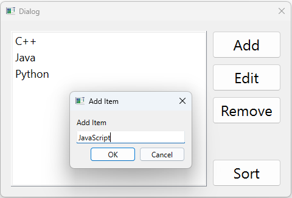

# PyQt6 Course Notes - Complete Reference

## Table of Contents
1. [Core Modules](#1-core-modules)
2. [Window Types (Base Widgets)](#2-window-types-base-widgets)
3. [Basic Widgets](#3-basic-widgets)
4. [Dialog Widgets](#4-dialog-widgets)
5. [Advanced Widgets & Features](#5-advanced-widgets--features)
6. [Layout Managers](#6-layout-managers)
7. [Window Configuration Methods](#7-window-configuration-methods)
8. [Widget Styling & Appearance](#8-widget-styling--appearance)
9. [Event Handling](#9-event-handling)
10. [Multithreading](#10-multithreading)
11. [Working with UI Files](#11-working-with-ui-files)
12. [Application Setup & Execution](#12-application-setup--execution)
13. [Development Tools & Workflow](#13-development-tools--workflow)
14. [Database management](#14-database-management)
15. [Graphics and Drawing](#15-graphics-and-drawing)
16. [QML and QtQuick](#16-qml-and-qtquick)
17. [Charts](#17-charts)
18. [Summary Tables](#18-summary-tables)

---

<div style="page-break-before: always;"></div>

## 1. Core Modules

**In this section:**
- [PyQt6.QtWidgets](#pyqt6qtwidgets)
- [PyQt6.QtGui](#pyqt6qtgui)
- [PyQt6.QtCore](#pyqt6qtcore)
- [PyQt6.uic](#pyqt6uic)
- [PyQt6.QtPrintSupport](#pyqt6qtprintsupport)
- [PyQt6.QtSql](#pyqt6qtsql)

### `PyQt6.QtWidgets`
**Purpose**: Contains all UI widgets and layout classes
```python
from PyQt6.QtWidgets import (
    QApplication,    # Main application object
    QWidget,         # Base widget class
    QMainWindow,     # Main window with menu/status bar
    QDialog,         # Dialog window
    QPushButton,     # Button widget
    QLabel,          # Text/image label
    QLineEdit,       # Single-line text input
    QRadioButton,    # Radio button
    QCheckBox,       # Checkbox
    QSpinBox,        # Integer spin box
    QDoubleSpinBox,  # Floating-point spin box
    QLCDNumber,      # LCD-style number display
    QComboBox,       # Dropdown/combobox widget
    QSlider,         # Slider widget
    QListWidget,     # List widget
    QFontComboBox,   # Font selection combo box
    QTableWidget,    # Table widget
    QTableWidgetItem,# Table widget item
    QTableView,      # Table view (model/view; used with QSqlQueryModel for database results)
    QHeaderView,     # Header for QTableView (e.g. setSectionResizeMode)
    QCalendarWidget, # Calendar widget
    QTreeView,       # Tree view widget
    QInputDialog,    # Input dialog
    QColorDialog,    # Color selection dialog
    QFontDialog,     # Font selection dialog
    QMessageBox,     # Message box dialog
    QTextEdit,       # Rich text editor
    QPlainTextEdit,  # Plain text editor
    QAction,         # Menu/context menu action
    QToolBar,        # Toolbar (icons/buttons, used with QMainWindow.addToolBar)
    QHBoxLayout,     # Horizontal box layout
    QVBoxLayout,     # Vertical box layout
    QGridLayout,     # Grid layout
    QFormLayout,     # Form layout (label + field rows)
    QSplitter,       # Resizable splitter
    QStackedLayout,  # Stack of widgets (one visible)
    QMenu,           # Popup menu
    QSpacerItem,     # Spacer for layouts
    QSizePolicy,     # Size policy for spacers
)
```

### `PyQt6.QtGui`
**Purpose**: Graphics-related classes (fonts, icons, images, drawing)
```python
from PyQt6.QtGui import (
    QIcon,              # Window/button icons
    QFont,              # Font styling
    QPixmap,            # Static images
    QMovie,             # Animated images (GIF)
    QKeyEvent,          # Keyboard events
    QTextCharFormat,    # Text formatting for QTextEdit
    QStandardItemModel, # Model for QTreeView
    QStandardItem,      # Item for QStandardItemModel
    QFileSystemModel,   # Model for file system
    QDrag,              # Drag operation
    QAction,            # Menu/context menu action
    QKeySequence,       # Keyboard shortcuts
    QPainter,           # Custom drawing (paintEvent; setPen, setBrush, drawRect, etc.)
    QPen,               # Outline for shapes/lines (color, width, style)
    QBrush,             # Fill for shapes (color, pattern)
)
```

### `PyQt6.QtCore`
**Purpose**: Core non-GUI classes and utilities
```python
from PyQt6.QtCore import (
    QSize,              # Size dimensions
    Qt,                 # Qt constants and enums (including Orientation, DropAction, SortOrder)
    QCoreApplication,   # Core application functions
    QMetaObject,        # Meta-object system
    QTimer,             # Timer for periodic events
    QTime,              # Time operations
    QDate,              # Date operations
    QMimeData,          # Data format for drag/drop and clipboard
    QFileSystemWatcher, # Monitor file system changes
    QFileInfo,          # File path info (e.g. suffix for PDF export)
)
```

**QTimer** - Timer for periodic events:
```python
from PyQt6.QtCore import QTimer

timer = QTimer()
timer.timeout.connect(self.update_function)  # Connect to function
timer.start(1000)  # Start timer, fire every 1000ms (1 second)
```

**QTime** - Time operations:
```python
from PyQt6.QtCore import QTime

time = QTime.currentTime()  # Get current time
text = time.toString("hh:mm")  # Format as string: "12:34"
```

### `PyQt6.uic`
**Purpose**: UI file loading utilities
```python
from PyQt6 import uic

# Load UI file directly
uic.loadUi("filename.ui", self)
```

### `PyQt6.QtPrintSupport`
**Purpose**: Printing and print preview
```python
from PyQt6.QtPrintSupport import QPrinter, QPrintDialog, QPrintPreviewDialog

printer = QPrinter(QPrinter.PrinterMode.HighResolution)
# QPrintDialog(printer), QPrintPreviewDialog(printer, parent), paintRequested signal
```

### `PyQt6.QtSql`
**Purpose**: Database connectivity and SQL queries (see [Database management](#database-management) for full coverage)
```python
from PyQt6.QtSql import (
    QSqlDatabase,   # Connection (addDatabase, setDatabaseName, open, transaction, commit, rollback)
    QSqlQuery,      # Execute SQL (prepare, bindValue, exec)
    QSqlQueryModel, # Model for SELECT results; use with QTableView.setModel()
)
```

---

<div style="page-break-before: always;"></div>

## 2. Window Types (Base Widgets)

**In this section:**
- [QWidget](#1-qwidget)
- [QMainWindow](#2-qmainwindow)
- [QDialog](#3-qdialog)

### 1. QWidget
**Module**: `PyQt6.QtWidgets`  
**Purpose**: Basic empty window, base class for all widgets

```python
from PyQt6.QtWidgets import QApplication, QWidget
import sys

app = QApplication(sys.argv)
window = QWidget()
window.show()
sys.exit(app.exec())
```

**Key Points**:
- Most basic window type
- Can be subclassed to create custom windows
- No built-in menu bar or status bar
- Used as parent class for custom window classes

**Common Pattern**:
```python
class Window(QWidget):
    def __init__(self):
        super().__init__()
        # Window configuration here
```

**Signals**:
- This widget emits no signals (QWidget is a base container class)

---

### 2. QMainWindow
**Module**: `PyQt6.QtWidgets`  
**Purpose**: Main application window with menu bar and status bar

```python
from PyQt6.QtWidgets import QApplication, QMainWindow

window = QMainWindow()
window.statusBar().showMessage("Welcome to PyQt6 Course")
window.menuBar().addMenu("File")
window.show()
```

**Built-in Components**:
- **Status Bar**: `statusBar()` - Bottom information bar
- **Menu Bar**: `menuBar()` - Top menu system
- **Tool Bars**: `addToolBar()` - Add a toolbar; add actions with `toolbar.addAction(action)`
- **Dock Widgets**: Support for dockable panels

**Key Methods**:
- `statusBar()` - Returns status bar object
- `menuBar()` - Returns menu bar object
- `addToolBar(title)` - Add a toolbar (e.g. `QToolBar`); returns the toolbar so you can call `addAction(action)` to add QAction items (icons/buttons)
- `statusBar().showMessage(str)` - Display message in status bar
- `menuBar().addMenu(str)` - Add menu to menu bar

**Creating a toolbar and linking actions**:
```python
from PyQt6.QtWidgets import QApplication, QMainWindow, QAction
from PyQt6.QtGui import QKeySequence, QIcon

class Window(QMainWindow):
    def __init__(self):
        super().__init__()
        # Create toolbar
        toolbar = self.addToolBar("File")
        # Create action and add to toolbar (same action can also be added to menu)
        save_action = QAction("Save", self)
        save_action.setShortcut(QKeySequence.StandardKey.Save)
        save_action.setIcon(QIcon("save.png"))  # optional
        save_action.triggered.connect(self.save_file)
        toolbar.addAction(save_action)
```

**Signals**:
- This widget emits no signals (QMainWindow is a container window class)

---

### 3. QDialog
**Module**: `PyQt6.QtWidgets`  
**Purpose**: Dialog/popup window

```python
from PyQt6.QtWidgets import QApplication, QDialog

window = QDialog()
window.show()
```

**Key Points**:
- Used for modal/non-modal dialogs
- No status bar or menu bar (commented out in examples)
- Typically used for user input, confirmations, alerts

**Signals**:
- This widget emits no signals (QDialog is a container window class)

---

<div style="page-break-before: always;"></div>

## 3. Basic Widgets

**In this section:**
- [QPushButton](#1-qpushbutton)
- [QLabel](#2-qlabel)
- [QLineEdit](#3-qlineedit)
- [QRadioButton](#4-qradiobutton)
- [QCheckBox](#5-qcheckbox)
- [QSpinBox](#6-qspinbox)
- [QDoubleSpinBox](#7-qdoublespinbox)
- [QLCDNumber](#8-qlcdnumber)
- [QComboBox](#9-qcombobox)
- [QSlider](#10-qslider)
- [QListWidget](#11-qlistwidget)
- [QFontComboBox](#12-qfontcombobox)
- [QTableWidget](#13-qtablewidget)
- [QCalendarWidget](#14-qcalendarwidget)
- [QTreeView](#15-qtreeview)

### 1. QPushButton
**Module**: `PyQt6.QtWidgets`  
**Purpose**: Clickable button

```python
from PyQt6.QtWidgets import QPushButton

btn = QPushButton("Click", self)
btn.setGeometry(100, 100, 130, 130)
```

**Key Methods**:
| Method | Purpose | Module |
|--------|---------|--------|
| `QPushButton(text, parent)` | Constructor | QtWidgets |
| `setGeometry(x, y, width, height)` | Set position and size | QtWidgets |
| `setFont(QFont)` | Set button font | QtWidgets |
| `setIcon(QIcon)` | Set button icon | QtWidgets |
| `setIconSize(QSize)` | Set icon size | QtWidgets |
| `setMenu(QMenu)` | Attach popup menu | QtWidgets |
| `clicked.connect(function)` | Connect click event | QtCore (signal) |

**Signals**:
- `clicked` - Emitted when the button is clicked (pressed and released)
- `pressed` - Emitted when the button is pressed down
- `released` - Emitted when the button is released

**Connecting Signals**:
```python
from PyQt6.QtWidgets import QPushButton

btn = QPushButton("Click Me", self)
btn.clicked.connect(self.button_clicked)

def button_clicked(self):
    # Handle button click
    print("Button was clicked!")
```

**Example with Full Styling**:
```python
from PyQt6.QtWidgets import QPushButton, QMenu
from PyQt6.QtGui import QIcon, QFont
from PyQt6.QtCore import QSize

btn = QPushButton("Click", self)
btn.setGeometry(100, 100, 130, 130)
btn.setFont(QFont("Times", 14, QFont.Weight.ExtraBold))
btn.setIcon(QIcon('path/to/icon.png'))
btn.setIconSize(QSize(36, 36))

# Add popup menu
menu = QMenu()
menu.addAction("Copy")
menu.addAction("Cut")
menu.addAction("Paste")
btn.setMenu(menu)
```

---

### 2. QLabel
**Module**: `PyQt6.QtWidgets`  
**Purpose**: Display text or images

```python
from PyQt6.QtWidgets import QLabel

label = QLabel("Python GUI Development", self)
label.move(100, 100)
```

**Key Methods**:
| Method | Purpose | Module |
|--------|---------|--------|
| `QLabel(text, parent)` | Constructor | QtWidgets |
| `setText(str)` | Set/change text | QtWidgets |
| `text()` | Get current text | QtWidgets |
| `setFont(QFont)` | Set font style | QtWidgets |
| `setStyleSheet(str)` | Apply CSS-like styling | QtWidgets |
| `setNum(int)` | Display number | QtWidgets |
| `clear()` | Clear label content | QtWidgets |
| `setPixmap(QPixmap)` | Display static image | QtWidgets |
| `setMovie(QMovie)` | Display animated GIF | QtWidgets |
| `move(x, y)` | Position the label | QtWidgets |

**Text Label Example**:
```python
from PyQt6.QtWidgets import QLabel
from PyQt6.QtGui import QFont

label = QLabel("Python GUI Development", self)
label.setText("New Text is Here")
label.move(100, 100)
label.setFont(QFont("Sanserif", 15))
label.setStyleSheet('color:red')

# Display numbers (two ways)
label.setText(str(12))  # Convert number to string
label.setNum(15)        # Direct number display
```

**Image Label Example**:
```python
from PyQt6.QtWidgets import QLabel
from PyQt6.QtGui import QPixmap

label = QLabel(self)
pixmap = QPixmap('path/to/image.jpg')
label.setPixmap(pixmap)
```

**Animated GIF Example**:
```python
from PyQt6.QtWidgets import QLabel
from PyQt6.QtGui import QMovie

label = QLabel(self)
movie = QMovie('path/to/animation.gif')
movie.setSpeed(500)  # Set playback speed (percentage, 100 = normal)
label.setMovie(movie)
movie.start()
```

**Signals**:
- This widget emits no signals (QLabel is a display-only widget)

---

### 3. QLineEdit
**Module**: `PyQt6.QtWidgets`  
**Purpose**: Single-line text input field

```python
from PyQt6.QtWidgets import QLineEdit

line_edit = QLineEdit(self)
line_edit.setFont(QFont('Sanserif', 15))
```

**Key Methods**:
| Method | Purpose | Module |
|--------|---------|--------|
| `QLineEdit(parent)` | Constructor | QtWidgets |
| `setText(str)` | Set default text | QtWidgets |
| `text()` | Get current text | QtWidgets |
| `setPlaceholderText(str)` | Set placeholder text | QtWidgets |
| `setFont(QFont)` | Set font | QtWidgets |
| `setEnabled(bool)` | Enable/disable input | QtWidgets |
| `setEchoMode(mode)` | Set display mode | QtWidgets |

**Echo Modes** (for password input):
- `QLineEdit.EchoMode.Normal` - Display text normally
- `QLineEdit.EchoMode.Password` - Display dots/asterisks
- `QLineEdit.EchoMode.NoEcho` - Display nothing
- `QLineEdit.EchoMode.PasswordEchoOnEdit` - Show while typing

**Examples**:
```python
# Regular input
line_edit = QLineEdit(self)
line_edit.setText("Default Text")
line_edit.setPlaceholderText("Please enter your username")

# Password input
line_edit.setEchoMode(QLineEdit.EchoMode.Password)

# Disabled input
line_edit.setEnabled(False)

# Get input value
text = line_edit.text()  # Returns string value
```

**Important**: Use `.text()` with parentheses to get the value, not `.text` without parentheses.

**Signals**:
- `textChanged(str)` - Emitted whenever the text changes (programmatically or by user)
- `textEdited(str)` - Emitted when the user edits the text (not when set programmatically)
- `returnPressed` - Emitted when the user presses Enter/Return
- `editingFinished` - Emitted when editing is finished (widget loses focus or Enter is pressed)

**Example - Connecting Signals**:
```python
from PyQt6.QtWidgets import QLineEdit

line_edit = QLineEdit(self)

# React to any text change
line_edit.textChanged.connect(self.on_text_changed)

# React only to user edits
line_edit.textEdited.connect(self.on_text_edited)

# React when Enter is pressed
line_edit.returnPressed.connect(self.on_enter_pressed)

# React when editing is finished
line_edit.editingFinished.connect(self.on_editing_finished)

def on_text_changed(self, text):
    print(f"Text changed to: {text}")

def on_text_edited(self, text):
    print(f"User edited text to: {text}")

def on_enter_pressed(self):
    print("Enter key was pressed")

def on_editing_finished(self):
    print("Editing finished")
```

---

### 4. QRadioButton
**Module**: `PyQt6.QtWidgets`  
**Purpose**: Radio button for mutually exclusive options

**Key Concept**: Radio buttons present a "one of many" choice. In a group of radio buttons, only one can be checked at a time. When the user selects another button, the previously selected button is automatically switched off.

```python
from PyQt6.QtWidgets import QRadioButton

rad1 = QRadioButton("Python")
```

**Key Methods**:
| Method | Purpose | Module |
|--------|---------|--------|
| `QRadioButton(text)` | Constructor | QtWidgets |
| `setText(str)` | Set button text | QtWidgets |
| `text()` | Get button text | QtWidgets |
| `setIcon(QIcon)` | Set icon | QtWidgets |
| `setIconSize(QSize)` | Set icon size | QtWidgets |
| `setFont(QFont)` | Set font | QtWidgets |
| `setChecked(bool)` | Set checked state (default selection) | QtWidgets |
| `isChecked()` | Get checked state (returns bool) | QtWidgets |
| `toggled.connect(function)` | Connect toggle event | QtCore (signal) |

**Signals**:
- `toggled` - Emitted whenever the radio button changes state from checked to unchecked and vice versa
- `clicked` - Emitted when the radio button is clicked (pressed and released)

**Note**: The `toggled` signal is preferred for radio buttons because it only fires when the state actually changes, whereas `clicked` fires even if you click an already-selected radio button.

**Complete Example**:
```python
from PyQt6.QtWidgets import QRadioButton, QVBoxLayout, QHBoxLayout, QLabel
from PyQt6.QtGui import QIcon, QFont
from PyQt6.QtCore import QSize

# Create radio buttons with text
rad1 = QRadioButton("Python")
rad1.setIcon(QIcon('images/py.png'))
rad1.setIconSize(QSize(40, 40))
rad1.setFont(QFont("Times", 14))
rad1.setChecked(True)  # Make this the default selection
rad1.toggled.connect(self.radio_selected)

rad2 = QRadioButton("Java")
rad2.setIcon(QIcon('images/java.png'))
rad2.setIconSize(QSize(40, 40))
rad2.setFont(QFont("Times", 14))
rad2.toggled.connect(self.radio_selected)

rad3 = QRadioButton("JavaScript")
rad3.setIcon(QIcon('images/javascript.png'))
rad3.setIconSize(QSize(40, 40))
rad3.setFont(QFont("Times", 14))
rad3.toggled.connect(self.radio_selected)

# Create label to display selection
self.label = QLabel("")
self.label.setFont(QFont("Sanserif", 15))

# Layout structure: vertical layout with label on top, horizontal layout with buttons below
vbox = QVBoxLayout()
hbox = QHBoxLayout()

# Add radio buttons to horizontal layout
hbox.addWidget(rad1)
hbox.addWidget(rad2)
hbox.addWidget(rad3)

# Add label and horizontal layout to vertical layout
vbox.addWidget(self.label)
vbox.addLayout(hbox)

# Set the layout to the window
self.setLayout(vbox)

# Event handler
def radio_selected(self):
    radio_btn = self.sender()  # Get which radio button triggered the signal
    if radio_btn.isChecked():
        self.label.setText("You have selected: {}".format(radio_btn.text()))
```

**Using sender() Method**:
- `self.sender()` returns the object that sent the signal
- Useful when multiple radio buttons connect to the same slot
- Allows one handler function to manage multiple radio buttons

**Best Practices**:
1. Use `setChecked(True)` on one radio button to set a default selection
2. Connect all radio buttons in a group to the same handler function
3. Use `isChecked()` to determine which button is selected
4. Use `text()` to get the label of the selected button
5. Group related radio buttons in the same layout for automatic mutual exclusivity

---

### 5. QCheckBox
**Module**: `PyQt6.QtWidgets`  
**Purpose**: Checkbox for multiple independent selections

**Key Concept**: Checkboxes are used to represent features that can be enabled or disabled independently. Unlike radio buttons, checkboxes allow multiple selections - users can select one or more options from a set. Each checkbox operates independently.

```python
from PyQt6.QtWidgets import QCheckBox

check1 = QCheckBox("Python")
```

**Key Methods**:
| Method | Purpose | Module |
|--------|---------|--------|
| `QCheckBox(text)` | Constructor | QtWidgets |
| `setText(str)` | Set checkbox text | QtWidgets |
| `text()` | Get checkbox text | QtWidgets |
| `setIcon(QIcon)` | Set icon | QtWidgets |
| `setIconSize(QSize)` | Set icon size | QtWidgets |
| `setFont(QFont)` | Set font | QtWidgets |
| `setChecked(bool)` | Set checked state (default selection) | QtWidgets |
| `isChecked()` | Get checked state (returns bool) | QtWidgets |
| `stateChanged.connect(function)` | Connect state change event | QtCore (signal) |

**Signals**:
- `stateChanged(int)` - Emitted whenever the checkbox changes state (checked to unchecked or vice versa). The integer parameter represents the new state (0 = unchecked, 2 = checked).

**Complete Example**:
```python
from PyQt6.QtWidgets import QCheckBox, QVBoxLayout, QHBoxLayout, QLabel
from PyQt6.QtGui import QIcon, QFont
from PyQt6.QtCore import QSize

# Create checkboxes with text
check1 = QCheckBox("Python")
check1.setIcon(QIcon('images/py.png'))
check1.setIconSize(QSize(40, 40))
check1.setFont(QFont("Sanserif", 13))
check1.stateChanged.connect(self.item_selected)

check2 = QCheckBox("Java")
check2.setIcon(QIcon('images/java.png'))
check2.setIconSize(QSize(40, 40))
check2.setFont(QFont("Sanserif", 13))
check2.stateChanged.connect(self.item_selected)

check3 = QCheckBox("JavaScript")
check3.setIcon(QIcon('images/javascript.png'))
check3.setIconSize(QSize(40, 40))
check3.setFont(QFont("Sanserif", 13))
check3.stateChanged.connect(self.item_selected)

# Create label to display selection
self.label = QLabel("")
self.label.setFont(QFont("Sanserif", 15))

# Layout structure: vertical layout with label on top, horizontal layout with checkboxes below
vbox = QVBoxLayout()
hbox = QHBoxLayout()

# Add checkboxes to horizontal layout
hbox.addWidget(check1)
hbox.addWidget(check2)
hbox.addWidget(check3)

# Add label and horizontal layout to vertical layout
vbox.addWidget(self.label)
vbox.addLayout(hbox)

# Set the layout to the window
self.setLayout(vbox)

# Event handler
def item_selected(self):
    value = ""
    if self.check1.isChecked():
        value = self.check1.text()
    if self.check2.isChecked():
        value = self.check2.text()
    if self.check3.isChecked():
        value = self.check3.text()
    self.label.setText(f"You have selected: {value}")
```

**Key Differences from QRadioButton**:
- **Multiple Selection**: Checkboxes allow multiple items to be selected simultaneously
- **Independent Operation**: Each checkbox operates independently - selecting one doesn't deselect others
- **Signal**: Uses `stateChanged` signal instead of `toggled`
- **Use Case**: Use checkboxes when users can select multiple options; use radio buttons for mutually exclusive choices

**Best Practices**:
1. Use `setChecked(True)` to set a default checked state if needed
2. Connect all checkboxes to the same handler function to check multiple selections
3. Use `isChecked()` to determine which checkboxes are selected
4. Use `text()` to get the label of checked boxes
5. Checkboxes work well in horizontal or vertical layouts depending on space and design

---

### 6. QSpinBox
**Module**: `PyQt6.QtWidgets`  
**Purpose**: Spin box for integer input with up/down arrow buttons

**Key Concept**: QSpinBox provides a text input field with up/down arrow buttons that allow users to increment or decrement integer values. It's useful for numeric input where you want to control the range and step size.

```python
from PyQt6.QtWidgets import QSpinBox

spinbox = QSpinBox()
```

**Key Methods**:
| Method | Purpose | Module |
|--------|---------|--------|
| `QSpinBox(parent)` | Constructor | QtWidgets |
| `setMinimum(int)` | Set minimum value | QtWidgets |
| `setMaximum(int)` | Set maximum value | QtWidgets |
| `setRange(min, max)` | Set both min and max | QtWidgets |
| `setValue(int)` | Set current value | QtWidgets |
| `value()` | Get current value (returns int) | QtWidgets |
| `setSingleStep(int)` | Set increment/decrement step | QtWidgets |
| `setPrefix(str)` | Set prefix text (e.g., "$") | QtWidgets |
| `setSuffix(str)` | Set suffix text (e.g., " kg") | QtWidgets |
| `valueChanged.connect(function)` | Connect value change event | QtCore (signal) |
| `editingFinished.connect(function)` | Connect when editing finishes | QtCore (signal) |

**Signals**:
- `valueChanged(int)` - Emitted whenever the value changes (by user or programmatically)
- `editingFinished` - Emitted when editing is finished (user presses Enter or widget loses focus)

**Complete Example**:
```python
from PyQt6.QtWidgets import QSpinBox, QHBoxLayout, QLabel, QLineEdit
from PyQt6.QtGui import QFont

# Create spinbox
self.spinbox = QSpinBox()
self.spinbox.setMinimum(0)
self.spinbox.setMaximum(100)
self.spinbox.setValue(1)  # Default value
self.spinbox.setSingleStep(1)  # Increment by 1
self.spinbox.valueChanged.connect(self.spin_selected)

# Event handler
def spin_selected(self):
    if self.lineedit.text() != "":
        price = int(self.lineedit.text())
        totalPrice = self.spinbox.value() * price
        self.total_result.setText(str(totalPrice))
```

**Using with QLineEdit for Calculations**:
```python
# Common pattern: Get price from QLineEdit, quantity from QSpinBox
price = int(self.lineEdit_price.text())
quantity = self.spinBox.value()
total = price * quantity
self.lineEdit_totalPrice.setText(str(total))
```

**Best Practices**:
1. Always set minimum and maximum values to prevent invalid input
2. Use `valueChanged` signal for real-time updates as user changes value
3. Use `editingFinished` signal when you only need to react after user finishes editing
4. Validate input from QLineEdit before using in calculations (check if text is not empty)
5. Use `value()` method to get the integer value for calculations

---

### 7. QDoubleSpinBox
**Module**: `PyQt6.QtWidgets`  
**Purpose**: Spin box for floating-point (decimal) input with up/down arrow buttons

**Key Concept**: QDoubleSpinBox is similar to QSpinBox but handles floating-point (decimal) numbers instead of integers. It's useful for quantities that can have decimal values (e.g., weight, price, measurements).

```python
from PyQt6.QtWidgets import QDoubleSpinBox

doublespinbox = QDoubleSpinBox()
```

**Key Methods**:
| Method | Purpose | Module |
|--------|---------|--------|
| `QDoubleSpinBox(parent)` | Constructor | QtWidgets |
| `setMinimum(float)` | Set minimum value | QtWidgets |
| `setMaximum(float)` | Set maximum value | QtWidgets |
| `setRange(min, max)` | Set both min and max | QtWidgets |
| `setValue(float)` | Set current value | QtWidgets |
| `value()` | Get current value (returns float) | QtWidgets |
| `setSingleStep(float)` | Set increment/decrement step | QtWidgets |
| `setDecimals(int)` | Set number of decimal places | QtWidgets |
| `setPrefix(str)` | Set prefix text (e.g., "$") | QtWidgets |
| `setSuffix(str)` | Set suffix text (e.g., " kg") | QtWidgets |
| `valueChanged.connect(function)` | Connect value change event | QtCore (signal) |
| `editingFinished.connect(function)` | Connect when editing finishes | QtCore (signal) |

**Signals**:
- `valueChanged(float)` - Emitted whenever the value changes (by user or programmatically)
- `editingFinished` - Emitted when editing is finished (user presses Enter or widget loses focus)

**Complete Example**:
```python
from PyQt6.QtWidgets import QDoubleSpinBox, QHBoxLayout, QLabel, QLineEdit

# Create double spinbox
self.doubleSpinBox = QDoubleSpinBox()
self.doubleSpinBox.setMinimum(0.0)
self.doubleSpinBox.setMaximum(1000.0)
self.doubleSpinBox.setValue(1.0)  # Default value
self.doubleSpinBox.setSingleStep(0.5)  # Increment by 0.5
self.doubleSpinBox.setDecimals(2)  # Show 2 decimal places
self.doubleSpinBox.valueChanged.connect(self.double_spin_selected)

# Event handler
def double_spin_selected(self):
    if self.lineEdit_Sprice.text() != "":
        sugarPrice = int(self.lineEdit_Sprice.text())
        totalSugarPrice = self.doubleSpinBox.value() * sugarPrice
        self.lineEdit_Tsugar.setText(str(totalSugarPrice))
```

**Key Differences from QSpinBox**:
- **Data Type**: Handles floating-point numbers (float) instead of integers (int)
- **Decimals**: Can set the number of decimal places displayed
- **Precision**: Useful for measurements, prices, weights, etc. that require decimal precision

**Using findChild() with UI Files**:
When loading UI files with `uic.loadUi()`, you can access widgets using `findChild()`:

```python
from PyQt6.QtWidgets import QApplication, QWidget, QLineEdit, QDoubleSpinBox
from PyQt6 import uic

class UI(QWidget):
    def __init__(self):
        super().__init__()
        uic.loadUi("DoubleSpinDemo.ui", self)
        
        # Access widgets by their object name
        self.linePrice = self.findChild(QLineEdit, "lineEdit_price")
        self.doublespin = self.findChild(QDoubleSpinBox, "doubleSpinBox")
        self.lineResult = self.findChild(QLineEdit, "lineEdit_total")
        
        self.doublespin.valueChanged.connect(self.spin_selected)
    
    def spin_selected(self):
        if self.linePrice.text() != "":
            price = int(self.linePrice.text())
            totalPrice = self.doublespin.value() * price
            self.lineResult.setText(str(totalPrice))
```

**findChild() Method**:
- `self.findChild(WidgetClass, "objectName")` - Find widget by its object name from UI file
- Returns the widget object if found, None if not found
- Useful when you need to access widgets loaded from `.ui` files

**Best Practices**:
1. Set appropriate minimum, maximum, and step values for your use case
2. Use `setDecimals()` to control decimal precision display
3. Use `valueChanged` for real-time updates or `editingFinished` for final calculations
4. Remember that `value()` returns a float, not an int
5. Validate input from other widgets before performing calculations

---

### 8. QLCDNumber
**Module**: `PyQt6.QtWidgets`  
**Purpose**: Display numbers in LCD-style format (like a digital clock or calculator display)

**Key Concept**: QLCDNumber displays numbers in a seven-segment LCD-style format. It's commonly used for displaying numeric values, time, or any numeric information that needs to be clearly visible.


*Example of QLCDNumber displaying a random number (492) with yellow background*


*Example of QLCDNumber displaying time (21:45) with red background*

```python
from PyQt6.QtWidgets import QLCDNumber

lcd = QLCDNumber()
```

**Key Methods**:
| Method | Purpose | Module |
|--------|---------|--------|
| `QLCDNumber(parent)` | Constructor | QtWidgets |
| `display(int)` | Display integer value | QtWidgets |
| `display(str)` | Display string (for time format) | QtWidgets |
| `setStyleSheet(str)` | Apply CSS-like styling | QtWidgets |
| `setDigitCount(int)` | Set number of digits to display | QtWidgets |
| `setSegmentStyle(style)` | Set segment style | QtWidgets |

**Displaying Numbers**:
```python
from PyQt6.QtWidgets import QLCDNumber, QVBoxLayout
from random import randint

lcd = QLCDNumber()
lcd.setStyleSheet("background: yellow")
lcd.display(randint(1, 500))  # Display random number
```

**Displaying Time**:
```python
from PyQt6.QtWidgets import QLCDNumber, QVBoxLayout
from PyQt6.QtCore import QTime, QTimer

lcd = QLCDNumber()
lcd.setStyleSheet("background: red")

# Create timer to update every second
timer = QTimer()
timer.timeout.connect(self.showLCD)
timer.start(1000)  # Update every 1000ms (1 second)
self.showLCD()  # Initial display

def showLCD(self):
    time = QTime.currentTime()
    text = time.toString("hh:mm")  # Format: "12:34"
    lcd.display(text)
```

**Segment Styles** (from `QLCDNumber.SegmentStyle`):
- `Outline` - Outlined segments (default)
- `Filled` - Filled segments
- `Flat` - Flat segments

**Complete Example - Random Number Generator**:
```python
from PyQt6.QtWidgets import QApplication, QDialog, QLCDNumber, QPushButton, QVBoxLayout
from PyQt6 import uic
from random import randint
import sys

class UI(QDialog):
    def __init__(self):
        super().__init__()
        uic.loadUi("QLCDDemo.ui", self)
        
        # Access LCD widget
        self.lcdNumber = self.findChild(QLCDNumber, "lcdNumber")
        self.pushButton = self.findChild(QPushButton, "pushButton")
        
        # Connect button click
        self.pushButton.clicked.connect(self.random_generator)
    
    def random_generator(self):
        random = randint(1, 500)
        self.lcdNumber.display(random)
```

**Complete Example - Digital Clock**:
```python
from PyQt6.QtWidgets import QApplication, QWidget, QVBoxLayout, QLCDNumber
from PyQt6.QtCore import QTime, QTimer
import sys

class Window(QWidget):
    def __init__(self):
        super().__init__()
        self.setGeometry(200, 200, 700, 400)
        self.setWindowTitle("PyQt6 QLCDNumber Clock")
        
        # Create timer
        timer = QTimer()
        timer.timeout.connect(self.showLCD)
        timer.start(1000)  # Update every second
        self.showLCD()  # Initial display
    
    def showLCD(self):
        vbox = QVBoxLayout()
        lcd = QLCDNumber()
        lcd.setStyleSheet("background: red")
        
        vbox.addWidget(lcd)
        self.setLayout(vbox)
        
        # Get current time and display
        time = QTime.currentTime()
        text = time.toString("hh:mm")  # Format: "12:34"
        lcd.display(text)
```

**Signals**:
- This widget emits no signals (QLCDNumber is a display-only widget)

**Best Practices**:
1. Use `display()` to update the LCD number value
2. For time display, use `QTime.currentTime().toString()` with format strings
3. Use `QTimer` for periodic updates (like clocks)
4. Style with `setStyleSheet()` for visual customization
5. Use `setDigitCount()` if you know the maximum number of digits needed

---

### 9. QComboBox
**Module**: `PyQt6.QtWidgets`  
**Purpose**: Dropdown/combobox widget for selecting one item from a list

**Key Concept**: QComboBox provides a dropdown menu that allows users to select one option from a list of items. It's space-efficient and commonly used for settings, preferences, or any "choose one" scenario.


*Example of QComboBox displaying account types with dropdown menu open*

```python
from PyQt6.QtWidgets import QComboBox

combo = QComboBox()
```

**Key Methods**:
| Method | Purpose | Module |
|--------|---------|--------|
| `QComboBox(parent)` | Constructor | QtWidgets |
| `addItem(str)` | Add item to dropdown | QtWidgets |
| `addItems(list)` | Add multiple items | QtWidgets |
| `currentText()` | Get selected text (returns str) | QtWidgets |
| `currentIndex()` | Get selected index (returns int) | QtWidgets |
| `setCurrentText(str)` | Set selection by text | QtWidgets |
| `setCurrentIndex(int)` | Set selection by index | QtWidgets |
| `count()` | Get number of items | QtWidgets |
| `clear()` | Remove all items | QtWidgets |
| `setFont(QFont)` | Set font | QtWidgets |
| `currentTextChanged.connect(function)` | Connect selection change event | QtCore (signal) |
| `currentIndexChanged.connect(function)` | Connect index change event | QtCore (signal) |

**Signals**:
- `currentTextChanged(str)` - Emitted when the selected text changes (passes new text)
- `currentIndexChanged(int)` - Emitted when the selected index changes (passes new index)

**Complete Example - Programmatic Creation**:
```python
from PyQt6.QtWidgets import QApplication, QWidget, QComboBox, QLabel, QHBoxLayout, QVBoxLayout
from PyQt6.QtGui import QFont
import sys

class Window(QWidget):
    def __init__(self):
        super().__init__()
        self.setGeometry(900, 200, 400, 300)
        self.setWindowTitle("PyQt6 QComboBox")
        self.create_combo()
    
    def create_combo(self):
        hbox = QHBoxLayout()
        label = QLabel("Select Account Type: ")
        label.setFont(QFont("Times", 15))
        
        self.combo = QComboBox()
        self.combo.addItem("Current Account")
        self.combo.addItem("Deposit Account")
        self.combo.addItem("Saving Account")
        
        hbox.addWidget(label)
        hbox.addWidget(self.combo)
        
        vbox = QVBoxLayout()
        self.label_result = QLabel()
        self.label_result.setFont(QFont("Times", 15))
        
        vbox.addWidget(self.label_result)
        vbox.addLayout(hbox)
        
        self.setLayout(vbox)
        
        # Connect signal
        self.combo.currentTextChanged.connect(self.combo_changed)
    
    def combo_changed(self):
        item = self.combo.currentText()
        self.label_result.setText(f"Your account type is: {item}")
```

**Complete Example - Loading from UI File**:
```python
from PyQt6.QtWidgets import QApplication, QWidget, QComboBox, QLabel
from PyQt6 import uic
import sys

class UI(QWidget):
    def __init__(self):
        super().__init__()
        uic.loadUi('ComboDemo.ui', self)
        
        # Access widgets using findChild
        self.label_result = self.findChild(QLabel, "label_result")
        self.combo = self.findChild(QComboBox, "comboBox")
        
        # Connect signal
        self.combo.currentTextChanged.connect(self.combo_changed)
    
    def combo_changed(self):
        item = self.combo.currentText()
        self.label_result.setText(f"Your favorite language is: {item}")
```

**Adding Items Programmatically**:
```python
# Add single item
combo.addItem("Python")

# Add multiple items
combo.addItems(["Python", "Java", "C++", "C#"])

# Add items one by one
combo.addItem("Python")
combo.addItem("Java")
combo.addItem("C++")
```

**Getting Selected Value**:
```python
# Get selected text
selected_text = self.combo.currentText()  # Returns: "Python"

# Get selected index (0-based)
selected_index = self.combo.currentIndex()  # Returns: 0 for first item
```

**Setting Selection Programmatically**:
```python
# Set by text
self.combo.setCurrentText("Java")

# Set by index
self.combo.setCurrentIndex(1)  # Select second item (0-based)
```

**Best Practices**:
1. Use `currentTextChanged` signal for reacting to user selection changes
2. Use `currentText()` to get the selected text value
3. Use `addItem()` or `addItems()` to populate the dropdown
4. When loading from UI files, use `findChild()` to access the combo box
5. Items in UI files are defined in the `.ui` file and don't need to be added programmatically
6. Use descriptive labels next to combo boxes to indicate what the selection is for

---

### 10. QSlider
**Module**: `PyQt6.QtWidgets`  
**Purpose**: Slider widget for selecting a value by dragging

**Key Concept**: QSlider provides a draggable slider control that allows users to select a value within a specified range. It's commonly used for volume controls, brightness settings, or any continuous value selection.

```python
from PyQt6.QtWidgets import QSlider
from PyQt6.QtCore import Qt

slider = QSlider()
```

**Key Methods**:
| Method | Purpose | Module |
|--------|---------|--------|
| `QSlider(parent)` | Constructor | QtWidgets |
| `setOrientation(orientation)` | Set horizontal or vertical | QtWidgets |
| `setMinimum(int)` | Set minimum value | QtWidgets |
| `setMaximum(int)` | Set maximum value | QtWidgets |
| `setRange(min, max)` | Set both min and max | QtWidgets |
| `setValue(int)` | Set current value | QtWidgets |
| `value()` | Get current value (returns int) | QtWidgets |
| `setTickPosition(position)` | Set where ticks appear | QtWidgets |
| `setTickInterval(int)` | Set spacing between ticks | QtWidgets |
| `valueChanged.connect(function)` | Connect value change event | QtCore (signal) |
| `sliderMoved.connect(function)` | Connect when slider is dragged | QtCore (signal) |
| `sliderPressed.connect(function)` | Connect when slider is pressed | QtCore (signal) |
| `sliderReleased.connect(function)` | Connect when slider is released | QtCore (signal) |

**Orientations** (from `Qt.Orientation`):
- `Qt.Orientation.Horizontal` - Horizontal slider (left to right)
- `Qt.Orientation.Vertical` - Vertical slider (top to bottom)

**Tick Positions** (from `QSlider.TickPosition`):
- `QSlider.TickPosition.NoTicks` - No ticks displayed
- `QSlider.TickPosition.TicksAbove` - Ticks above horizontal slider
- `QSlider.TickPosition.TicksBelow` - Ticks below horizontal slider
- `QSlider.TickPosition.TicksLeft` - Ticks left of vertical slider
- `QSlider.TickPosition.TicksRight` - Ticks right of vertical slider
- `QSlider.TickPosition.TicksBothSides` - Ticks on both sides

**Signals**:
- `valueChanged(int)` - Emitted whenever the value changes (by user or programmatically)
- `sliderMoved(int)` - Emitted while the user is dragging the slider (passes current value)
- `sliderPressed` - Emitted when the user starts dragging
- `sliderReleased` - Emitted when the user releases the slider

**Complete Example - Basic Slider**:
```python
from PyQt6.QtWidgets import QApplication, QWidget, QSlider, QLabel, QHBoxLayout
from PyQt6.QtGui import QFont, QIcon
from PyQt6.QtCore import Qt
import sys

class Window(QWidget):
    def __init__(self):
        super().__init__()
        self.setGeometry(200, 200, 700, 400)
        self.setWindowTitle("PyQt6 QSlider")
        self.setWindowIcon(QIcon('images/python.png'))
        
        hbox = QHBoxLayout()
        
        # Create slider
        self.slider = QSlider()
        self.slider.setOrientation(Qt.Orientation.Horizontal)
        self.slider.setTickPosition(QSlider.TickPosition.TicksAbove)
        self.slider.setTickInterval(5)
        self.slider.setMinimum(0)
        self.slider.setMaximum(100)
        self.slider.valueChanged.connect(self.changed_slider)
        
        # Create label to display value
        self.label = QLabel("")
        self.label.setFont(QFont("Times", 15))
        
        hbox.addWidget(self.slider)
        hbox.addWidget(self.label)
        
        self.setLayout(hbox)
    
    def changed_slider(self):
        value = self.slider.value()
        self.label.setText(str(value))
```

**Complete Example - Slider with QLineEdit (Two-Way Binding)**:
```python
from PyQt6.QtWidgets import QApplication, QWidget, QSlider, QLabel, QLineEdit, QHBoxLayout, QVBoxLayout
from PyQt6.QtGui import QFont
from PyQt6.QtCore import Qt
import sys

class Window(QWidget):
    def __init__(self):
        super().__init__()
        self.setGeometry(200, 200, 550, 200)
        self.setWindowTitle("PyQt6 QSlider with QLineEdit")
        
        vbox = QVBoxLayout()
        hbox = QHBoxLayout()
        
        # Label
        label = QLabel("Blood Pressure:")
        label.setFont(QFont("Times", 14))
        label.setBold(True)
        
        # Slider
        self.slider = QSlider()
        self.slider.setOrientation(Qt.Orientation.Horizontal)
        self.slider.setMinimum(0)
        self.slider.setMaximum(200)
        self.slider.sliderMoved.connect(self.slider_moved)
        
        hbox.addWidget(label)
        hbox.addWidget(self.slider)
        
        # LineEdit for direct input
        self.lineEdit = QLineEdit()
        self.lineEdit.setFont(QFont("Times", 12))
        self.lineEdit.returnPressed.connect(self.lineedit_changed)
        
        vbox.addLayout(hbox)
        vbox.addWidget(self.lineEdit)
        
        self.setLayout(vbox)
    
    def slider_moved(self, value):
        """Update LineEdit when slider moves"""
        self.lineEdit.setText(str(value))
    
    def lineedit_changed(self):
        """Update slider when LineEdit value changes"""
        try:
            value = int(self.lineEdit.text())
            self.slider.setValue(value)
        except ValueError:
            pass  # Handle invalid input
```

**Using with UI Files**:
When loading UI files with `uic.loadUi()`, you can access the slider using `findChild()`:

```python
from PyQt6.QtWidgets import QApplication, QWidget, QSlider, QLineEdit
from PyQt6 import uic
import sys

class UI(QWidget):
    def __init__(self):
        super().__init__()
        uic.loadUi('SliderDemoui.ui', self)
        
        # Access widgets
        self.slider = self.findChild(QSlider, "horizontalSlider")
        self.lineEdit = self.findChild(QLineEdit, "lineEdit")
        
        # Connect signals
        self.slider.sliderMoved.connect(self.slider_moved)
        self.lineEdit.returnPressed.connect(self.lineedit_changed)
    
    def slider_moved(self, value):
        self.lineEdit.setText(str(value))
    
    def lineedit_changed(self):
        try:
            value = int(self.lineEdit.text())
            self.slider.setValue(value)
        except ValueError:
            pass
```

**Key Differences Between Signals**:
- `valueChanged(int)` - Fires whenever value changes (including programmatic changes)
- `sliderMoved(int)` - Fires only while user is dragging (doesn't fire on programmatic changes)
- Use `valueChanged` for general value monitoring
- Use `sliderMoved` when you only want to react to user interaction

**Best Practices**:
1. Always set minimum and maximum values to define the range
2. Use `setTickPosition()` and `setTickInterval()` for better visual feedback
3. Use `valueChanged` for general updates, `sliderMoved` for real-time feedback during dragging
4. For two-way binding with QLineEdit, connect both widgets to update each other
5. Validate input when setting slider value from text input (use try/except)
6. Consider the orientation (horizontal vs vertical) based on available space and UI design
7. Use descriptive labels to indicate what the slider controls

---

### 11. QListWidget
**Module**: `PyQt6.QtWidgets`  
**Purpose**: List widget for displaying and managing a list of items

**Key Concept**: QListWidget provides a list view that displays items in a vertical list. It's useful for displaying lists of items that users can select, add, edit, remove, or sort.



*Example of QListWidget with Add, Edit, Remove, and Sort buttons, showing QInputDialog for adding items*

```python
from PyQt6.QtWidgets import QListWidget

list_widget = QListWidget()
```

**Key Methods**:
| Method | Purpose | Module |
|--------|---------|--------|
| `QListWidget(parent)` | Constructor | QtWidgets |
| `addItem(str)` | Add item to list | QtWidgets |
| `insertItem(int, str)` | Insert item at position | QtWidgets |
| `item(int)` | Get item at index (returns QListWidgetItem) | QtWidgets |
| `currentRow()` | Get selected row index (returns int) | QtWidgets |
| `takeItem(int)` | Remove item at index | QtWidgets |
| `sortItems()` | Sort items alphabetically | QtWidgets |
| `setFocus()` | Set focus to widget | QtWidgets |

**Signals**:
- `itemClicked(QListWidgetItem)` - Emitted when an item is clicked
- `itemDoubleClicked(QListWidgetItem)` - Emitted when an item is double-clicked
- `currentRowChanged(int)` - Emitted when the selected row changes

**Complete Example - Adding Items**:
```python
from PyQt6.QtWidgets import QApplication, QWidget, QListWidget, QLineEdit, QPushButton, QVBoxLayout, QHBoxLayout, QLabel
from PyQt6.QtGui import QFont
import sys

class Window(QWidget):
    def __init__(self):
        super().__init__()
        self.setGeometry(200, 200, 600, 500)
        self.setWindowTitle("PyQt6 QListWidget")
        
        vbox = QVBoxLayout()
        hbox = QHBoxLayout()
        
        # Label
        label = QLabel("Favorite Programming Language:")
        label.setFont(QFont("Times", 14))
        label.setBold(True)
        
        # LineEdit for input
        self.lineEdit = QLineEdit()
        self.lineEdit.setFont(QFont("Times", 12))
        
        # Button to add item
        btn = QPushButton("Add Item")
        btn.setFont(QFont("Times", 14))
        btn.clicked.connect(self.add_item)
        
        hbox.addWidget(label)
        hbox.addWidget(self.lineEdit)
        hbox.addWidget(btn)
        
        # ListWidget
        self.listWidget = QListWidget()
        self.listWidget.setFont(QFont("Times", 14))
        
        vbox.addLayout(hbox)
        vbox.addWidget(self.listWidget)
        
        self.setLayout(vbox)
    
    def add_item(self):
        item = self.lineEdit.text()
        if not item == "":
            self.listWidget.addItem(item)
            self.lineEdit.clear()
        self.lineEdit.setFocus()  # Return focus to LineEdit
```

**Complete Example - Add, Edit, Remove, Sort**:
```python
from PyQt6.QtWidgets import QApplication, QDialog, QListWidget, QPushButton, QHBoxLayout, QVBoxLayout, QInputDialog, QMessageBox, QLineEdit
from PyQt6.QtGui import QFont
import sys

class Window(QDialog):
    def __init__(self):
        super().__init__()
        self.setGeometry(200, 200, 692, 481)
        self.setWindowTitle("PyQt6 QListWidget - Full Example")
        
        hbox = QHBoxLayout()
        
        # ListWidget
        self.listWidget = QListWidget()
        hbox.addWidget(self.listWidget)
        
        # Buttons
        vbox = QVBoxLayout()
        
        self.btn_add = QPushButton("Add")
        self.btn_add.setFont(QFont("Times", 12))
        self.btn_add.clicked.connect(self.add_item)
        
        self.btn_edit = QPushButton("Edit")
        self.btn_edit.setFont(QFont("Times", 12))
        self.btn_edit.clicked.connect(self.edit_item)
        
        self.btn_remove = QPushButton("Remove")
        self.btn_remove.setFont(QFont("Times", 12))
        self.btn_remove.clicked.connect(self.remove_item)
        
        self.btn_sort = QPushButton("Sort")
        self.btn_sort.setFont(QFont("Times", 12))
        self.btn_sort.clicked.connect(self.sort_item)
        
        vbox.addWidget(self.btn_add)
        vbox.addWidget(self.btn_edit)
        vbox.addWidget(self.btn_remove)
        vbox.addStretch()
        vbox.addWidget(self.btn_sort)
        
        hbox.addLayout(vbox)
        self.setLayout(hbox)
    
    def add_item(self):
        row = self.listWidget.currentRow()
        title = "Add Item"
        data, ok = QInputDialog.getText(self, title, title)
        
        if ok and data is not None:
            self.listWidget.insertItem(row, data)
    
    def edit_item(self):
        row = self.listWidget.currentRow()
        item = self.listWidget.item(row)
        if item is not None:
            title = "Edit Item"
            data, ok = QInputDialog.getText(self, title, title, QLineEdit.EchoMode.Normal, item.text())
            if ok and data is not None:
                item.setText(data)
    
    def remove_item(self):
        row = self.listWidget.currentRow()
        item = self.listWidget.item(row)
        if item is None:
            return
        reply = QMessageBox.question(self, "Remove Item", "Do you want to remove item?",
                                     QMessageBox.StandardButton.Yes | QMessageBox.StandardButton.No)
        if reply == QMessageBox.StandardButton.Yes:
            self.listWidget.takeItem(row)
    
    def sort_item(self):
        self.listWidget.sortItems()
```

**Key Points**:
- Use `addItem()` to append items to the end of the list
- Use `insertItem(row, text)` to insert at a specific position
- Use `currentRow()` to get the index of the selected item
- Use `item(row)` to get the QListWidgetItem object at a specific row
- Use `takeItem(row)` to remove an item
- Use `setFocus()` to return focus to a widget (e.g., after clearing QLineEdit)
- Use `sortItems()` to sort items alphabetically

**Best Practices**:
1. Always check if `item is not None` before accessing item properties
2. Use `setFocus()` to return focus to input widgets after operations
3. Use `QInputDialog` for getting user input for add/edit operations
4. Use `QMessageBox` for confirmation dialogs before destructive operations
5. Validate input before adding items (check if text is not empty)

---

### 12. QFontComboBox
**Module**: `PyQt6.QtWidgets`  
**Purpose**: Combo box for selecting fonts

**Key Concept**: QFontComboBox provides a dropdown menu that displays all available system fonts. It's useful for font selection in text editors or styling applications.


*Example of QFontComboBox showing the system font list dropdown*

```python
from PyQt6.QtWidgets import QFontComboBox
from PyQt6.QtGui import QFont

font_combo = QFontComboBox()
```

**Key Methods**:
| Method | Purpose | Module |
|--------|---------|--------|
| `QFontComboBox(parent)` | Constructor | QtWidgets |
| `currentText()` | Get selected font name (returns str) | QtWidgets |
| `currentIndex()` | Get selected index (returns int) | QtWidgets |
| `itemText(int)` | Get font name at index (returns str) | QtWidgets |
| `currentFontChanged.connect(function)` | Connect font change event | QtCore (signal) |

**Signals**:
- `currentFontChanged(QFont)` - Emitted when the selected font changes (passes QFont object)
- `currentTextChanged(str)` - Emitted when the selected font name changes (passes font name string)

**Complete Example**:
```python
from PyQt6.QtWidgets import QApplication, QDialog, QFontComboBox, QPlainTextEdit, QVBoxLayout, QHBoxLayout, QLabel
from PyQt6.QtGui import QFont
import sys

class Window(QDialog):
    def __init__(self):
        super().__init__()
        self.setGeometry(200, 200, 618, 400)
        self.setWindowTitle("PyQt6 QFontComboBox")
        
        vbox = QVBoxLayout()
        hbox = QHBoxLayout()
        
        # Label
        label = QLabel("Choose Font Type:")
        label.setFont(QFont("Times", 14))
        label.setBold(True)
        
        # FontComboBox
        self.fontComboBox = QFontComboBox()
        self.fontComboBox.currentFontChanged.connect(self.change_type)
        
        hbox.addWidget(label)
        hbox.addWidget(self.fontComboBox)
        
        # PlainTextEdit for text input
        self.plainTextEdit = QPlainTextEdit()
        
        vbox.addLayout(hbox)
        vbox.addWidget(self.plainTextEdit)
        
        self.setLayout(vbox)
    
    def change_type(self):
        myFont = QFont(self.fontComboBox.itemText(self.fontComboBox.currentIndex()))
        self.plainTextEdit.setFont(myFont)
```

**Key Points**:
- `currentFontChanged` signal passes a QFont object
- Use `itemText(index)` to get the font name string at a specific index
- Use `currentText()` to get the currently selected font name as a string
- Create QFont from font name string: `QFont(font_name_string)`

**Best Practices**:
1. Use `currentFontChanged` signal for real-time font updates
2. Create QFont object from font name when applying to widgets
3. Works well with QPlainTextEdit or QTextEdit for text editing applications

---

### 13. QTableWidget
**Module**: `PyQt6.QtWidgets`  
**Purpose**: Table widget for displaying data in rows and columns

**Key Concept**: QTableWidget provides a table view that displays data in a grid format with rows and columns. It's useful for displaying structured data, spreadsheets, or any tabular information. For **database-backed** tables (e.g. SQL query results), use **QTableView** with **QSqlQueryModel** instead — see [Database management](#database-management).

**Rule of thumb:** Use **QTableWidget** for manual/in-memory table data; use **QTableView + QSqlQueryModel** for SQL/database result sets.


*Example of QTableWidget displaying contact information in rows and columns with headers*

```python
from PyQt6.QtWidgets import QTableWidget, QTableWidgetItem

table_widget = QTableWidget()
```

**Key Methods**:
| Method | Purpose | Module |
|--------|---------|--------|
| `QTableWidget(parent)` | Constructor | QtWidgets |
| `setRowCount(int)` | Set number of rows | QtWidgets |
| `setColumnCount(int)` | Set number of columns | QtWidgets |
| `setItem(row, col, QTableWidgetItem)` | Set item at position | QtWidgets |
| `item(row, col)` | Get item at position (returns QTableWidgetItem) | QtWidgets |
| `rowCount()` | Get number of rows (returns int) | QtWidgets |
| `columnCount()` | Get number of columns (returns int) | QtWidgets |

**QTableWidgetItem**:
- `QTableWidgetItem(text)` - Create a table item with text
- `setText(str)` - Set item text
- `text()` - Get item text
- `setTextAlignment(Qt.AlignmentFlag)` - Set text alignment (e.g. `Qt.AlignmentFlag.AlignCenter` for center-aligned cells)

**Complete Example**:
```python
from PyQt6.QtWidgets import QApplication, QWidget, QTableWidget, QTableWidgetItem, QVBoxLayout
from PyQt6.QtGui import QIcon
import sys

class Window(QWidget):
    def __init__(self):
        super().__init__()
        self.setGeometry(200, 200, 700, 400)
        self.setWindowTitle("PyQt6 QTableWidget")
        self.setWindowIcon(QIcon('images/python.png'))
        
        vbox = QVBoxLayout()
        
        # Create table widget
        table_widget = QTableWidget()
        table_widget.setRowCount(3)
        table_widget.setColumnCount(3)
        
        # Set header row
        table_widget.setItem(0, 0, QTableWidgetItem("Name"))
        table_widget.setItem(0, 1, QTableWidgetItem("Email"))
        table_widget.setItem(0, 2, QTableWidgetItem("Phone"))
        
        # Set data rows
        table_widget.setItem(1, 0, QTableWidgetItem("Parwiz"))
        table_widget.setItem(1, 1, QTableWidgetItem("parwiz@gmail.com"))
        table_widget.setItem(1, 2, QTableWidgetItem("666556"))
        
        table_widget.setItem(2, 0, QTableWidgetItem("John"))
        table_widget.setItem(2, 1, QTableWidgetItem("john@gmail.com"))
        table_widget.setItem(2, 2, QTableWidgetItem("88888"))
        
        vbox.addWidget(table_widget)
        self.setLayout(vbox)
```

**Key Points**:
- Use `setRowCount()` and `setColumnCount()` to define table dimensions
- Use `setItem(row, col, QTableWidgetItem)` to set cell values
- Row and column indices are 0-based
- First row (row 0) is often used for headers

**Best Practices**:
1. Set row and column counts before adding items
2. Use first row for column headers
3. Create QTableWidgetItem objects for each cell
4. Consider using `setHorizontalHeaderLabels()` for column headers (alternative approach)

---

### 14. QCalendarWidget
**Module**: `PyQt6.QtWidgets`  
**Purpose**: Calendar widget for date selection

**Key Concept**: QCalendarWidget provides a monthly calendar view that allows users to select dates. It's useful for date pickers, scheduling applications, or any feature requiring date selection.


*Example of QCalendarWidget displaying January 2026 with date selection*

```python
from PyQt6.QtWidgets import QCalendarWidget

calendar = QCalendarWidget()
```

**Key Methods**:
| Method | Purpose | Module |
|--------|---------|--------|
| `QCalendarWidget(parent)` | Constructor | QtWidgets |
| `setGridVisible(bool)` | Show/hide grid lines | QtWidgets |
| `selectedDate()` | Get selected date (returns QDate) | QtWidgets |
| `selectionChanged.connect(function)` | Connect date selection event | QtCore (signal) |

**QDate Methods**:
- `toPyDate()` - Convert QDate to Python date object
- `toString(format)` - Convert to string with format

**Complete Example**:
```python
from PyQt6.QtWidgets import QApplication, QWidget, QCalendarWidget, QVBoxLayout, QLabel
from PyQt6.QtGui import QIcon, QFont
import sys

class Window(QWidget):
    def __init__(self):
        super().__init__()
        self.setGeometry(200, 200, 700, 400)
        self.setWindowTitle("PyQt6 QCalendarWidget")
        self.setWindowIcon(QIcon('images/python.png'))
        
        vbox = QVBoxLayout()
        
        # Create calendar
        self.calendar = QCalendarWidget()
        self.calendar.setGridVisible(True)
        self.calendar.selectionChanged.connect(self.calendar_date)
        
        # Label to display selected date
        self.label = QLabel("Hello")
        self.label.setFont(QFont("Times", 15))
        self.setStyleSheet('color:green')
        
        vbox.addWidget(self.calendar)
        vbox.addWidget(self.label)
        
        self.setLayout(vbox)
    
    def calendar_date(self):
        dateSelected = self.calendar.selectedDate()
        date_string = str(dateSelected.toPyDate())
        self.label.setText("Date Is {} : ".format(date_string))
```

**Key Points**:
- `selectedDate()` returns a QDate object
- Use `toPyDate()` to convert QDate to Python's date object
- Use `toString(format)` to format date as string
- `selectionChanged` signal is emitted when user selects a date
- `setGridVisible(True)` shows grid lines between dates

**Best Practices**:
1. Connect `selectionChanged` signal to update UI when date is selected
2. Use `toPyDate()` to convert to Python date for easier manipulation
3. Use `setGridVisible(True)` for better visual separation of dates
4. Display selected date in a label or other widget for user feedback

---

<div style="page-break-before: always;"></div>

## 4. Dialog Widgets

**In this section:**
- [QInputDialog](#1-qinputdialog)
- [QColorDialog](#2-qcolordialog)
- [QFontDialog](#3-qfontdialog)
- [QMessageBox](#4-qmessagebox)

### 1. QInputDialog
**Module**: `PyQt6.QtWidgets`  
**Purpose**: Dialog for getting user input (text, items, integers, etc.)

**Key Concept**: QInputDialog provides convenient static methods to get various types of input from users. It's a modal dialog that blocks until the user responds.


*Example of QInputDialog.getItem() showing a list of countries for selection*

```python
from PyQt6.QtWidgets import QInputDialog

# All methods return a tuple: (value, ok)
# ok is True if user clicked OK, False if Cancel
```

**Key Methods**:
| Method | Purpose | Returns |
|--------|---------|---------|
| `QInputDialog.getText(parent, title, label, echoMode, text)` | Get text input | `(str, bool)` |
| `QInputDialog.getItem(parent, title, label, items, current, editable)` | Get item from list | `(str, bool)` |
| `QInputDialog.getInt(parent, title, label, value, min, max, step)` | Get integer input | `(int, bool)` |
| `QInputDialog.getDouble(parent, title, label, value, min, max, decimals)` | Get float input | `(float, bool)` |

**Important**: All QInputDialog methods return a 2-item tuple: `(value, ok)`
- First item: The input value (text, item, int, or float)
- Second item: Boolean indicating if user clicked OK (True) or Cancel (False)

**getText() - Text Input**:
```python
from PyQt6.QtWidgets import QInputDialog, QLineEdit

mytext, ok = QInputDialog.getText(self, "Get Username", "Enter Your Name : ")
if ok and mytext:
    self.lineEdit.setText(mytext)
```

**getItem() - Item Selection**:
```python
from PyQt6.QtWidgets import QInputDialog

countries = ["Afghanistan", "Albania", "India", "Algeria", "Barbados", 
             "Belarus", "Belgium", "Kazakhstan", "United Kingdom", 
             "United States", "Pakistan"]

country, ok = QInputDialog.getItem(self, "Input Dialog", "List Of Countries", 
                                    countries, 0, False)
if ok and country:
    self.lineEdit.setText(country)
```

**Parameters for getItem()**:
- `parent` - Parent widget
- `title` - Dialog window title
- `label` - Label text above the input
- `items` - List of items to choose from
- `current` - Index of initially selected item (0-based)
- `editable` - Whether user can type custom text (True) or only select (False)

**getInt() - Integer Input**:
```python
from PyQt6.QtWidgets import QInputDialog

mynumber, ok = QInputDialog.getInt(self, "Order Quantity", "Enter Quantity : ", 
                                    1, 2, 30, 50)
if ok and mynumber:
    self.lineEdit.setText(str(mynumber))
```

**Parameters for getInt()**:
- `parent` - Parent widget
- `title` - Dialog window title
- `label` - Label text above the input
- `value` - Initial/default value
- `min` - Minimum allowed value
- `max` - Maximum allowed value
- `step` - Step size for increment/decrement buttons

**getText() with EchoMode**:
```python
from PyQt6.QtWidgets import QInputDialog, QLineEdit

# For editing existing text
data, ok = QInputDialog.getText(self, "Edit Item", "Edit Item", 
                                QLineEdit.EchoMode.Normal, item.text())
if ok and data is not None:
    item.setText(data)
```

**Complete Example**:
```python
from PyQt6.QtWidgets import QApplication, QDialog, QHBoxLayout, QLabel, QPushButton, QLineEdit, QInputDialog
from PyQt6.QtGui import QIcon, QFont
import sys

class Window(QDialog):
    def __init__(self):
        super().__init__()
        self.setGeometry(200, 200, 700, 400)
        self.setWindowTitle("PyQt6 QInputDialog")
        self.setWindowIcon(QIcon('images/python.png'))
        
        hbox = QHBoxLayout()
        
        label = QLabel("Choose Country : ")
        label.setFont(QFont("Times", 15))
        
        self.lineedit = QLineEdit()
        self.lineedit.setFont(QFont("Times", 15))
        
        btn = QPushButton("Choose Country")
        btn.setFont(QFont("Times", 15))
        btn.clicked.connect(self.get_int)
        
        hbox.addWidget(label)
        hbox.addWidget(self.lineedit)
        hbox.addWidget(btn)
        
        self.setLayout(hbox)
    
    def show_dialog(self):
        countries = ["Afghanistan", "Albania", "India", "Algeria", "Barbados",
                     "Belarus", "Belgium", "Kazakhstan", "United Kingdom",
                     "United States", "Pakistan"]
        
        country, ok = QInputDialog.getItem(self, "Input Dialog", "List Of Countries", 
                                            countries, 0, False)
        if ok and country:
            self.lineedit.setText(country)
    
    def get_text(self):
        mytext, ok = QInputDialog.getText(self, "Get Username", "Enter Your Name : ")
        if ok and mytext:
            self.lineedit.setText(mytext)
    
    def get_int(self):
        mynumber, ok = QInputDialog.getInt(self, "Order Quantity", "Enter Quantity : ", 
                                            1, 2, 30, 50)
        if ok and mynumber:
            self.lineedit.setText(str(mynumber))
```

**Best Practices**:
1. Always check `ok` before using the value (user might have clicked Cancel)
2. Check if value is not None/empty before using it
3. Use appropriate method for the type of input needed
4. Provide meaningful titles and labels for better UX
5. Set appropriate min/max values for getInt() and getDouble()

---

### 2. QColorDialog
**Module**: `PyQt6.QtWidgets`  
**Purpose**: Dialog for selecting colors

**Key Concept**: QColorDialog provides a color picker dialog that allows users to select colors. It's useful for text color, background color, or any color selection feature.


*Example of QColorDialog showing color selection interface with basic colors, custom colors, and color picker*

```python
from PyQt6.QtWidgets import QColorDialog

color = QColorDialog.getColor()
```

**Key Methods**:
| Method | Purpose | Returns |
|--------|---------|---------|
| `QColorDialog.getColor(initial, parent, title)` | Show color dialog | `QColor` |

**QColor Methods**:
- `isValid()` - Check if color is valid (returns bool)
- `name()` - Get color as hex string (e.g., "#ff0000")

**Complete Example - Text Color**:
```python
from PyQt6.QtWidgets import QApplication, QDialog, QTextEdit, QPushButton, QVBoxLayout, QLabel
from PyQt6.QtWidgets import QColorDialog
from PyQt6.QtGui import QTextCharFormat
import sys

class Window(QDialog):
    def __init__(self):
        super().__init__()
        self.setGeometry(200, 200, 400, 300)
        self.setWindowTitle("PyQt6 QColorDialog")
        
        vbox = QVBoxLayout()
        
        # TextEdit
        self.textEdit = QTextEdit()
        vbox.addWidget(self.textEdit)
        
        # Button
        btn = QPushButton("Choose Color")
        btn.setFont(QFont("Times", 12))
        btn.clicked.connect(self.choose_color)
        vbox.addWidget(btn)
        
        # Label to show color code
        self.label_result = QLabel("")
        self.label_result.setFont(QFont("Times", 14))
        vbox.addWidget(self.label_result)
        
        self.setLayout(vbox)
    
    def choose_color(self):
        color = QColorDialog.getColor()
        
        if color.isValid():
            # Set color for future text (text typed after this)
            self.textEdit.setTextColor(color)
            
            # Alternative: Set color for selected text
            # cursor = self.textEdit.textCursor()
            # format = QTextCharFormat()
            # format.setForeground(color)
            # cursor.mergeCharFormat(format)
            
            # Alternative: Set color for all existing text
            # cursor = self.textEdit.textCursor()
            # cursor.selectAll()
            # format = QTextCharFormat()
            # format.setForeground(color)
            # cursor.setCharFormat(format)
            
            self.label_result.setText('You have selected color with code : ' + str(color.name()))
```

**Important Note on setTextColor()**:
- `setTextColor(color)` sets the color for **future** text that will be typed
- It does NOT change the color of existing text
- To change existing text color, use `QTextCharFormat` with text cursor

**Changing Existing Text Color**:
```python
from PyQt6.QtGui import QTextCharFormat

def choose_color(self):
    color = QColorDialog.getColor()
    if color.isValid():
        # For selected text
        cursor = self.textEdit.textCursor()
        format = QTextCharFormat()
        format.setForeground(color)
        cursor.mergeCharFormat(format)
        
        # OR for all existing text
        cursor = self.textEdit.textCursor()
        cursor.selectAll()
        format = QTextCharFormat()
        format.setForeground(color)
        cursor.setCharFormat(format)
```

**Best Practices**:
1. Always check `color.isValid()` before using the color
2. Use `setTextColor()` for future text input
3. Use `QTextCharFormat` with text cursor for existing text
4. Display the selected color code (using `color.name()`) for user feedback

---

### 3. QFontDialog
**Module**: `PyQt6.QtWidgets`  
**Purpose**: Dialog for selecting fonts

**Key Concept**: QFontDialog provides a font selection dialog that allows users to choose font family, size, style, and weight. It's useful for text editors or applications with font customization.


*Example of QFontDialog showing font selection interface with font family, style, size, and effects options*

```python
from PyQt6.QtWidgets import QFontDialog

font, ok = QFontDialog.getFont()
```

**Key Methods**:
| Method | Purpose | Returns |
|--------|---------|---------|
| `QFontDialog.getFont(initial, parent, title)` | Show font dialog | `(QFont, bool)` |

**Returns**: Tuple of `(QFont, bool)`
- First item: QFont object with selected font properties
- Second item: Boolean indicating if user clicked OK (True) or Cancel (False)

**Complete Example**:
```python
from PyQt6.QtWidgets import QApplication, QDialog, QTextEdit, QPushButton, QVBoxLayout, QFontDialog
from PyQt6.QtGui import QFont
import sys

class Window(QDialog):
    def __init__(self):
        super().__init__()
        self.setGeometry(200, 200, 400, 300)
        self.setWindowTitle("PyQt6 QFontDialog")
        
        vbox = QVBoxLayout()
        
        # TextEdit
        self.textEdit = QTextEdit()
        vbox.addWidget(self.textEdit)
        
        # Button
        btn = QPushButton("Choose Font")
        btn.setFont(QFont("Times", 12))
        btn.clicked.connect(self.change_font)
        vbox.addWidget(btn)
        
        self.setLayout(vbox)
    
    def change_font(self):
        font, ok = QFontDialog.getFont()
        if ok:
            self.textEdit.setFont(font)
```

**Key Points**:
- Returns a tuple: `(QFont, bool)`
- Always check `ok` before using the font
- The QFont object contains all font properties (family, size, weight, style)
- Use `setFont(font)` to apply the font to widgets

**Best Practices**:
1. Always check `ok` before applying the font
2. The font dialog allows users to preview font selection
3. Works with QTextEdit, QPlainTextEdit, QLabel, and other text widgets
4. Font changes apply to all text in the widget

---

### 4. QMessageBox
**Module**: `PyQt6.QtWidgets`  
**Purpose**: Dialog for displaying messages (information, warnings, questions, about)

**Key Concept**: QMessageBox provides convenient static methods to display various types of message dialogs. It's useful for notifications, confirmations, warnings, and information display.


*Example of QMessageBox.warning() showing a warning dialog with icon and message*

```python
from PyQt6.QtWidgets import QMessageBox

# All methods are static - call directly on QMessageBox class
```

**Key Methods**:
| Method | Purpose | Returns |
|--------|---------|---------|
| `QMessageBox.information(parent, title, text)` | Show information message | None |
| `QMessageBox.warning(parent, title, text)` | Show warning message | None |
| `QMessageBox.question(parent, title, text, buttons)` | Show question with buttons | `StandardButton` |
| `QMessageBox.about(parent, title, text)` | Show about message | None |

**StandardButton Values**:
- `QMessageBox.StandardButton.Yes`
- `QMessageBox.StandardButton.No`
- `QMessageBox.StandardButton.Ok`
- `QMessageBox.StandardButton.Cancel`

**Complete Example**:
```python
from PyQt6.QtWidgets import QApplication, QDialog, QPushButton, QHBoxLayout, QMessageBox
import sys

class Window(QDialog):
    def __init__(self):
        super().__init__()
        self.setGeometry(200, 200, 400, 300)
        self.setWindowTitle("PyQt6 QMessageBox")
        
        hbox = QHBoxLayout()
        
        # Warning button
        btn_warn = QPushButton("Warning")
        btn_warn.clicked.connect(self.warn_msg)
        hbox.addWidget(btn_warn)
        
        # Information button
        btn_info = QPushButton("Information")
        btn_info.clicked.connect(self.info_msg)
        hbox.addWidget(btn_info)
        
        # About button
        btn_about = QPushButton("About")
        btn_about.clicked.connect(self.about_msg)
        hbox.addWidget(btn_about)
        
        self.setLayout(hbox)
    
    def warn_msg(self):
        QMessageBox.warning(self, "Warning", "This is a warning message")
    
    def info_msg(self):
        QMessageBox.information(self, "Information", "This is information message")
    
    def about_msg(self):
        QMessageBox.about(self, "About", "This is about message")
```

**Question Dialog with Response**:
```python
from PyQt6.QtWidgets import QMessageBox

def remove_item(self):
    row = self.listWidget.currentRow()
    item = self.listWidget.item(row)
    if item is None:
        return
    
    reply = QMessageBox.question(self, "Remove Item", "Do you want to remove item?",
                                 QMessageBox.StandardButton.Yes | QMessageBox.StandardButton.No)
    
    if reply == QMessageBox.StandardButton.Yes:
        self.listWidget.takeItem(row)
```

**Key Points**:
- `information()`, `warning()`, and `about()` don't return values (just display)
- `question()` returns a `StandardButton` value indicating which button was clicked
- Use bitwise OR (`|`) to combine multiple buttons: `Yes | No`
- Compare return value with `StandardButton.Yes`, `StandardButton.No`, etc.

**Best Practices**:
1. Use `information()` for general information messages
2. Use `warning()` for warning messages
3. Use `question()` when you need user confirmation (returns button clicked)
4. Use `about()` for application information
5. Always check the return value from `question()` before proceeding with actions

---

<div style="page-break-before: always;"></div>

## 5. Advanced Widgets & Features

**In this section:**
- [QTreeView](#1-qtreeview)
- [Drag and Drop](#2-drag-and-drop)
- [Dynamic Updates with QFileSystemWatcher](#3-dynamic-updates-with-qfilesystemwatcher)
- [Clipboard Operations](#4-clipboard-operations)
- [Advanced Table Features](#5-advanced-table-features)
- [QScrollArea](#6-qscrollarea)

### 1. QTreeView
**Module**: `PyQt6.QtWidgets`  
**Purpose**: Tree view widget for displaying hierarchical data

**Key Concept**: QTreeView displays data in a tree structure with parent-child relationships. It requires a model (like QStandardItemModel or QFileSystemModel) to provide the data.


*Example of QTreeView showing a simple parent/child hierarchy (Root → Folder → File)*

```python
from PyQt6.QtWidgets import QTreeView, QMainWindow
from PyQt6.QtGui import QStandardItemModel, QStandardItem

tree_view = QTreeView()
```

**Key Methods**:
| Method | Purpose | Module |
|--------|---------|--------|
| `QTreeView(parent)` | Constructor | QtWidgets |
| `setModel(model)` | Set data model | QtWidgets |
| `setCentralWidget(widget)` | Set as central widget (QMainWindow) | QtWidgets |

**QStandardItemModel**:
| Method | Purpose | Module |
|--------|---------|--------|
| `QStandardItemModel()` | Constructor | QtGui |
| `appendRow(item)` | Add item to model | QtGui |
| `setRootPath(path)` | Set root path (for QFileSystemModel) | QtGui |

**QStandardItem**:
| Method | Purpose | Module |
|--------|---------|--------|
| `QStandardItem(text)` | Constructor | QtGui |
| `appendRow(item)` | Add child item | QtGui |
| `setIcon(QIcon)` | Set item icon | QtGui |
| `setToolTip(str)` | Set tooltip text | QtGui |

**Complete Example - File Explorer Structure**:
```python
from PyQt6.QtWidgets import QApplication, QMainWindow, QTreeView
from PyQt6.QtGui import QStandardItem, QStandardItemModel, QIcon
import sys

class TreeViewWindow(QMainWindow):
    def __init__(self):
        super().__init__()
        self.setGeometry(200, 200, 700, 400)
        self.setWindowTitle("PyQt6 QTreeView")
        
        # Create tree view
        self.tree_view = QTreeView()
        self.setCentralWidget(self.tree_view)
        
        # Create model
        self.model = QStandardItemModel()
        self.tree_view.setModel(self.model)
        
        # Build tree structure
        self.file_explorer()
    
    def file_explorer(self):
        # Root item
        root_item = QStandardItem("Root")
        self.model.appendRow(root_item)
        
        # Folder item (child of root)
        folder_item = QStandardItem("Folder 1")
        root_item.appendRow(folder_item)
        
        # File item (child of folder)
        file_item = QStandardItem("File 1")
        file_item.setIcon(QIcon("python.png"))
        file_item.setToolTip("This is file 1")
        folder_item.appendRow(file_item)

app = QApplication(sys.argv)
window = TreeViewWindow()
window.show()
sys.exit(app.exec())
```

**Key Points**:
- QTreeView requires a model (QStandardItemModel, QFileSystemModel, etc.)
- Use `appendRow()` to add items to the model or as children
- Items can have icons and tooltips
- Tree structure is created by appending child items to parent items

**Best Practices**:
1. Always create a model before setting it on QTreeView
2. Use QStandardItemModel for custom hierarchical data
3. Use QFileSystemModel for file system browsing
4. Set icons and tooltips for better user experience
5. Use `setCentralWidget()` when using QMainWindow

---

### 2. Drag and Drop
**Module**: `PyQt6.QtCore` (QMimeData, Qt), `PyQt6.QtGui` (QDrag)  
**Purpose**: Implement drag and drop functionality between widgets

**Key Concept**: Drag and drop allows users to move data between widgets by dragging. It involves creating draggable widgets and droppable targets.

**Key Classes**:
- `QDrag` - Handles the drag operation
- `QMimeData` - Carries data during drag and drop
- `Qt.DropAction` - Defines drop action types

**Complete Example - Draggable and Droppable Labels**:
```python
from PyQt6.QtWidgets import QApplication, QWidget, QLabel, QVBoxLayout
from PyQt6.QtCore import Qt, QMimeData
from PyQt6.QtGui import QDrag
import sys

class DraggableLabel(QLabel):
    def __init__(self, text):
        super().__init__(text)
    
    def mousePressEvent(self, event):
        if event.button() == Qt.MouseButton.LeftButton:
            # Create drag object
            drag = QDrag(self)
            
            # Create mime data with text
            mime_data = QMimeData()
            mime_data.setText(self.text())
            drag.setMimeData(mime_data)
            
            # Execute drag operation
            drag.exec(Qt.DropAction.MoveAction)

class DroppableLabel(QLabel):
    def __init__(self):
        super().__init__()
        self.setAcceptDrops(True)  # Enable drop
    
    def dragEnterEvent(self, event):
        # Accept if mime data has text
        if event.mimeData().hasText():
            event.acceptProposedAction()
    
    def dropEvent(self, event):
        # Get text from mime data
        text = event.mimeData().text()
        self.setText(text)
        event.acceptProposedAction()

class MainWindow(QWidget):
    def __init__(self):
        super().__init__()
        self.setWindowTitle("Drag and Drop")
        self.setGeometry(100, 100, 300, 200)
        
        vbox = QVBoxLayout()
        
        draggable_label = DraggableLabel("Drag Me")
        droppable_label = DroppableLabel()
        
        vbox.addWidget(draggable_label)
        vbox.addWidget(droppable_label)
        
        self.setLayout(vbox)

app = QApplication([])
window = MainWindow()
window.show()
sys.exit(app.exec())
```

**QTreeView with Drag and Drop**:
```python
from PyQt6.QtCore import Qt
from PyQt6.QtWidgets import QApplication, QMainWindow, QTreeView
from PyQt6.QtGui import QStandardItemModel, QStandardItem, QIcon

class TreeViewWindow(QMainWindow):
    def __init__(self):
        super().__init__()
        self.setGeometry(800, 400, 300, 200)
        self.setWindowTitle("PyQt6 QTreeView Drag and Drop")
        
        self.tree_view = QTreeView()
        self.setCentralWidget(self.tree_view)
        
        self.model = QStandardItemModel()
        self.tree_view.setModel(self.model)
        
        # Enable drag and drop
        self.tree_view.setDragEnabled(True)
        self.tree_view.setAcceptDrops(True)
        self.tree_view.setDropIndicatorShown(True)
        
        self.file_explorer()
    
    def file_explorer(self):
        root_item = QStandardItem("Root")
        self.model.appendRow(root_item)
        
        folder_item = QStandardItem("Folder 1")
        file_item = QStandardItem("File 1")
        file_item.setIcon(QIcon('python.png'))
        
        root_item.appendRow(folder_item)
        folder_item.appendRow(file_item)
```

**Key Methods for Drag and Drop**:
| Method | Purpose | Module |
|--------|---------|--------|
| `setDragEnabled(bool)` | Enable dragging from widget | QtWidgets |
| `setAcceptDrops(bool)` | Enable dropping on widget | QtWidgets |
| `setDropIndicatorShown(bool)` | Show drop indicator | QtWidgets |
| `dragEnterEvent(event)` | Handle drag enter | QtWidgets (override) |
| `dragMoveEvent(event)` | Handle drag move | QtWidgets (override) |
| `dropEvent(event)` | Handle drop | QtWidgets (override) |

**QMimeData Methods**:
- `setText(str)` - Set text data
- `text()` - Get text data
- `hasText()` - Check if has text data
- `hasUrls()` - Check if has URL data

**Drop Actions** (from `Qt.DropAction`):
- `MoveAction` - Move the data
- `CopyAction` - Copy the data
- `LinkAction` - Create a link

**Best Practices**:
1. Always check `event.mimeData().hasText()` or `hasUrls()` before accepting
2. Use `event.acceptProposedAction()` to accept the drop
3. Use `event.ignore()` to reject the drop
4. Set `setAcceptDrops(True)` on widgets that should accept drops
5. Use `setDropIndicatorShown(True)` for visual feedback

---

### 3. Dynamic Updates with QFileSystemWatcher
**Module**: `PyQt6.QtCore` (QFileSystemWatcher), `PyQt6.QtGui` (QFileSystemModel)  
**Purpose**: Monitor file system changes and update UI dynamically

**Key Concept**: QFileSystemWatcher monitors files and directories for changes. When combined with QFileSystemModel and QTreeView, it creates a file browser that updates automatically when files change.


*Example of QTreeView with QFileSystemModel displaying file system hierarchy with dynamic updates*

**Key Classes**:
- `QFileSystemWatcher` - Monitors file system changes
- `QFileSystemModel` - Model for file system data
- `QTreeView` - Displays the file system tree

**Complete Example**:
```python
from PyQt6.QtWidgets import QApplication, QMainWindow, QTreeView, QWidget, QVBoxLayout
from PyQt6.QtCore import QFileSystemWatcher
from PyQt6.QtGui import QFileSystemModel
import sys
import os

class Window(QMainWindow):
    def __init__(self):
        super().__init__()
        self.setGeometry(200, 200, 700, 400)
        self.setWindowTitle("QTreeView Dynamic Updates")
        
        # Create tree view
        self.tree_view = QTreeView()
        
        # Create file system model
        self.model = QFileSystemModel()
        self.model.setRootPath("")
        self.tree_view.setModel(self.model)
        
        # Layout
        layout = QVBoxLayout()
        layout.addWidget(self.tree_view)
        
        main_widget = QWidget()
        main_widget.setLayout(layout)
        self.setCentralWidget(main_widget)
        
        # Setup file watcher
        self.setup_file_watcher()
    
    def setup_file_watcher(self):
        self.file_watcher = QFileSystemWatcher()
        self.file_watcher.directoryChanged.connect(self.handle_directory)
        self.file_watcher.fileChanged.connect(self.file_changed)
    
    def handle_directory(self, directory):
        # Update tree view when directory changes
        index = self.model.index(directory)
        self.tree_view.update(index)
    
    def file_changed(self, file):
        # Update tree view when file changes
        directory = os.path.dirname(file)
        index = self.model.index(directory)
        self.tree_view.update(index)
    
    def add_directory_to_watch(self, directory):
        self.file_watcher.addPath(directory)

app = QApplication(sys.argv)
window = Window()
window.add_directory_to_watch(os.getcwd())  # Watch current directory
window.show()
sys.exit(app.exec())
```

**QFileSystemWatcher Methods**:
| Method | Purpose | Module |
|--------|---------|--------|
| `QFileSystemWatcher()` | Constructor | QtCore |
| `addPath(str)` | Add path to watch | QtCore |
| `directoryChanged.connect(function)` | Connect directory change signal | QtCore |
| `fileChanged.connect(function)` | Connect file change signal | QtCore |

**QFileSystemModel Methods**:
| Method | Purpose | Module |
|--------|---------|--------|
| `QFileSystemModel()` | Constructor | QtGui |
| `setRootPath(str)` | Set root directory path | QtGui |
| `index(path)` | Get model index for path | QtGui |

**Signals**:
- `directoryChanged(str)` - Emitted when a watched directory changes
- `fileChanged(str)` - Emitted when a watched file changes

**Key Points**:
- Use `os.path.dirname(file)` to get directory from file path
- Use `model.index(path)` to get QModelIndex for updating
- Use `tree_view.update(index)` to refresh the view
- Add paths to watch using `addPath()`

**Best Practices**:
1. Watch directories rather than individual files when possible
2. Use `os.path.dirname()` to get directory from file path
3. Update the tree view when changes are detected
4. Watch the current working directory or specific project directories
5. Handle both directory and file change events

---

### 4. Clipboard Operations
**Module**: `PyQt6.QtWidgets` (QApplication), `PyQt6.QtCore` (QMimeData)  
**Purpose**: Implement copy and paste functionality using system clipboard

**Key Concept**: Clipboard operations allow copying data to and pasting data from the system clipboard. This is useful for tables, text editors, and any application that needs to exchange data with other applications.

**Key Classes**:
- `QApplication.clipboard()` - Access system clipboard
- `QMimeData` - Data format for clipboard
- `QAction` - Menu actions for copy/paste
- `QKeySequence` - Keyboard shortcuts

**Complete Example - Table with Copy/Paste**:
```python
from PyQt6.QtWidgets import QApplication, QMainWindow, QTableWidget, QTableWidgetItem, QMenu
from PyQt6.QtGui import QAction, QKeySequence
from PyQt6.QtCore import Qt, QMimeData
import sys

class Window(QMainWindow):
    def __init__(self):
        super().__init__()
        self.setGeometry(200, 200, 700, 400)
        self.setWindowTitle("Clipboard Operations")
        
        self.table_widget = QTableWidget()
        self.setCentralWidget(self.table_widget)
        
        self.setup_table()
    
    def setup_table(self):
        # Setup table
        self.table_widget.setColumnCount(3)
        self.table_widget.setHorizontalHeaderLabels(["Name", "Age", "Email"])
        
        # Add data
        data = [
            ("John", "25", "john@example.com"),
            ("Alice", "32", "alice@example.com"),
            ("Bob", "40", "bob@example.com")
        ]
        
        self.table_widget.setRowCount(len(data))
        
        for row, (name, age, email) in enumerate(data):
            self.table_widget.setItem(row, 0, QTableWidgetItem(name))
            self.table_widget.setItem(row, 1, QTableWidgetItem(age))
            self.table_widget.setItem(row, 2, QTableWidgetItem(email))
        
        # Enable context menu
        self.table_widget.setContextMenuPolicy(Qt.ContextMenuPolicy.ActionsContextMenu)
        
        # Create actions
        self.create_context_menu_actions()
        self.table_widget.addAction(self.copy_action)
        self.table_widget.addAction(self.paste_action)
    
    def create_context_menu_actions(self):
        # Copy action
        self.copy_action = QAction("Copy", self)
        self.copy_action.setShortcut(QKeySequence.StandardKey.Copy)
        self.copy_action.triggered.connect(self.copy_selected_cell)
        
        # Paste action
        self.paste_action = QAction("Paste", self)
        self.paste_action.setShortcut(QKeySequence.StandardKey.Paste)
        self.paste_action.triggered.connect(self.paste_selected_cell)
    
    def copy_selected_cell(self):
        selection = self.table_widget.selectedRanges()
        if not selection:
            return
        
        cells_text = []
        
        # Collect text from selected cells
        for selection_range in selection:
            for row in range(selection_range.topRow(), selection_range.bottomRow() + 1):
                for column in range(selection_range.leftColumn(), selection_range.rightColumn() + 1):
                    item = self.table_widget.item(row, column)
                    if item:
                        cells_text.append(item.text())
        
        # Create mime data and set to clipboard
        mime_data = QMimeData()
        mime_data.setText('\t'.join(cells_text))  # Tab-separated for table format
        clipboard = QApplication.clipboard()
        clipboard.setMimeData(mime_data)
    
    def paste_selected_cell(self):
        clipboard = QApplication.clipboard()
        mime_data = clipboard.mimeData()
        
        if mime_data.hasText():
            text = mime_data.text()
            cells_text = text.split('\t')  # Split by tab
            
            if not self.table_widget.selectedRanges():
                return
            
            current_range = self.table_widget.selectedRanges()[0]
            top_row = current_range.topRow()
            left_column = current_range.leftColumn()
            
            # Paste into selected range
            for row in range(current_range.rowCount()):
                for column in range(current_range.columnCount()):
                    item = self.table_widget.item(top_row + row, left_column + column)
                    if item and cells_text:
                        item.setText(cells_text.pop(0))
    
    def contextMenuEvent(self, event):
        context_menu = QMenu()
        context_menu.addAction(self.copy_action)
        context_menu.addAction(self.paste_action)
        context_menu.exec(event.globalPos())

app = QApplication(sys.argv)
window = Window()
window.show()
sys.exit(app.exec())
```

**Key Methods**:
| Method | Purpose | Module |
|--------|---------|--------|
| `QApplication.clipboard()` | Get clipboard instance | QtWidgets |
| `clipboard.setMimeData(mimeData)` | Set data to clipboard | QtWidgets |
| `clipboard.mimeData()` | Get data from clipboard | QtWidgets |
| `QMimeData.setText(str)` | Set text data | QtCore |
| `QMimeData.text()` | Get text data | QtCore |
| `QMimeData.hasText()` | Check if has text | QtCore |
| `selectedRanges()` | Get selected ranges (QTableWidget) | QtWidgets |

**QAction and Shortcuts**:
- `QAction(text, parent)` - Create action
- `setShortcut(QKeySequence.StandardKey.Copy)` - Set keyboard shortcut
- `triggered.connect(function)` - Connect action to function
- `QKeySequence.StandardKey.Copy` - Ctrl+C
- `QKeySequence.StandardKey.Paste` - Ctrl+V

**Context Menu**:
- `setContextMenuPolicy(Qt.ContextMenuPolicy.ActionsContextMenu)` - Enable context menu
- `addAction(action)` - Add action to widget
- `contextMenuEvent(event)` - Override to show custom context menu

**Key Points**:
- Use tab (`\t`) to separate cells when copying/pasting table data
- Use `selectedRanges()` to get selected cell ranges
- Use `topRow()`, `bottomRow()`, `leftColumn()`, `rightColumn()` to get range boundaries
- Check if selection exists before copying/pasting

**Best Practices**:
1. Use tab-separated values for table data copy/paste
2. Check if selection exists before operations
3. Use standard keyboard shortcuts (Ctrl+C, Ctrl+V)
4. Provide context menu for right-click access
5. Handle empty selections gracefully

---

### 5. Advanced Table Features
**Module**: `PyQt6.QtWidgets` (QTableWidget)  
**Purpose**: Advanced features for QTableWidget including sorting, filtering, and customization

**Key Concept**: QTableWidget supports sorting, filtering, and extensive styling customization. These features make tables more interactive and visually appealing.

**Sorting**:
```python
from PyQt6.QtCore import Qt

# Enable sorting
self.table_widget.setSortingEnabled(True)

# Sort by column programmatically
self.table_widget.sortItems(column, Qt.SortOrder.AscendingOrder)

# Connect header click to sorting
self.table_widget.horizontalHeader().sectionClicked.connect(self.sort_table)

def sort_table(self, column):
    self.table_widget.sortItems(column, Qt.SortOrder.AscendingOrder)
```

**Filtering**:
```python
def filter_table(self, filter_text):
    for row in range(self.table_widget.rowCount()):
        match = False
        for col in range(self.table_widget.columnCount()):
            item = self.table_widget.item(row, col)
            if item and filter_text.lower() in item.text().lower():
                match = True
                break
        self.table_widget.setRowHidden(row, not match)
```

**Cell alignment** (center all cell contents):
```python
from PyQt6.QtCore import Qt

for row in range(self.table_widget.rowCount()):
    for col in range(self.table_widget.columnCount()):
        item = self.table_widget.item(row, col)
        if item is not None:
            item.setTextAlignment(Qt.AlignmentFlag.AlignCenter)
```

**Complete Example - Sorting and Filtering**:
```python
from PyQt6.QtWidgets import QApplication, QMainWindow, QTableWidget, QTableWidgetItem, QLineEdit, QVBoxLayout, QWidget
from PyQt6.QtCore import Qt
import sys

class Window(QMainWindow):
    def __init__(self):
        super().__init__()
        self.setGeometry(200, 200, 700, 400)
        self.setWindowTitle("Sorting & Filtering")
        
        # Create widgets
        self.filter_edit = QLineEdit()
        self.table_widget = QTableWidget()
        
        # Layout
        vbox = QVBoxLayout()
        vbox.addWidget(self.filter_edit)
        vbox.addWidget(self.table_widget)
        
        main_widget = QWidget()
        main_widget.setLayout(vbox)
        self.setCentralWidget(main_widget)
        
        self.setup_table()
        self.setup_connections()
    
    def setup_table(self):
        self.table_widget.setColumnCount(4)
        self.table_widget.setHorizontalHeaderLabels(["Name", "Category", "Price", "Date"])
        
        data = [
            ("Product 1", "Category A", "10", "2023-05-15"),
            ("Product 2", "Category B", "15", "2023-06-10"),
            ("Product 3", "Category A", "20", "2023-07-20"),
            ("Product 4", "Category C", "25", "2023-08-05"),
            ("Product 5", "Category B", "30", "2023-09-15")
        ]
        
        self.table_widget.setRowCount(len(data))
        
        for row, (name, category, price, date) in enumerate(data):
            self.table_widget.setItem(row, 0, QTableWidgetItem(name))
            self.table_widget.setItem(row, 1, QTableWidgetItem(category))
            self.table_widget.setItem(row, 2, QTableWidgetItem(price))
            self.table_widget.setItem(row, 3, QTableWidgetItem(date))
    
    def setup_connections(self):
        # Connect header click to sorting
        self.table_widget.horizontalHeader().sectionClicked.connect(self.sort_table)
        # Connect filter input to filtering
        self.filter_edit.textChanged.connect(self.filter_table)
    
    def sort_table(self, column):
        self.table_widget.sortItems(column, Qt.SortOrder.AscendingOrder)
    
    def filter_table(self, filter_text):
        for row in range(self.table_widget.rowCount()):
            match = False
            for col in range(self.table_widget.columnCount()):
                item = self.table_widget.item(row, col)
                if item and filter_text.lower() in item.text().lower():
                    match = True
                    break
            self.table_widget.setRowHidden(row, not match)

app = QApplication(sys.argv)
window = Window()
window.show()
sys.exit(app.exec())
```

**Table Customization with Styling**:
```python
self.table_widget.setStyleSheet("""
    QTableWidget {
        background-color: #F5F5F5;
        font-family: Arial;
        border: 1px solid black;
    }
    
    QTableWidget::item {
        border-bottom: 1px solid black;
        padding: 5px;
    }
    
    QTableWidget::item:selected {
        background-color: #A9D9F7;
    }
    
    QTableWidget::item:selected:!active {
        color: black;
    }
""")
```

**Key Methods for Advanced Features**:
| Method | Purpose | Module |
|--------|---------|--------|
| `setSortingEnabled(bool)` | Enable/disable sorting | QtWidgets |
| `sortItems(column, order)` | Sort by column | QtWidgets |
| `setRowHidden(row, bool)` | Hide/show row | QtWidgets |
| `horizontalHeader().sectionClicked.connect(function)` | Connect header click | QtWidgets |
| `selectedRanges()` | Get selected cell ranges | QtWidgets |

**Sort Orders** (from `Qt.SortOrder`):
- `AscendingOrder` - Sort ascending (A-Z, 0-9)
- `DescendingOrder` - Sort descending (Z-A, 9-0)

**Styling Pseudo-States**:
- `QTableWidget::item` - Style all items
- `QTableWidget::item:selected` - Style selected items
- `QTableWidget::item:selected:!active` - Style selected items when window not active

**Best Practices**:
1. Enable sorting for better user experience
2. Use case-insensitive filtering for better results
3. Search across all columns when filtering
4. Use `setRowHidden()` for filtering (preserves row indices)
5. Style tables for better visual appearance
6. Connect header clicks to sorting for intuitive interaction

---

### 6. QScrollArea
**Module**: `PyQt6.QtWidgets`  
**Purpose**: Show a widget inside a scrollable viewport when content is larger than the visible area.

**Key Concept**: `QScrollArea` wraps another widget (often a container with a layout). When the child is too large, scroll bars appear. `setWidgetResizable(True)` lets the scroll area resize the child widget with the viewport.

**Key Methods**:
| Method | Purpose | Module |
|--------|---------|--------|
| `QScrollArea(parent)` | Constructor | QtWidgets |
| `setWidget(widget)` | Set the child/content widget | QtWidgets |
| `setWidgetResizable(bool)` | Allow child widget to resize with viewport | QtWidgets |
| `setVerticalScrollBarPolicy(policy)` | Control vertical scroll bar behavior | QtWidgets |
| `setHorizontalScrollBarPolicy(policy)` | Control horizontal scroll bar behavior | QtWidgets |

**Example: scrollable vertical content**
```python
from PyQt6.QtWidgets import (
    QApplication, QWidget, QVBoxLayout,
    QLabel, QScrollArea
)
import sys

app = QApplication(sys.argv)
window = QWidget()
window.setWindowTitle("QScrollArea Example")

main_layout = QVBoxLayout(window)

scroll = QScrollArea()
scroll.setWidgetResizable(True)  # key method: content grows/shrinks with viewport

content = QWidget()
content_layout = QVBoxLayout(content)
for i in range(30):
    content_layout.addWidget(QLabel(f"Item {i+1}"))

scroll.setWidget(content)
main_layout.addWidget(scroll)

window.show()
sys.exit(app.exec())
```

**When to use `setWidgetResizable(True)`**
- Use `True` when you want responsive content width/height with the scroll area.
- Use `False` when content should keep its own fixed/preferred size.

---

<div style="page-break-before: always;"></div>

## 6. Layout Managers

Layout managers automatically arrange widgets within a window.

**In this section:**
- [QHBoxLayout (Horizontal Box Layout)](#1-qhboxlayout-horizontal-box-layout)
- [QVBoxLayout (Vertical Box Layout)](#2-qvboxlayout-vertical-box-layout)
- [QGridLayout (Grid Layout)](#3-qgridlayout-grid-layout)
- [Spacer Items (QSpacerItem)](#spacer-items-qspaceritem)
- [QFormLayout](#4-qformlayout)
- [Nested Layouts](#5-nested-layouts)
- [QSplitter](#6-qsplitter)
- [QStackedLayout](#7-qstackedlayout)
- [Dynamic Layout](#8-dynamic-layout)
- [Stretch Factor](#9-stretch-factor)

Layout managers automatically arrange widgets within a window.

### 1. QHBoxLayout (Horizontal Box Layout)
**Module**: `PyQt6.QtWidgets`  
**Purpose**: Arrange widgets horizontally (left to right)

```python
from PyQt6.QtWidgets import QHBoxLayout, QPushButton

hbox = QHBoxLayout()
hbox.addWidget(QPushButton("Button 1"))
hbox.addWidget(QPushButton("Button 2"))
self.setLayout(hbox)
```

**Key Methods**:
| Method | Purpose | Module |
|--------|---------|--------|
| `QHBoxLayout()` | Constructor | QtWidgets |
| `addWidget(widget)` | Add widget to layout | QtWidgets |
| `addLayout(layout)` | Add another layout (nested layouts) | QtWidgets |
| `addSpacing(int)` | Add fixed spacing (pixels) | QtWidgets |
| `addStretch(int)` | Add stretchable space | QtWidgets |

**Example**:
```python
hbox = QHBoxLayout()
hbox.addWidget(QPushButton("Click One"))
hbox.addWidget(QPushButton("Click Two"))
hbox.addWidget(QPushButton("Click Three"))
hbox.addSpacing(100)  # Add 100px space
hbox.addStretch(5)    # Add stretchable space
self.setLayout(hbox)
```

---

### 2. QVBoxLayout (Vertical Box Layout)
**Module**: `PyQt6.QtWidgets`  
**Purpose**: Arrange widgets vertically (top to bottom)

```python
from PyQt6.QtWidgets import QVBoxLayout, QPushButton

vbox = QVBoxLayout()
vbox.addWidget(QPushButton("Button 1"))
vbox.addWidget(QPushButton("Button 2"))
self.setLayout(vbox)
```

**Key Methods**:
| Method | Purpose | Module |
|--------|---------|--------|
| `QVBoxLayout()` | Constructor | QtWidgets |
| `addWidget(widget)` | Add widget to layout | QtWidgets |
| `addLayout(layout)` | Add another layout (nested layouts) | QtWidgets |
| `addSpacing(int)` | Add fixed spacing | QtWidgets |
| `addStretch(int)` | Add stretchable space | QtWidgets |

**Example**:
```python
vbox = QVBoxLayout()
vbox.addWidget(QPushButton("Click one"))
vbox.addWidget(QPushButton("Click two"))
vbox.addSpacing(100)
vbox.addStretch(5)
self.setLayout(vbox)
```

---

### 3. QGridLayout (Grid Layout)
**Module**: `PyQt6.QtWidgets`  
**Purpose**: Arrange widgets in a grid (rows and columns)

```python
from PyQt6.QtWidgets import QGridLayout, QPushButton

grid = QGridLayout()
grid.addWidget(QPushButton("One"), 0, 0)    # Row 0, Col 0
grid.addWidget(QPushButton("Two"), 0, 1)    # Row 0, Col 1
grid.addWidget(QPushButton("Three"), 1, 0)  # Row 1, Col 0
self.setLayout(grid)
```

**Key Methods**:
| Method | Purpose | Module |
|--------|---------|--------|
| `QGridLayout()` | Constructor | QtWidgets |
| `addWidget(widget, row, col)` | Add widget at position | QtWidgets |
| `addWidget(widget, row, col, rowspan, colspan)` | Add with spanning | QtWidgets |
| `addLayout(layout, row, col)` | Add another layout at position | QtWidgets |

**Example**:
```python
grid = QGridLayout()

# First row
grid.addWidget(QPushButton("One"), 0, 0)
grid.addWidget(QPushButton("Two"), 0, 1)
grid.addWidget(QPushButton("Three"), 0, 2)

# Second row
grid.addWidget(QPushButton("Four"), 1, 0)
grid.addWidget(QPushButton("Five"), 1, 1)

self.setLayout(grid)
```

---

### Spacer Items (QSpacerItem)

**Module**: `PyQt6.QtWidgets`  
**Purpose**: Add empty space in layouts

```python
from PyQt6.QtWidgets import QSpacerItem, QSizePolicy

# Create spacer
spacer = QSpacerItem(40, 20, QSizePolicy.Policy.Expanding, QSizePolicy.Policy.Minimum)

# Add to layout
layout.addItem(spacer)
```

**Size Policies** (from `QSizePolicy.Policy`):
- `Fixed` - Fixed size, cannot grow or shrink
- `Minimum` - Can grow but not shrink
- `Maximum` - Can shrink but not grow
- `Expanding` - Can grow and shrink, prefers to grow
- `MinimumExpanding` - Can grow but not shrink, prefers to grow

**Common Usage**:
- Horizontal spacer: `QSpacerItem(40, 20, QSizePolicy.Policy.Expanding, QSizePolicy.Policy.Minimum)`
- Vertical spacer: `QSpacerItem(20, 40, QSizePolicy.Policy.Minimum, QSizePolicy.Policy.Expanding)`

---

### 4. QFormLayout
**Module**: `PyQt6.QtWidgets`  
**Purpose**: Arrange widgets in two-column rows (label + field), ideal for forms

```python
from PyQt6.QtWidgets import QFormLayout, QLabel, QLineEdit

form_layout = QFormLayout()
form_layout.addRow(QLabel("Name :"), QLineEdit())
form_layout.addRow(QLabel("Email :"), QLineEdit())
form_layout.addRow(QLabel("Phone :"), QLineEdit())
# Add to main layout: main_layout.addLayout(form_layout)
```

**Key Methods**:
| Method | Purpose | Module |
|--------|---------|--------|
| `QFormLayout()` | Constructor | QtWidgets |
| `addRow(label, field)` | Add a row (label widget, input widget) | QtWidgets |
| `addRow(label_text, field)` | Add row with string as label | QtWidgets |
| `addLayout(layout)` | Add form layout to another layout | QtWidgets |

**Complete Example**:
```python
from PyQt6.QtWidgets import QApplication, QWidget, QVBoxLayout, QLabel, QLineEdit, QFormLayout
import sys

class Window(QWidget):
    def __init__(self):
        super().__init__()
        self.setGeometry(200, 200, 700, 400)
        self.setWindowTitle("QFormLayout")

        main_layout = QVBoxLayout()
        form_layout = QFormLayout()

        form_layout.addRow(QLabel("Name :"), QLineEdit())
        form_layout.addRow(QLabel("Email :"), QLineEdit())
        form_layout.addRow(QLabel("Phone :"), QLineEdit())

        main_layout.addLayout(form_layout)
        self.setLayout(main_layout)
```

---

### 5. Nested Layouts
**Module**: `PyQt6.QtWidgets`  
**Purpose**: Combine layouts by adding one layout into another (e.g. rows of HBox inside VBox)

**Key Concept**: Use `addLayout(layout)` to nest layouts. A vertical layout can contain multiple horizontal layouts, each representing a row.

```python
from PyQt6.QtWidgets import QApplication, QWidget, QVBoxLayout, QHBoxLayout, QLabel, QLineEdit, QPushButton
import sys

class Window(QWidget):
    def __init__(self):
        super().__init__()
        self.setGeometry(200, 200, 700, 400)
        self.setWindowTitle("Nested Layout")

        main_layout = QVBoxLayout()

        row1 = QHBoxLayout()
        row1.addWidget(QLabel("First Name :"))
        row1.addWidget(QLineEdit())

        row2 = QHBoxLayout()
        row2.addWidget(QLabel("Last Name :"))
        row2.addWidget(QLineEdit())

        row3 = QHBoxLayout()
        row3.addWidget(QPushButton("Submit"))

        main_layout.addLayout(row1)
        main_layout.addLayout(row2)
        main_layout.addLayout(row3)
        self.setLayout(main_layout)
```

---

### 6. QSplitter
**Module**: `PyQt6.QtWidgets`  
**Purpose**: Resizable splitter that lets users drag to resize two or more widgets (e.g. two panels)

```python
from PyQt6.QtWidgets import QApplication, QWidget, QSplitter, QTextEdit, QVBoxLayout
import sys

splitter = QSplitter()
splitter.addWidget(QTextEdit())
splitter.addWidget(QTextEdit())
splitter.setSizes([200, 300])  # Initial sizes in pixels
main_layout.addWidget(splitter)
```

**Key Methods**:
| Method | Purpose | Module |
|--------|---------|--------|
| `QSplitter()` | Constructor | QtWidgets |
| `addWidget(widget)` | Add widget to splitter | QtWidgets |
| `setSizes(list)` | Set initial sizes (list of widths/heights) | QtWidgets |
| `sizes()` | Get current sizes | QtWidgets |

---

### 7. QStackedLayout
**Module**: `PyQt6.QtWidgets`  
**Purpose**: Stack multiple widgets in the same space; only one is visible at a time (e.g. wizard or tab-like views)

```python
from PyQt6.QtWidgets import QStackedLayout, QLabel, QPushButton
from PyQt6.QtGui import QFont

stacked_layout = QStackedLayout()
stacked_layout.addWidget(QLabel("View 1"))
stacked_layout.addWidget(QLabel("View 2"))
stacked_layout.addWidget(QLabel("View 3"))
stacked_layout.setCurrentIndex(0)  # Show first widget

# Switch view on button click
button1.clicked.connect(lambda: stacked_layout.setCurrentIndex(0))
button2.clicked.connect(lambda: stacked_layout.setCurrentIndex(1))
button3.clicked.connect(lambda: stacked_layout.setCurrentIndex(2))
```

**Key Methods**:
| Method | Purpose | Module |
|--------|---------|--------|
| `QStackedLayout()` | Constructor | QtWidgets |
| `addWidget(widget)` | Add widget to stack | QtWidgets |
| `setCurrentIndex(int)` | Show widget at index | QtWidgets |
| `currentIndex()` | Get current visible index | QtWidgets |

---

### 8. Dynamic Layout
**Module**: `PyQt6.QtWidgets`  
**Purpose**: Add widgets or spacers to a layout at runtime (e.g. "Add Spacer" button)

**Key Concept**: Get the window's layout with `self.layout()`, then call `addWidget()`, `addLayout()`, or `addItem()` to add new content when the user triggers an action.

```python
from PyQt6.QtWidgets import QSpacerItem, QSizePolicy

def add_spacer(self):
    spacer = QSpacerItem(20, 40, QSizePolicy.Policy.Expanding, QSizePolicy.Policy.Expanding)
    layout = self.layout()
    layout.addItem(spacer)
```

---

### 9. Stretch Factor
**Module**: `PyQt6.QtWidgets`  
**Purpose**: Control how much space widgets get when the window is resized (stretch index and factor)

**Key Concept**: Use `setStretch(index, factor)` on a box layout. Widget at `index` gets a share of extra space proportional to `factor`. Use `0` for no stretch (fixed size).

```python
vbox = QVBoxLayout()
vbox.addWidget(label1)  # index 0
vbox.addWidget(label2)  # index 1

vbox.setStretch(0, 1)   # label1 stretches (factor 1)
vbox.setStretch(1, 0)   # label2 does not stretch (factor 0)
```

**Key Methods**:
| Method | Purpose | Module |
|--------|---------|--------|
| `setStretch(index, stretch)` | Set stretch factor for widget at index | QtWidgets |
| `stretch(index)` | Get stretch factor at index | QtWidgets |

---

<div style="page-break-before: always;"></div>

## 7. Window Configuration Methods

All window types (QWidget, QMainWindow, QDialog) support these configuration methods:

**In this section:**
- [Size & Position](#size--position)
- [Title & Icon](#title--icon)
- [Styling](#styling)
- [Layout](#layout)

All window types (QWidget, QMainWindow, QDialog) support these configuration methods:

### Size & Position

| Method | Purpose | Example | Module |
|--------|---------|---------|--------|
| `setGeometry(x, y, width, height)` | Set position and size | `self.setGeometry(200, 200, 700, 400)` | QtWidgets |
| `setFixedWidth(int)` | Set fixed width | `self.setFixedWidth(700)` | QtWidgets |
| `setFixedHeight(int)` | Set fixed height | `self.setFixedHeight(400)` | QtWidgets |
| `resize(width, height)` | Resize window | `Form.resize(803, 699)` | QtWidgets |

### Title & Icon

| Method | Purpose | Example | Module |
|--------|---------|---------|--------|
| `setWindowTitle(str)` | Set window title | `self.setWindowTitle("Python GUI")` | QtWidgets |
| `setWindowIcon(QIcon)` | Set window icon | `self.setWindowIcon(QIcon('icon.jpg'))` | QtWidgets |

### Styling

| Method | Purpose | Example | Module |
|--------|---------|---------|--------|
| `setStyleSheet(str)` | Apply CSS-like styling | `self.setStyleSheet('background-color: green')` | QtWidgets |
| `setWindowOpacity(float)` | Set transparency (0.0-1.0) | `self.setWindowOpacity(0.5)` | QtWidgets |

### Layout

| Method | Purpose | Example | Module |
|--------|---------|---------|--------|
| `setLayout(layout)` | Apply layout to window | `self.setLayout(hbox)` | QtWidgets |

---

<div style="page-break-before: always;"></div>

## 8. Widget Styling & Appearance

**In this section:**
- [QFont](#qfont)
- [QIcon](#qicon)
- [QPixmap](#qpixmap)
- [QMovie](#qmovie)
- [QSize](#qsize)
- [QMenu](#qmenu)
- [QAction](#qaction)
- [Advanced CSS Styling](#advanced-css-styling)

### QFont
**Module**: `PyQt6.QtGui`  
**Purpose**: Define font properties

```python
from PyQt6.QtGui import QFont

# Basic font
font = QFont("Times", 14)

# Font with weight
font = QFont("Times", 14, QFont.Weight.ExtraBold)
```

**Font Weights** (from `QFont.Weight`):
- `Thin`
- `ExtraLight`
- `Light`
- `Normal`
- `Medium`
- `DemiBold`
- `Bold`
- `ExtraBold`
- `Black`

**Common Methods**:
- `setPointSize(int)` - Set font size
- `setBold(bool)` - Set bold
- `setFont(QFont)` - Apply font to widget

---

### QIcon
**Module**: `PyQt6.QtGui`  
**Purpose**: Load and display icons

```python
from PyQt6.QtGui import QIcon

icon = QIcon('path/to/icon.png')
self.setWindowIcon(icon)
btn.setIcon(icon)
```

**Usage**:
- Window icons: `setWindowIcon(QIcon)`
- Button icons: `btn.setIcon(QIcon)`
- Radio button icons: `radio.setIcon(QIcon)`

---

### QPixmap
**Module**: `PyQt6.QtGui`  
**Purpose**: Load and display static images

```python
from PyQt6.QtGui import QPixmap
from PyQt6.QtWidgets import QLabel

label = QLabel(self)
pixmap = QPixmap('path/to/image.jpg')
label.setPixmap(pixmap)
```

---

### QMovie
**Module**: `PyQt6.QtGui`  
**Purpose**: Load and display animated GIFs

```python
from PyQt6.QtGui import QMovie
from PyQt6.QtWidgets import QLabel

label = QLabel(self)
movie = QMovie('path/to/animation.gif')
label.setMovie(movie)
movie.start()  # Start animation
```

**Key Methods**:
- `QMovie(filepath)` - Constructor
- `setSpeed(int)` - Set playback speed (percentage: 100 = normal, 200 = 2x speed, 50 = half speed)
- `start()` - Start animation
- `stop()` - Stop animation

---

### QSize
**Module**: `PyQt6.QtCore`  
**Purpose**: Define size dimensions

```python
from PyQt6.QtCore import QSize

size = QSize(36, 36)
btn.setIconSize(size)
```

---

### QMenu
**Module**: `PyQt6.QtWidgets`  
**Purpose**: Create popup menus

```python
from PyQt6.QtWidgets import QMenu

menu = QMenu()
menu.setFont(QFont("Times", 14))
menu.setStyleSheet('background-color:green')
menu.addAction("Copy")
menu.addAction("Cut")
menu.addAction("Paste")
btn.setMenu(menu)
```

**Key Methods**:
- `QMenu()` - Constructor
- `addAction(str)` - Add menu item
- `setFont(QFont)` - Set menu font
- `setStyleSheet(str)` - Style the menu

---

### QAction
**Module**: `PyQt6.QtWidgets` (also in `PyQt6.QtGui` for use with `QKeySequence`)  
**Purpose**: Represents a single action that can be used in menus, toolbars, and keyboard shortcuts. One QAction can drive a menu item, a toolbar button, and a shortcut at the same time.

**What it is**: An abstract “action” (e.g. Save, Copy, Print). It has text, optional icon and shortcut, and emits the **`triggered`** signal when the user activates it (by clicking the menu item, toolbar button, or pressing the shortcut).

**Creating actions in code** (then link to menu and/or toolbar):
```python
from PyQt6.QtWidgets import QMainWindow, QAction
from PyQt6.QtGui import QKeySequence, QIcon

# Create action
action = QAction("Save", self)
action.setShortcut(QKeySequence.StandardKey.Save)  # e.g. Ctrl+S
action.setIcon(QIcon("path/to/save_icon.png"))     # optional: for toolbar/menu
action.triggered.connect(self.save_file)

# Add to toolbar (creates toolbar if needed, then adds action as icon+tooltip)
toolbar = self.addToolBar("File")
toolbar.addAction(action)

# Optionally add same action to a menu (one action, menu + toolbar + shortcut)
# menu = self.menuBar().addMenu("File")
# menu.addAction(action)
```

**Link to menu, toolbar, and shortcut**: In Qt Designer (and the generated `.ui` / `Ui_MainWindow`), each QAction is **linked** to (1) a **menu item** (e.g. File → Save), (2) an **icon on the toolbar** (if you added the action to a toolbar), and (3) an optional **keyboard shortcut**. Any of these—clicking the menu item, clicking the toolbar icon, or pressing the shortcut—emits the same `triggered` signal, so you connect **once** and all three invoke your slot.

**With generated UI (pyuic6)**: When you use a `.ui` file with a menu bar, the generated `Ui_MainWindow` class creates QAction objects as attributes, e.g. `self.actionSave`, `self.actionPrint`, `self.actionPrint_Preview`. Connect their `triggered` signal to your slots:
```python
self.ui.actionSave.triggered.connect(self.save_file)
self.ui.actionPrint_Preview.triggered.connect(self.preview_dialog)
```

**Key methods/signals**:
| Method / Signal | Purpose |
|-----------------|---------|
| `QAction(text, parent)` | Create action with label text |
| `triggered` | Signal emitted when the action is activated (menu click, toolbar, shortcut) |
| `triggered.connect(slot)` | Connect to your handler |
| `setShortcut(QKeySequence)` | Set keyboard shortcut |
| `setText(str)` | Set label text |
| `setIcon(QIcon)` | Set icon (menu/toolbar) |

**Key Points**:
- One QAction can be added to both a menu and a toolbar; both stay in sync. In Designer, the same action is linked to the menu item, the toolbar icon, and the shortcut—one connection to `triggered` handles all three.
- In composition pattern (e.g. `self.ui = Ui_MainWindow()`), always use `self.ui.actionName`, not `self.actionName`.

---

### Advanced CSS Styling
**Module**: `PyQt6.QtWidgets` (setStyleSheet method)  
**Purpose**: Apply advanced CSS-like styling to widgets and windows

**Key Concept**: PyQt6 supports CSS-like styling through `setStyleSheet()`. This allows you to customize colors, fonts, borders, padding, and pseudo-states (hover, pressed, etc.) for a modern, polished appearance.

**Basic Styling**:
```python
button.setStyleSheet("""
    QPushButton {
        background-color: #4CAF50;
        color: white;
        font-size: 18px;
        border: none;
        border-radius: 10px;
    }
    
    QPushButton:hover {
        background-color: #45a049;
    }
    
    QPushButton:pressed {
        background-color: #367c39;
    }
""")
```

**Complete Example - Single Widget Styling**:
```python
from PyQt6.QtWidgets import QApplication, QWidget, QPushButton, QVBoxLayout
import sys

class Window(QWidget):
    def __init__(self):
        super().__init__()
        self.setGeometry(200, 200, 700, 400)
        self.setWindowTitle("PyQt6 Styling")
        
        button = QPushButton("Click Me")
        
        vbox = QVBoxLayout()
        vbox.addWidget(button)
        self.setLayout(vbox)
        
        button.setStyleSheet("""
            QPushButton {
                background-color: #4CAF50;
                color: white;
                font-size: 18px;
                border: none;
                border-radius: 10px;
            }
            
            QPushButton:hover {
                background-color: #45a049;
            }
            
            QPushButton:pressed {
                background-color: #367c39;
            }
        """)
```

**Complete Example - Application-Wide Styling**:
```python
from PyQt6.QtWidgets import QApplication, QWidget, QVBoxLayout, QLabel, QPushButton, QLineEdit
import sys

class Window(QWidget):
    def __init__(self):
        super().__init__()
        self.setGeometry(200, 200, 700, 400)
        self.setWindowTitle("Advanced Styling")
        
        vbox = QVBoxLayout()
        
        label = QLabel("Enter Your Name :")
        vbox.addWidget(label)
        
        line = QLineEdit()
        vbox.addWidget(line)
        
        button = QPushButton("Submit")
        vbox.addWidget(button)
        
        self.setLayout(vbox)
        
        # Apply stylesheet to entire window (affects all child widgets)
        self.setStyleSheet("""
            QWidget {
                background-color: #f0f0f0;
            }
            
            QLabel {
                color: #333;
                font-size: 18px;
                font-weight: bold;
            }
            
            QLineEdit {
                padding: 6px;
                border: 2px solid #aaa;
                border-radius: 5px;
            }
            
            QPushButton {
                padding: 8px 16px;
                background-color: #4CAF50;
                color: white;
                font-size: 18px;
                border: none;
                border-radius: 5px;
            }
            
            QPushButton:hover {
                background-color: #45a049;
            }
            
            QPushButton:pressed {
                background-color: #367c39;
            }
        """)
```

**Common CSS Properties**:
| Property | Purpose | Example |
|----------|---------|---------|
| `background-color` | Set background color | `background-color: #4CAF50;` |
| `color` | Set text color | `color: white;` |
| `font-size` | Set font size | `font-size: 18px;` |
| `font-weight` | Set font weight | `font-weight: bold;` |
| `border` | Set border | `border: 2px solid #aaa;` |
| `border-radius` | Set rounded corners | `border-radius: 10px;` |
| `padding` | Set internal spacing | `padding: 8px 16px;` |
| `font-family` | Set font family | `font-family: Arial;` |

**Pseudo-States**:
- `:hover` - Style when mouse hovers over widget
- `:pressed` - Style when widget is pressed/clicked
- `:selected` - Style when item is selected
- `:!active` - Style when window is not active

**Widget-Specific Styling**:
```python
# Style specific widget type
QPushButton {
    background-color: green;
}

# Style widget sub-elements (pseudo-elements)
QTableWidget::item {
    border-bottom: 1px solid black;
    padding: 5px;
}

QTableWidget::item:selected {
    background-color: #A9D9F7;
}
```

**Color Formats**:
- Hex: `#4CAF50`, `#fff`, `#000000`
- RGB: `rgb(76, 175, 80)`
- Named colors: `white`, `black`, `red`, `green`, `blue`

**Best Practices**:
1. Use application-wide styling by setting stylesheet on main window
2. Use pseudo-states (`:hover`, `:pressed`) for interactive feedback
3. Use consistent color scheme throughout application
4. Use `border-radius` for modern, rounded appearance
5. Use `padding` for better spacing and readability
6. Test styles on different platforms for consistency
7. Use widget-specific selectors to target specific widget types

---

<div style="page-break-before: always;"></div>

## 9. Event Handling

**In this section:**
- [Button Click Events](#button-click-events)
- [Keyboard Events](#keyboard-events)
- [Paint events](#paint-events)
- [Mouse events](#mouse-events)
- [pyqtSignal (custom signals)](#pyqtsignal-custom-signals)

### Button Click Events

**Signal**: `clicked`  
**Module**: QtCore (signal system)

```python
from PyQt6.QtWidgets import QPushButton

btn = QPushButton("Change Text")
btn.clicked.connect(self.clicked_btn)

def clicked_btn(self):
    # Handle click event
    self.label.setText("Button was clicked!")
```

**Pattern**:
1. Create widget
2. Connect signal to slot (method)
3. Define slot method to handle event

**Full Example**:
```python
class Window(QWidget):
    def __init__(self):
        super().__init__()
        self.create_widget()
    
    def create_widget(self):
        btn = QPushButton("Change Text")
        btn.clicked.connect(self.clicked_btn)
        self.label = QLabel("Default Text")
        
        hbox = QHBoxLayout()
        hbox.addWidget(btn)
        hbox.addWidget(self.label)
        self.setLayout(hbox)
    
    def clicked_btn(self):
        self.label.setText("Another Text")
        self.label.setFont(QFont("Times", 15))
        self.label.setStyleSheet('color:red')
```

**Getting Input Values**:
```python
def clicked_btn(self):
    # Get text from QLineEdit
    mytext = self.lineEdit.text()
    # Display in QLabel
    self.label.setText(mytext)
```

**Note**: Use `.text()` (with parentheses) to get the value from QLineEdit, not `.text` (without parentheses).

### Keyboard Events

**Module**: `PyQt6.QtGui` (QKeyEvent), `PyQt6.QtCore` (Qt constants)

```python
from PyQt6.QtGui import QKeyEvent
from PyQt6.QtCore import Qt

def keyPressEvent(self, event: QKeyEvent):
    if event.key() == Qt.Key.Key_F5:
        # Handle F5 key press
        pass
    elif event.key() == Qt.Key.Key_R and event.modifiers() == Qt.KeyboardModifier.ControlModifier:
        # Handle Ctrl+R
        pass
```

**Common Key Constants** (from `Qt.Key`):
- `Key_F5`, `Key_F1`, etc.
- `Key_A`, `Key_B`, etc.
- `Key_1`, `Key_2`, etc.
- `Key_Return`, `Key_Escape`

**Keyboard Modifiers** (from `Qt.KeyboardModifier`):
- `ControlModifier` - Ctrl key
- `ShiftModifier` - Shift key
- `AltModifier` - Alt key

---

### Paint events

Qt calls **`paintEvent(self, event)`** whenever the widget needs to be (re)drawn: when it is first shown, resized, uncovered, or when **`update()`** is called. Override **`paintEvent`** and use **`QPainter(self)`** to perform drawing; set pen and brush, then call drawing methods (e.g. drawRect, drawEllipse, drawText). For the drawing API (QPen, QBrush, drawRect, drawEllipse, drawText, gradients), see [Graphics and Drawing](#graphics-and-drawing).

---

### Mouse events

**Module**: `PyQt6.QtWidgets` (QWidget), `PyQt6.QtCore` (Qt for MouseButton)  
**Purpose**: React to mouse movement, button press, and button release on a widget.

**Key Concept**: Override **`mouseMoveEvent`**, **`mousePressEvent`**, and **`mouseReleaseEvent`** on a QWidget. Use **`setMouseTracking(True)`** to receive move events when no button is pressed. Use **`event.position().x()`** / **`event.position().y()`** for cursor or click position — not **`self.x()`** / **`self.y()`** (those are the window’s position on screen). The widget under the cursor receives the event; **`event.position()`** is relative to that widget.

**Key methods / event API**:
| Method / API | Purpose |
|--------------|---------|
| `setMouseTracking(True)` | Receive **mouseMoveEvent** when cursor moves (no button required). |
| `mouseMoveEvent(self, event)` | Override; called when mouse moves over widget. |
| `mousePressEvent(self, event)` | Override; called when a button is pressed. |
| `mouseReleaseEvent(self, event)` | Override; called when a button is released. |
| `event.position().x()`, `event.position().y()` | Mouse position relative to the widget that received the event (PyQt6). |
| `event.buttons() & Qt.MouseButton.LeftButton` | True if left button is **currently** in the held-down state (bitmask). Use for "while left is down" (e.g. in **mousePressEvent** or **mouseMoveEvent**). |
| `event.button() == Qt.MouseButton.LeftButton` | True if **this event** was caused by the left button. Prefer in **mouseReleaseEvent** (see below). |

**`event.button()` vs `event.buttons()`:** **`event.buttons()`** is a **bitmask** of which buttons are **currently held down** (state). **`event.button()`** is which button **caused this specific** press or release. For "only react to left button" in **mousePressEvent**, either check works. In **mouseReleaseEvent**, use **`event.button() == Qt.MouseButton.LeftButton`**: **`event.buttons()`** reflects the state **after** the release, so the left bit may already be cleared. Use **`event.buttons() & Qt.MouseButton.LeftButton`** when you need "left button is currently held" (e.g. in **mouseMoveEvent**: "only do this while the left button is down").

**Key Points**:
- Handlers must be **class methods** (same indentation as **`__init__`**), not nested inside **`__init__`**.
- **Press/release** do not require **setMouseTracking**; they are always delivered.
- Call **`self.update()`** after changing UI (e.g. label text) or after storing a new position for drawing, to schedule a repaint so **paintEvent** runs.

**Complete Example - Mouse move**:
```python
import sys
from PyQt6.QtGui import QFont, QIcon
from PyQt6.QtWidgets import QHBoxLayout, QLabel, QWidget, QApplication

class Window(QWidget):
    def __init__(self):
        super().__init__()
        self.setGeometry(1100, 350, 500, 300)
        self.setWindowTitle("PyQt6 Mousemove Event")
        self.setWindowIcon(QIcon('../../images/CY_LOGO_RGB.jpg'))
        self.setMouseTracking(True)
        hbox = QHBoxLayout()
        self.label = QLabel("Mouse Track")
        self.label.setFont(QFont("Times", 15))
        hbox.addWidget(self.label)
        self.setLayout(hbox)

    def mouseMoveEvent(self, event):
        x, y = event.position().x(), event.position().y()
        self.label.setText(f"X: {x}, Y: {y}")
        self.update()

app = QApplication(sys.argv)
window = Window()
window.show()
sys.exit(app.exec())
```

**Complete Example - Mouse press / release**:
```python
import sys
from PyQt6.QtCore import Qt
from PyQt6.QtGui import QFont, QIcon
from PyQt6.QtWidgets import QVBoxLayout, QLabel, QWidget, QApplication

class Window(QWidget):
    def __init__(self):
        super().__init__()
        self.setGeometry(1100, 350, 500, 300)
        self.setWindowTitle("PyQt6 Mouse Press / Release")
        self.setWindowIcon(QIcon('../../images/CY_LOGO_RGB.jpg'))
        vbox = QVBoxLayout()
        self.label_press = QLabel("Mouse Press")
        self.label_press.setFont(QFont("Times", 15))
        vbox.addWidget(self.label_press)
        self.label_release = QLabel("Mouse Release")
        self.label_release.setFont(QFont("Times", 15))
        vbox.addWidget(self.label_release)
        self.setLayout(vbox)

    def mousePressEvent(self, event):
        if event.buttons() & Qt.MouseButton.LeftButton:
            x, y = event.position().x(), event.position().y()
            self.label_press.setText(f"Mouse Press X: {x}, Y: {y}")

    def mouseReleaseEvent(self, event):
        x, y = event.position().x(), event.position().y()
        self.label_release.setText(f"Mouse Release X: {x}, Y: {y}")
        self.update()

app = QApplication(sys.argv)
window = Window()
window.show()
sys.exit(app.exec())
```

---

### pyqtSignal (custom signals)

**Module**: `PyQt6.QtCore`  
**Purpose**: Define your own signals to send data/events between objects (commonly from worker/background logic to the UI).

**Why use it:** Signals let objects communicate without tight coupling. In threaded patterns, `pyqtSignal` is the safe way to notify the main thread and update widgets.

**Definition pattern (class-level declaration):**
```python
from PyQt6.QtCore import QObject, pyqtSignal

class Worker(QObject):
    progress_updated = pyqtSignal(int)
    message_ready = pyqtSignal(str)
```

**Emit pattern:**
```python
self.progress_updated.emit(42)
self.message_ready.emit("Done")
```

**Connect pattern:**
```python
worker.progress_updated.connect(self.update_progress)
worker.message_ready.connect(self.show_message)
```

**Complete example: pick up signal and update a `QLabel`:**
```python
from PyQt6.QtCore import QObject, pyqtSignal
from PyQt6.QtWidgets import QLabel, QWidget, QVBoxLayout

class Worker(QObject):
    message_ready = pyqtSignal(str)

    def do_work(self):
        self.message_ready.emit("Task finished")

class Window(QWidget):
    def __init__(self):
        super().__init__()
        self.label = QLabel("Waiting...")
        layout = QVBoxLayout()
        layout.addWidget(self.label)
        self.setLayout(layout)

        self.worker = Worker()
        self.worker.message_ready.connect(self.update_label)
        self.worker.do_work()

    def update_label(self, message):
        self.label.setText(message)
```

**Flow:** declare signal -> emit signal -> connect signal to slot -> slot receives data and updates widget/object.

**Key points:**
- Declare `pyqtSignal(...)` at class level (not inside `__init__`).
- Signal argument types should match the slot method parameters.
- Use signals to transfer data/results; keep UI updates in main-thread slots.

`int` and `str` are just examples, not the only allowed signal types.

**Common signal argument types:**
- `int`, `float`, `bool`, `str`
- `list`, `dict`
- `object` (generic Python object)
- Multiple arguments (e.g. `pyqtSignal(int, str)`)

**Examples:**
```python
progress = pyqtSignal(int)
status = pyqtSignal(str)
result = pyqtSignal(dict)
anything = pyqtSignal(object)
pair = pyqtSignal(int, str)
```

Use `object` when data shape is variable, but prefer specific types when possible for clarity.

---

<div style="page-break-before: always;"></div>

## 10. Multithreading

**In this section:**
- [QThread + custom signal (core pattern)](#qthread--custom-signal-core-pattern)
- [`QObject` worker vs `QThread` subclass](#qobject-worker-vs-qthread-subclass)
- [Multiple worker threads and result aggregation](#multiple-worker-threads-and-result-aggregation)
- [QThreadPool and QRunnable (task pool pattern)](#qthreadpool-and-qrunnable-task-pool-pattern)

**Purpose:** Keep the UI responsive while running long tasks in the background.

**Why this matters:** In PyQt, the GUI runs on the main thread. If a long loop runs there, the window freezes until the loop ends.

**Purpose of using a `QThread` object:**
- Run long-running work outside the main GUI thread.
- Prevent the application window from freezing during slow operations.
- Send progress/results back to the UI safely via signals.
- Keep the UI thread focused on rendering and user interaction.

**When to use it:** If a task can block the UI (loops, I/O waits, network calls, heavy processing), move that task to a worker thread and start it with `worker.start()`.

**Typical pattern:**
- Put long task in `run()` of a worker thread.
- Start it with `worker.start()`.
- Emit progress/result from worker.
- Update UI in main-window slot connected to that signal.

So you use `QThread` not because the task is "thread-related", but because the task is long enough to block the interface if kept on the main thread.

### QThread + custom signal (core pattern)

**Core pattern (QThread + custom signal):**
```python
from PyQt6.QtCore import QThread, pyqtSignal

class WorkerThread(QThread):
    progress_updated = pyqtSignal(int)  # custom signal carrying progress value

    def run(self):
        for i in range(101):
            # long work...
            self.progress_updated.emit(i)
```

**Using the worker from the UI:**
```python
self.worker_thread = WorkerThread()
self.worker_thread.progress_updated.connect(self.update_progress)
self.worker_thread.start()
```

**Key points:**
- Declare custom signals with **`pyqtSignal(...)`** at class level.
- Do background work in **`run()`**.
- Emit progress/data from worker, update widgets in main-thread slots.
- Do not update UI widgets directly from worker thread methods.

### `QObject` worker vs `QThread` subclass

**Why this comparison matters:** Both patterns can use signals/slots, but they are not equivalent for threading behavior.

**Approach A: subclass `QThread` (threaded worker)**
- You put long work in `run()`.
- `worker.start()` launches a separate thread and then executes `run()` there.
- Good when you explicitly want that work to run asynchronously.

```python
class WorkerThread(QThread):
    progress_updated = pyqtSignal(int)

    def run(self):
        # long task in worker thread
        self.progress_updated.emit(50)
```

**Approach B: subclass `QObject` (signal-capable worker object)**
- You define methods and signals on a plain QObject.
- By itself, this does **not** create a new thread.
- If called directly (e.g. `worker.do_work()`), it runs in the current thread.

```python
class Worker(QObject):
    message_ready = pyqtSignal(str)

    def do_work(self):
        # runs in current thread unless moved to a thread
        self.message_ready.emit("Task finished")
```

**Visual signal flow**
```text
QThread subclass pattern
UI thread -> worker.start() -> WorkerThread.run() (worker thread) -> emit signal -> UI slot updates QLabel

QObject direct-call pattern
UI thread -> worker.do_work() (UI thread) -> emit signal -> connected slot (UI thread)
```

**Important:** `moveToThread(...)` is a separate, more advanced pattern. It is not used in the current examples, so it is not covered here yet.

### Multiple worker threads and result aggregation

**Purpose:** Run several background jobs in parallel, collect each result in the UI, and re-enable controls only after all workers finish.

**Pattern highlights:**
- Pass task-specific data into each worker (e.g. `worker_id`) via `__init__`.
- Start workers in a loop (`for i in range(...): worker.start()`).
- Connect each worker signal to one slot (e.g. `result_ready -> collect_result`).
- Store worker references in a list (e.g. `self.worker_threads`) so they stay alive while running.
- Disable Start button before launch; enable it again after all workers are done.

**Example: create/start many workers**
```python
self.button.setEnabled(False)
self.worker_threads = []

for i in range(1, 6):
    worker = Worker(i)
    worker.result_ready.connect(self.collect_result)
    worker.start()
    self.worker_threads.append(worker)
```

**Example: append each result and detect completion**
```python
def collect_result(self, result):
    current = self.results_label.text()
    self.results_label.setText(current + f"\nWorker Result: {result}")

    # Re-enable button when all threads have stopped
    if all(not t.isRunning() for t in self.worker_threads):
        self.button.setEnabled(True)
```

**Notes:**
- `QThread.start()` is asynchronous; it launches the thread and then runs that worker's `run()`.
- `time.sleep(...)` inside `run()` delays only that worker thread (not the GUI thread).

### QThreadPool and QRunnable (task pool pattern)

**Purpose:** Run many short-lived background tasks without manually managing multiple `QThread` objects. The pool reuses threads and schedules tasks efficiently.

**Key types:**
- **`QThreadPool`**: manages a pool of reusable threads; you submit tasks to it.
- **`QRunnable`**: a lightweight "task" object with a `run()` method.
- **`QObject` signal helper**: `QRunnable` is not a `QObject`, so a common pattern is to attach signals via a separate `QObject` that holds `pyqtSignal`s.

**Minimal pattern: define signals + runnable task**
```python
from PyQt6.QtCore import QObject, QRunnable, QThreadPool, pyqtSignal

class WorkerSignals(QObject):
    result_ready = pyqtSignal(int)

class Worker(QRunnable):
    def __init__(self, worker_id: int, signals: WorkerSignals):
        super().__init__()
        self.worker_id = worker_id
        self.signals = signals

    def run(self):
        # long/slow work here (runs in a thread from the pool)
        result = self.worker_id * 10
        self.signals.result_ready.emit(result)

thread_pool = QThreadPool()
signals = WorkerSignals()
signals.result_ready.connect(handle_result)
thread_pool.start(Worker(1, signals))
```

**Completion checks**
- For simple UIs, you can re-enable a button when the pool is idle:
```python
if thread_pool.activeThreadCount() == 0:
    button.setEnabled(True)
```

**Updating output and auto-scrolling a `QScrollArea`**
```python
# Append output to a QLabel (QLabel can render HTML like <br>)
label.setText(label.text() + "<br>" + "New line")

# Scroll to bottom after updating
bar = scroll_area.verticalScrollBar()
bar.setValue(bar.maximum())
```

**When to pick QThreadPool**
- Many independent tasks that can be expressed as "run this function and report result".
- You want a queue/pool instead of creating many threads yourself.

**Notes:** This section will be expanded as more multithreading patterns are covered.

---

<div style="page-break-before: always;"></div>

## 11. Working with UI Files

**In this section:**
- [Loading UI Files with uic.loadUi()](#loading-ui-files-with-uicloadui)
- [Converting UI to Python with pyuic6](#converting-ui-to-python-with-pyuic6)
- [Using Generated UI with QMainWindow: Two Patterns](#using-generated-ui-with-qmainwindow-two-patterns)
- [Simple NotePad Application: Printing, PDF, and UI Pattern](#simple-notepad-application-printing-pdf-and-ui-pattern)
- [Key Actions for Applications: Menu Bar to Slot Methods](#key-actions-for-applications-menu-bar-to-slot-methods)

### Loading UI Files with uic.loadUi()

**Module**: `PyQt6.uic`

```python
from PyQt6.QtWidgets import QApplication, QWidget
from PyQt6 import uic
import sys

class UI(QWidget):
    def __init__(self):
        super().__init__()
        uic.loadUi("WindowUI.ui", self)

app = QApplication(sys.argv)
window = UI()
window.show()
app.exec()
```

**Key Points**:
- Loads `.ui` file created in Qt Designer
- Automatically creates all widgets defined in the file
- Widgets accessible via their object names

**Accessing Widgets with findChild()**:

When using `uic.loadUi()`, you can access widgets by their object name using the `findChild()` method:

```python
from PyQt6.QtWidgets import QApplication, QWidget, QLineEdit, QDoubleSpinBox
from PyQt6 import uic

class UI(QWidget):
    def __init__(self):
        super().__init__()
        uic.loadUi("DoubleSpinDemo.ui", self)
        
        # Access widgets by their object name from the UI file
        self.linePrice = self.findChild(QLineEdit, "lineEdit_price")
        self.doublespin = self.findChild(QDoubleSpinBox, "doubleSpinBox")
        self.lineResult = self.findChild(QLineEdit, "lineEdit_total")
        
        # Now you can use the widgets
        self.doublespin.valueChanged.connect(self.spin_selected)
    
    def spin_selected(self):
        if self.linePrice.text() != "":
            price = int(self.linePrice.text())
            totalPrice = self.doublespin.value() * price
            self.lineResult.setText(str(totalPrice))
```

**findChild() Method**:
- `self.findChild(WidgetClass, "objectName")` - Finds a widget by its object name
- Returns the widget object if found, `None` if not found
- Useful when you need to access widgets loaded from `.ui` files
- The object name must match exactly what's defined in Qt Designer

---

### Converting UI to Python with pyuic6

**Command Line Tool**: `pyuic6`

```bash
# Basic conversion
pyuic6 WindowUI.ui -o windowui.py

# With executable code (-x flag)
pyuic6 -x WindowUI.ui -o windowui.py
```

**Generated File Structure**:
```python
from PyQt6 import QtCore, QtGui, QtWidgets

class Ui_Form(object):
    def setupUi(self, Form):
        # Widget creation and configuration
        pass
    
    def retranslateUi(self, Form):
        # Text translations
        pass
```

**Using Generated UI Class**:
```python
from PyQt6 import QtWidgets
import sys
from windowui import Ui_Form

app = QtWidgets.QApplication(sys.argv)
Form = QtWidgets.QWidget()
ui = Ui_Form()
ui.setupUi(Form)
Form.show()
sys.exit(app.exec())
```

**Connecting Events in Generated UI Files**:

When you convert a `.ui` file with pyuic6, you can connect events directly in the generated code:

```python
class Ui_Form(object):
    def setupUi(self, Form):
        # ... widget creation ...
        self.btn_click = QtWidgets.QPushButton(parent=self.widget)
        self.btn_click.clicked.connect(self.click_me)  # Connect event
        
        self.lineEdit = QtWidgets.QLineEdit(parent=self.widget)
        self.label = QtWidgets.QLabel(parent=self.widget)
    
    def click_me(self):
        # Event handler method
        mytext = self.lineEdit.text()
        self.label.setText(mytext)
```

**Key Points**:
- Events can be connected directly in the `setupUi()` method
- Event handler methods are added to the same class
- Use `QtCore.QMetaObject.connectSlotsByName(Form)` for automatic signal connection by naming convention

**Image paths after converting `.ui` to `.py` (important):**

When Designer/pyuic6 uses Qt resource URLs like `":/images/viewmembers.png"`, images only load if the Qt resource system is active (a compiled `.qrc` module is imported, e.g. `resources_rc.py`).

If you are not using/importing a compiled resource module, switch to normal filesystem paths:

```python
# Qt resource path (requires compiled .qrc module import)
":/images/viewmembers.png"

# Filesystem relative path (works without .qrc)
"images/viewmembers.png"
```

**Rule of thumb:**
- Keep `":/images/..."` when `.qrc` is compiled and imported.
- Use `"images/..."` when loading files directly from your project folders.

---

### Using Generated UI with QMainWindow: Two Patterns

When using a generated UI class (e.g. `Ui_MainWindow` from pyuic6) with `QMainWindow`, two patterns are common: **multiple inheritance** and **composition**.

**Pattern A — Multiple inheritance:**

```python
from PyQt6.QtWidgets import QMainWindow
from NotePad import Ui_MainWindow

class NotePadWindow(QMainWindow, Ui_MainWindow):
    def __init__(self):
        super().__init__()
        self.setupUi(self)
        self.show()
        self.actionSave.triggered.connect(self.save_file)
        # Access widgets directly: self.textEdit, self.actionSave, etc.
```

- Subclass both `QMainWindow` and `Ui_MainWindow`.
- Call `self.setupUi(self)`; widgets and actions are then attributes of `self`, so use `self.textEdit`, `self.actionSave`, etc.
- **Caveat:** On some setups, this can cause the application to close before any window is shown (e.g. during or right after `super().__init__()`). If that happens, use Pattern B.

**Pattern B — Composition (recommended):**

```python
from PyQt6.QtWidgets import QMainWindow
from NotePad import Ui_MainWindow

class NotePadWindow(QMainWindow):
    def __init__(self):
        super().__init__()
        self.ui = Ui_MainWindow()
        self.ui.setupUi(self)
        self.show()
        self.ui.actionSave.triggered.connect(self.save_file)
        # Access widgets via self.ui: self.ui.textEdit, self.ui.actionSave, etc.
```

- Subclass only `QMainWindow`.
- Create a UI instance: `self.ui = Ui_MainWindow()`, then `self.ui.setupUi(self)`.
- All widgets and actions live on `self.ui`; always use **`self.ui.textEdit`**, **`self.ui.actionSave`**, etc., not `self.textEdit`.

**Summary:** If the app exits before the window appears with Pattern A, switch to Pattern B and reference all UI elements through `self.ui`.

---

### Simple NotePad Application: Printing, PDF, and UI Pattern

This pattern is widely used in PyQt projects: multiple inheritance is concise, while composition with `self.ui` can be easier to maintain in larger applications.

**Module for printing:** `PyQt6.QtPrintSupport` — `QPrinter`, `QPrintDialog`, `QPrintPreviewDialog`.

**Printing:**

- Create a printer (defaults to system default printer):  
  `printer = QPrinter(QPrinter.PrinterMode.HighResolution)`
- Show print dialog: `dialog = QPrintDialog(printer)`; if `dialog.exec() == QPrintDialog.DialogCode.Accepted`, then `self.ui.textEdit.print(printer)` (or `self.textEdit.print(printer)` with Pattern A).

**Print preview:**

- `previewDialog = QPrintPreviewDialog(printer, self)`
- Connect the dialog’s signal so your slot does the actual drawing:  
  `previewDialog.paintRequested.connect(self.print_preview)`
- When Qt emits `paintRequested`, it passes the printer as the only argument; your slot receives it:  
  `def print_preview(self, printer): self.ui.textEdit.print(printer)`
- Then `previewDialog.exec()`.

**Export to PDF:**

- Get save path: `fn, _ = QFileDialog.getSaveFileName(self, "Export PDF", "PDF file (*.pdf);;All Files (*)")`  
  (Use `;;` between filters; `(*.pdf)` and `(*)` are the patterns.)
- If `fn` is not empty: optionally ensure extension with `QFileInfo(fn).suffix()`; if empty, append `'.pdf'`.
- Set printer to PDF output:  
  `printer.setOutputFormat(QPrinter.OutputFormat.PdfFormat)`  
  `printer.setOutputFileName(fn)`  
  Then print the document: `self.ui.textEdit.document().print(printer)` (or `self.textEdit.document().print(printer)` with Pattern A).

**File dialogs:**

- `QFileDialog.getSaveFileName(...)` and `getOpenFileName(...)` return a tuple `(path, selected_filter)`. Use `fn, _ = ...` or `fn = ...[0]` to get the path.
- Check for cancel with `if fn != ""` (or `if filename[0]:`) before using the path.

**Other:** Use `maybe_save()` and `QMessageBox` (Save / Discard / Cancel) before clearing or closing; connect Format menu (bold, italic, alignment, font, color) to slots that use `self.ui.textEdit` (or `self.textEdit` with Pattern A).

---

### Key Actions for Applications: Menu Bar to Slot Methods

This subsection gives a **basis for all applications**: each menu bar (and toolbar) item is a **QAction**; you connect each action’s `triggered` signal to a **slot method** that implements the behaviour. Below: (1) mapping of QActions to slot methods, (2) how to connect them in `__init__`, (3) how to implement each category of functionality.

**1. Mapping: QAction → Slot method**

Use this as a checklist. Replace `self.ui` with `self` if using the multiple-inheritance pattern (Pattern A).

| Menu | QAction (typical name) | Slot method (you implement) |
|------|------------------------|----------------------------|
| **File** | `actionSave` | `save_file` |
| | `actionNew` | `file_new` |
| | `actionOpen` | `file_open` |
| | `actionPrint` | `file_print` |
| | `actionPrint_Preview` | `preview_dialog` |
| | `actionExport_PDF` | `export_pdf` |
| | `actionExit` | `exit_app` |
| **Edit** | `actionUndo` | `self.ui.textEdit.undo` (built-in) |
| | `actionRedo` | `self.ui.textEdit.redo` |
| | `actionCopy` | `self.ui.textEdit.copy` |
| | `actionPaste` | `self.ui.textEdit.paste` |
| | `actionCut` | `self.ui.textEdit.cut` |
| **Format** | `actionBold` | `text_bold` |
| | `actionItalic` | `text_italic` |
| | `actionUnderline` | `text_underline` |
| | `actionLeft` / `actionRight` / `actionCenter` / `actionJustify` | `align_left` / `align_right` / `align_center` / `justify` |
| | `actionFont` | `font_dialog` |
| | `actionColor` | `color_dialog` |
| **Help** | `actionAbout_App` | `about` |

**2. Connecting in `__init__`**

After `self.ui.setupUi(self)` (or `self.setupUi(self)` with Pattern A), connect every action to its slot:

```python
# File Menu
self.ui.actionSave.triggered.connect(self.save_file)
self.ui.actionNew.triggered.connect(self.file_new)
self.ui.actionOpen.triggered.connect(self.file_open)
self.ui.actionPrint.triggered.connect(self.file_print)
self.ui.actionPrint_Preview.triggered.connect(self.preview_dialog)
self.ui.actionExport_PDF.triggered.connect(self.export_pdf)
self.ui.actionExit.triggered.connect(self.exit_app)

# Edit Menu (connect to QTextEdit built-in methods)
self.ui.actionUndo.triggered.connect(self.ui.textEdit.undo)
self.ui.actionRedo.triggered.connect(self.ui.textEdit.redo)
self.ui.actionCopy.triggered.connect(self.ui.textEdit.copy)
self.ui.actionPaste.triggered.connect(self.ui.textEdit.paste)
self.ui.actionCut.triggered.connect(self.ui.textEdit.cut)

# Format Menu
self.ui.actionBold.triggered.connect(self.text_bold)
self.ui.actionItalic.triggered.connect(self.text_italic)
self.ui.actionUnderline.triggered.connect(self.text_underline)
self.ui.actionLeft.triggered.connect(self.align_left)
self.ui.actionRight.triggered.connect(self.align_right)
self.ui.actionCenter.triggered.connect(self.align_center)
self.ui.actionJustify.triggered.connect(self.justify)
self.ui.actionFont.triggered.connect(self.font_dialog)
self.ui.actionColor.triggered.connect(self.color_dialog)

# Help
self.ui.actionAbout_App.triggered.connect(self.about)
```

**3. Implementing the slot methods (examples)**

**File — Save:** `QFileDialog.getSaveFileName`, write `textEdit.toPlainText()` to file, optionally `QMessageBox.about` when done.

```python
def save_file(self):
    filename = QFileDialog.getSaveFileName(self, "Save File")
    if filename[0]:
        with open(filename[0], "w") as f:
            f.write(self.ui.textEdit.toPlainText())
        QMessageBox.about(self, "Save File", "File has been saved")
```

**File — New / Open (with “unsaved changes?”):** Use a helper `maybe_save()` that checks `textEdit.document().isModified()`, shows `QMessageBox.warning` with Save | Discard | Cancel; if Save, call `save_file()`; if Cancel, return `False`. Then in `file_new`: if `maybe_save()`: `textEdit.clear()`. In `file_open`: if `maybe_save()` and user chose a file, read file and `textEdit.setText(data)`.

```python
def maybe_save(self):
    if not self.ui.textEdit.document().isModified():
        return True
    ret = QMessageBox.warning(self, "Application",
        "The document has been modified.\nDo you want to save your changes?",
        QMessageBox.StandardButton.Save | QMessageBox.StandardButton.Discard | QMessageBox.StandardButton.Cancel)
    if ret == QMessageBox.StandardButton.Save:
        return self.save_file()
    if ret == QMessageBox.StandardButton.Cancel:
        return False
    return True

def file_new(self):
    if self.maybe_save():
        self.ui.textEdit.clear()

def file_open(self):
    fname = QFileDialog.getOpenFileName(self, "Open File", "")
    if fname[0]:
        with open(fname[0], "r") as f:
            self.ui.textEdit.setText(f.read())
```

**File — Print:** `QPrinter`, `QPrintDialog`; if accepted, `textEdit.print(printer)`. **Print preview:** `QPrintPreviewDialog(printer, self)`, `paintRequested.connect(self.print_preview)`, then `def print_preview(self, printer): self.ui.textEdit.print(printer)`. **Export PDF:** `getSaveFileName` with PDF filter; `QPrinter.setOutputFormat(PdfFormat)`, `setOutputFileName(fn)`; `textEdit.document().print(printer)`. **Exit:** `self.close()`.

**Format — Bold / Italic / Underline:** Get current font (or new `QFont()`), set bold/italic/underline, then `textEdit.setFont(font)`.

```python
def text_bold(self):
    font = QFont()
    font.setBold(True)
    self.ui.textEdit.setFont(font)

def text_italic(self):
    font = QFont()
    font.setItalic(True)
    self.ui.textEdit.setFont(font)

def text_underline(self):
    font = QFont()
    font.setUnderline(True)
    self.ui.textEdit.setFont(font)
```

**Format — Alignment:** `textEdit.setAlignment(Qt.AlignmentFlag.AlignLeft)` (or `AlignRight`, `AlignCenter`, `AlignJustify`).

**Format — Font dialog:** `font, ok = QFontDialog.getFont()`; if `ok`: `textEdit.setFont(font)`.

**Format — Color dialog:** `color = QColorDialog.getColor()`; `textEdit.setTextColor(color)`.

**Help — About:** `QMessageBox.about(self, "About App", "Your message here.")`.

**Summary:** (1) In Designer, create actions and add them to menu/toolbar. (2) In code, connect each `action.triggered` to the slot from the table. (3) Implement each slot with the patterns above. Use `self.ui` (or `self`) consistently for widgets/actions depending on your UI pattern.

---

<div style="page-break-before: always;"></div>

## 12. Application Setup & Execution

**In this section:**
- [Standard Application Setup](#standard-application-setup)
- [With Custom Window Class](#with-custom-window-class)
- [Common Patterns & Best Practices](#common-patterns--best-practices)
- [Error Handling](#error-handling)

### Standard Application Setup

```python
from PyQt6.QtWidgets import QApplication, QWidget
import sys

# 1. Create application instance
app = QApplication(sys.argv)

# 2. Create window
window = QWidget()

# 3. Show window
window.show()

# 4. Execute application (event loop)
sys.exit(app.exec())
```

### With Custom Window Class

```python
from PyQt6.QtWidgets import QApplication, QWidget
import sys

class Window(QWidget):
    def __init__(self):
        super().__init__()
        # Window configuration
        self.setGeometry(200, 200, 700, 400)
        self.setWindowTitle("My Application")

app = QApplication(sys.argv)
window = Window()
window.show()
sys.exit(app.exec())
```

---

### Module Import Reference

### Quick Reference by Task

**Creating Basic Window:**
```python
from PyQt6.QtWidgets import QApplication, QWidget
import sys
```

**Window with Menu/Status Bar:**
```python
from PyQt6.QtWidgets import QApplication, QMainWindow
import sys
```

**Adding Buttons:**
```python
from PyQt6.QtWidgets import QApplication, QWidget, QPushButton
```

**Adding Text/Images:**
```python
from PyQt6.QtWidgets import QApplication, QWidget, QLabel
from PyQt6.QtGui import QFont, QPixmap, QMovie
```

**Adding Text Input:**
```python
from PyQt6.QtWidgets import QApplication, QWidget, QLineEdit
from PyQt6.QtGui import QFont
```

**Using Layouts:**
```python
from PyQt6.QtWidgets import (
    QApplication, QWidget,
    QHBoxLayout,  # or QVBoxLayout, QGridLayout
    QPushButton   # or other widgets
)
```

**Styling Widgets:**
```python
from PyQt6.QtGui import QIcon, QFont, QPixmap, QMovie
from PyQt6.QtCore import QSize
```

**Event Handling:**
```python
from PyQt6.QtWidgets import QApplication, QWidget, QPushButton, QLabel
from PyQt6.QtGui import QFont
```

**Loading UI Files:**
```python
from PyQt6.QtWidgets import QApplication, QWidget
from PyQt6 import uic
```

---

### Common Patterns & Best Practices

#### 1. Class-Based Window Structure

```python
from PyQt6.QtWidgets import QApplication, QWidget
import sys

class Window(QWidget):
    def __init__(self):
        super().__init__()
        
        # Window configuration
        self.setGeometry(200, 200, 700, 400)
        self.setWindowTitle("Application Title")
        
        # Create UI
        self.create_ui()
    
    def create_ui(self):
        # Create and arrange widgets
        pass

# Application execution
app = QApplication(sys.argv)
window = Window()
window.show()
sys.exit(app.exec())
```

#### 2. Event Handler Pattern

```python
def create_ui(self):
    btn = QPushButton("Click Me")
    btn.clicked.connect(self.handle_click)
    # ... add to layout

def handle_click(self):
    # Handle the event
    pass
```

#### 3. Layout Organization

```python
def create_ui(self):
    # Create layout
    layout = QVBoxLayout()  # or QHBoxLayout, QGridLayout
    
    # Create widgets
    widget1 = QPushButton("Button 1")
    widget2 = QPushButton("Button 2")
    
    # Add widgets to layout
    layout.addWidget(widget1)
    layout.addWidget(widget2)
    
    # Apply layout to window
    self.setLayout(layout)
```

---

### Error Handling

#### Common Try-Except Pattern

```python
def handle_input(self):
    try:
        value = int(self.lineEdit.text())
        # Process value
    except ValueError:
        self.label.setText("Error: Please enter a valid number")
```

---

<div style="page-break-before: always;"></div>

## 13. Development Tools & Workflow

**In this section:**
- [Auto-Reload with Watchfiles](#auto-reload-with-watchfiles)
- [Creating an EXE file](#creating-an-exe-file)
- [Creating an installer](#creating-an-installer)
- [Quick Command Reference](#quick-command-reference)

### Auto-Reload with Watchfiles

**Module**: `watchfiles` (third-party, install with pip)  
**Purpose**: Automatically restart your PyQt6 application when files change

**Installation**:
```bash
pip install watchfiles
```

**Basic Usage**:
```bash
# From your project directory (e.g., PartTwo/)
python -m watchfiles --filter python "..\venv\Scripts\python.exe .\filename.py"
```

**What This Does**:
- Monitors Python files for changes
- Automatically restarts your application when you save
- Useful during development to see changes immediately
- No need to manually close and restart the app

**Command Breakdown**:
- `python -m watchfiles` - Run the watchfiles module
- `--filter python` - Only watch Python files
- `"..\venv\Scripts\python.exe .\filename.py"` - Command to execute (must use full venv path)

**Stopping Watchfiles**:
- Press `Ctrl+C` in the terminal to stop
- Make sure terminal has focus (click on it first)
- If stuck, open a new terminal and run:
  ```powershell
  Stop-Process -Name python -Force
  ```

**Important Notes**:
1. **Must use venv Python path**: Use the full path to your virtual environment's Python executable
2. **Windows paths with spaces**: The command handles paths with spaces correctly
3. **Works with PyQt6**: Application closes and reopens on each save
4. **Terminal must stay open**: Keep the terminal running while developing

**Example Workflow**:
```bash
# 1. Activate your virtual environment
.\venv\Scripts\Activate.ps1

# 2. Navigate to your script directory
cd PartTwo

# 3. Start watchfiles
python -m watchfiles --filter python "..\venv\Scripts\python.exe .\myapp.py"

# 4. Edit your code in Cursor/VS Code
# 5. Save the file (Ctrl+S)
# 6. Application automatically restarts
# 7. Press Ctrl+C when done developing
```

**Alternative: Manual Reload with Keyboard Shortcut**

You can add keyboard shortcuts to your PyQt6 application for manual reload:

```python
from PyQt6.QtWidgets import QApplication, QWidget
from PyQt6.QtGui import QKeyEvent
from PyQt6.QtCore import Qt
import sys
import os

class Window(QWidget):
    def __init__(self):
        super().__init__()
        # Your window setup
    
    def keyPressEvent(self, event: QKeyEvent):
        # Press F5 to reload
        if event.key() == Qt.Key.Key_F5:
            self.reload_app()
        else:
            super().keyPressEvent(event)
    
    def reload_app(self):
        """Restart the application"""
        python = sys.executable
        script_path = os.path.abspath(__file__)
        os.execl(python, python, script_path)

app = QApplication(sys.argv)
window = Window()
window.show()
sys.exit(app.exec())
```

**Key Press Options**:
- `Qt.Key.Key_F5` - F5 key
- `Qt.Key.Key_R` with `Qt.KeyboardModifier.ControlModifier` - Ctrl+R
- Any other key combination

**Troubleshooting**:

| Problem | Solution |
|---------|----------|
| "No module named 'PyQt6'" error | Watchfiles is using wrong Python. Use full venv path: `..\venv\Scripts\python.exe` |
| Can't stop with Ctrl+C | Click terminal to focus, try Ctrl+Break, or use `Stop-Process -Name python -Force` |
| Path with spaces error | Ensure command is in quotes: `"path\to\python.exe .\script.py"` |
| Terminal blocked/can't type | This is normal - watchfiles owns the terminal. Press Ctrl+C to exit |

**Best Practices**:
1. Use for development only (not for production)
2. Keep one terminal dedicated to watchfiles
3. Use another terminal for other commands
4. Remember to activate venv before starting watchfiles
5. Save frequently to see changes

### Creating an EXE file

**Purpose:** Package your PyQt app into a Windows executable for distribution.

**Important:** The commands below are **terminal commands** (PowerShell/CMD), **not** Python code inside a `.py` file.

**Install build tool:**
```bash
pip install pyinstaller
```

**Basic build (window app):**
```bash
pyinstaller --noconfirm --windowed --name MyApp .\Main.py
```

**With icon:**
```bash
pyinstaller --noconfirm --windowed --name MyApp --icon ".\images\app.ico" .\Main.py
```

**When using QtMultimedia / QtWebEngine (common packaging fix):**
```bash
pyinstaller --noconfirm --windowed --name MyApp .\Main.py --hidden-import PyQt6.QtMultimedia --hidden-import PyQt6.QtWebEngineWidgets
```

**Build output:**
- `dist\MyApp\` contains the runnable packaged app
- `build\` contains temporary build artifacts
- `MyApp.spec` stores build configuration for repeatable builds

**Concrete example (Library Management System):**
```bash
# From project root:
pyinstaller --noconfirm --windowed --name "LibrarySystem" ".\path\to\Main.py"
```

```bash
# Or from the application folder:
pyinstaller --noconfirm --windowed --name "LibrarySystem" .\Main.py
```

### Creating an installer

**Purpose:** Wrap `dist\MyApp\` into a standard installer (`.exe`) for end users.

**Important:** You do this **after** creating/testing the EXE. The installer packages the files from `dist\MyApp\`.

**Step-by-step (Inno Setup):**
1. Install **Inno Setup**.
2. In your project root, create a file named `installer.iss`.
3. Paste the script below and adjust:
   - `AppName`, `AppVersion`
   - `Source` path (must point to your `dist\MyApp\` output)
   - executable name (`MyApp.exe`)
4. In Inno Setup, open `installer.iss` and click **Build** (or run `iscc installer.iss` in terminal).
5. Find your installer in Inno Setup output (usually a file like `MyApp-Setup.exe`).
6. Run the installer on your machine, then test on another machine.

**Inno Setup script example (minimal):**
```ini
[Setup]
AppName=MyApp
AppVersion=1.0.0
DefaultDirName={autopf}\MyApp
DefaultGroupName=MyApp
OutputBaseFilename=MyApp-Setup

[Files]
Source: "dist\MyApp\*"; DestDir: "{app}"; Flags: recursesubdirs

[Icons]
Name: "{group}\MyApp"; Filename: "{app}\MyApp.exe"
Name: "{commondesktop}\MyApp"; Filename: "{app}\MyApp.exe"
```

**Build installer from terminal (optional):**
```bash
iscc .\installer.iss
```

**Concrete installer example (Library Management System):**
```ini
[Setup]
AppName=LibrarySystem
AppVersion=1.0.0
DefaultDirName={autopf}\LibrarySystem
DefaultGroupName=LibrarySystem
OutputBaseFilename=LibrarySystem-Setup

[Files]
Source: "dist\LibrarySystem\*"; DestDir: "{app}"; Flags: recursesubdirs

[Icons]
Name: "{group}\LibrarySystem"; Filename: "{app}\LibrarySystem.exe"
Name: "{commondesktop}\LibrarySystem"; Filename: "{app}\LibrarySystem.exe"
```

---

### Quick Command Reference

#### Running Applications
```bash
# Run Python file
python filename.py

# Run with auto-reload (requires watchfiles)
python -m watchfiles --filter python "..\venv\Scripts\python.exe .\filename.py"
```

#### Converting UI Files
```bash
# Convert .ui to .py
pyuic6 filename.ui -o output.py

# Convert with executable code
pyuic6 -x filename.ui -o output.py
```

#### Virtual Environment
```bash
# Activate venv
.\venv\Scripts\Activate.ps1

# Deactivate venv
deactivate

# Install packages
pip install PyQt6
pip install watchfiles
```

---

<div style="page-break-before: always;"></div>

## 14. Database management

**In this section:**
- [WampServer](#wampserver)
- [QSqlDatabase](#qsqldatabase)
- [SQL language and queries](#sql-language-and-queries)

---

### WampServer

**Purpose:** Connect Python/PyQt6 applications to a **MySQL** database server. **WampServer** provides the server and tools on Windows; **PyMySQL** or **mysql.connector** is the Python client that runs SQL and fetches results.

#### WampServer: use, installation and function

| Aspect | Description |
|--------|-------------|
| **What it is** | WampServer installs **Apache**, **MySQL**, and **PHP** on Windows. For PyQt6 database apps, only **MySQL** is required. |
| **Installation** | Download from wampserver.com; run the installer. Choose a directory (e.g. `C:\wamp64`). Ensure required Visual C++ redistributables are installed if prompted. |
| **Function** | **MySQL** runs as a service and stores databases on disk (e.g. `C:\wamp64\bin\mysql\mysql8.x.x\data\`). Each database is a subfolder. Use **phpMyAdmin** (WampServer menu or `http://localhost/phpmyadmin`) to create databases and run SQL in the browser. |
| **Use** | Start WampServer; ensure the tray icon is **green** (Apache and MySQL running). Default MySQL user is **`root`** with **empty password** unless you set one. Your Python app connects to `localhost` with this user. |

**Default WampServer MySQL credentials (fresh install):**
- **Username**: `root`
- **Password**: `""` (empty/blank)

If you later set a root password, update your Python connection parameters and phpMyAdmin login accordingly.

**Checking MySQL:** WampServer menu → MySQL → Service → Start/Resume. To see data directory: run `SHOW VARIABLES LIKE 'datadir';` in MySQL console or phpMyAdmin.

#### Python MySQL clients: PyMySQL and mysql.connector

| Client | Installation | Notes |
|--------|--------------|--------|
| **mysql.connector** | `pip install mysql-connector-python` | Oracle driver; C extension. On some Windows + MySQL 8 setups can crash on `connect()`. |
| **PyMySQL** | `pip install pymysql` | Pure Python; connection errors surface as normal exceptions. Recommended if mysql.connector fails. |

**If `mysql.connector` crashes on `connect()` (Windows + MySQL 8) try:**
- Use PyMySQL as the database library instead of `mysql.connector`.
- **`use_pure=True` in `.connect(...)`**: e.g. `conn = mc.connect(host="localhost", 
user="root", 
password="", 
database="library", 
use_pure=True)`.

#### Connection and cursor: key classes and methods

**Key Parameters (connect)**:

| Parameter | Purpose | Example / Notes |
|----------|---------|----------------|
| `host` | Server address | `"localhost"` |
| `user` | MySQL username | `"root"` |
| `password` | MySQL password | `""` (empty if none set) |
| `database` | Database to connect to | Omit when creating a new DB |

**Key Methods (cursor / connection)**:

| Method | Purpose | Notes |
|--------|---------|------|
| `cursor.execute(query, params)` | Run SQL | Use `%s` placeholders and a tuple for values |
| `cursor.fetchone()` | Get one row | Returns a tuple, or `None` |
| `cursor.fetchall()` | Get all rows | Returns a list of tuples |
| `connection.commit()` | Save changes | Needed after INSERT/UPDATE/DELETE |
| `cursor.close()` | Close cursor | Release resources |
| `connection.close()` | Close connection | Release resources |

**Example: connect and create database**

```python
import pymysql
mydb = pymysql.connect(host="localhost", user="root", password="")
cursor = mydb.cursor()
cursor.execute("CREATE DATABASE mydb")
cursor.close()
mydb.close()
```

**Example: parameterized INSERT**

```python
query = "INSERT INTO users (username, password) VALUES (%s, %s)"
cursor.execute(query, (username, password))
mydb.commit()
```

**Example: parameterized SELECT and fetchone**

```python
query = "SELECT password FROM users WHERE username = %s"
cursor.execute(query, (username,))  # one-element tuple
row = cursor.fetchone()
if row is None:
    # No user
else:
    password_from_db = row[0]
```

**Key point:** Use **`%s`** and a **tuple** of values; for one parameter use **`(username,)`**. Never concatenate user input into SQL.

---

### QSqlDatabase

**Purpose:** Use Qt's built-in SQL API (`PyQt6.QtSql`) to connect to databases, run queries, and display results in widgets (e.g. **QTableView**). Works with **QSQLITE** (SQLite file) or other drivers by changing the driver name.

#### Key classes

| Class | Module | Purpose |
|-------|--------|---------|
| **QSqlDatabase** | `PyQt6.QtSql` | Connection: add driver, set database name, open/close, transaction/commit/rollback |
| **QSqlQuery** | `PyQt6.QtSql` | Execute SQL: prepare, bind values, exec (INSERT, UPDATE, CREATE, SELECT) |
| **QSqlQueryModel** | `PyQt6.QtSql` | Hold a SELECT and feed a view; you set the query on the model |

#### QSqlDatabase: key methods and parameters

| Method | Purpose |
|--------|---------|
| `QSqlDatabase.addDatabase(driverName)` | Register driver; use `"QSQLITE"` for SQLite. Returns default connection. |
| `db.setDatabaseName(name)` | SQLite: path to `.db` file (e.g. `"example.db"`). MySQL: database name. |
| `db.open()` | Open connection; returns `True` on success |
| `db.close()` | Close connection |
| `db.lastError().text()` | Error message |
| `db.transaction()`, `db.commit()`, `db.rollback()` | Transaction control |

**Example: connect to SQLite**

```python
from PyQt6.QtSql import QSqlDatabase
db = QSqlDatabase.addDatabase("QSQLITE")
db.setDatabaseName("example.db")
if db.open():
    self.label.setText("Connected to database")
else:
    self.label.setText("Failed to connect")
    print(db.lastError().text())
```

#### QSqlQuery: key methods and parameters

| Method | Purpose |
|--------|---------|
| `QSqlQuery()` | Create query using default connection |
| `query.prepare(sql)` | Prepare SQL with placeholders (e.g. `:name`, `:age`) |
| `query.bindValue(placeholder, value)` | Bind value to placeholder |
| `query.exec()` | Execute; returns `True` on success |
| `query.exec(sql_string)` | Execute raw string (e.g. CREATE TABLE) |
| `query.lastError().text()` | Error message |

**Example: CREATE TABLE**

```python
from PyQt6.QtSql import QSqlDatabase, QSqlQuery
db = QSqlDatabase.addDatabase("QSQLITE")
db.setDatabaseName("example.db")
if not db.open():
    return
query = QSqlQuery()
create_table = """
    CREATE TABLE IF NOT EXISTS employees (
        id INTEGER PRIMARY KEY AUTOINCREMENT,
        name TEXT,
        age INTEGER
    )
"""
if not query.exec(create_table):
    print(query.lastError().text())
db.close()
```

**Example: INSERT with bound parameters**

```python
query = QSqlQuery()
insert_query = "INSERT INTO employees (name, age) VALUES (:name, :age)"
query.prepare(insert_query)
query.bindValue(":name", name)
query.bindValue(":age", age)
if query.exec():
    self.status_label.setText("Data inserted")
    self.name_input.clear()
    self.age_input.clear()
else:
    print(query.lastError().text())
```

**Example: UPDATE with bound parameters**

```python
query = QSqlQuery()
update_query = "UPDATE employees SET name = :name, age = :age WHERE id = :id"
query.prepare(update_query)
query.bindValue(":name", name)
query.bindValue(":age", age)
query.bindValue(":id", employee_id)
if query.exec():
    self.fetch_data()
```

#### QSqlQueryModel: key methods and parameters

| Method | Purpose |
|--------|---------|
| `QSqlQueryModel()` | Create model |
| `model.setQuery(sql_string)` | Set SELECT and run it; model fills with result set |
| Use with `QTableView.setModel(model)` | Display results in a table |

**Example: SELECT and show in QTableView**

```python
from PyQt6.QtSql import QSqlQueryModel
from PyQt6.QtWidgets import QTableView
model = QSqlQueryModel()
model.setQuery("SELECT * FROM employees")
self.table_view.setModel(model)
```

**Example: filter as you type (LIKE; % inside quotes)**

```python
base_query = "SELECT * FROM employees"
if filter_text:
    safe_text = filter_text.replace("'", "''")
    modified_query = base_query + f" WHERE name LIKE '{safe_text}%'"
else:
    modified_query = base_query
model.setQuery(modified_query)
```

**Example: transactions**

```python
db.transaction()
query = QSqlQuery()
if not query.exec(create_query):
    db.rollback()
    return False
if not query.exec(insert_query):
    db.rollback()
    return False
db.commit()
return True
```

---

### SQL language and queries

**Purpose:** Reference for writing and parameterizing SQL from Python (PyMySQL/mysql.connector or Qt SQL).

#### Basic SQL commands and structures

Use this table as a quick reference for the fundamentals. SQL is the language you send to the database; the database runs it and returns results or confirms changes.

| Command / clause | Purpose | Basic structure | Example (conceptual) |
|-----------------|---------|-----------------|----------------------|
| **CREATE DATABASE** | Create a new database | `CREATE DATABASE name;` | `CREATE DATABASE mydb;` |
| **CREATE TABLE** | Define a new table and its columns | `CREATE TABLE name (col1 type, col2 type, ...);` | `CREATE TABLE users (id INT, name TEXT, age INT);` |
| **INSERT** | Add one or more rows | `INSERT INTO table (col1, col2) VALUES (val1, val2);` | `INSERT INTO users (name, age) VALUES ('John', 25);` |
| **SELECT** | Read rows (query data) | `SELECT columns FROM table [WHERE ...] [ORDER BY ...];` | `SELECT * FROM users;` or `SELECT name FROM users WHERE age > 20;` |
| **UPDATE** | Change existing rows | `UPDATE table SET col = val [, col2 = val2] WHERE condition;` | `UPDATE users SET age = 26 WHERE name = 'John';` |
| **DELETE** | Remove rows | `DELETE FROM table WHERE condition;` | `DELETE FROM users WHERE id = 1;` |
| **WHERE** | Filter which rows are affected (SELECT, UPDATE, DELETE) | `WHERE column operator value` | `WHERE name = 'John'`, `WHERE age >= 18` |
| **LIKE** | Pattern match in WHERE (text) | `WHERE column LIKE 'pattern'` — `%` = any characters, `_` = one character | `WHERE name LIKE 'Jo%'` (starts with Jo) |
| **AND / OR** | Combine conditions in WHERE | `WHERE cond1 AND cond2` or `WHERE cond1 OR cond2` | `WHERE age > 18 AND name = 'John'` |
| **ORDER BY** | Sort result rows (SELECT) | `ORDER BY column ASC or DESC` | `ORDER BY name ASC` |
| **PRIMARY KEY** | Column(s) that uniquely identify a row (in CREATE TABLE) | `id INTEGER PRIMARY KEY` or `PRIMARY KEY (id)` | Often an integer that auto-increments |
| **Transaction** | Group several statements: all succeed or all are undone | `BEGIN;` … statements … `COMMIT;` or `ROLLBACK;` | In Qt: `db.transaction()`, `db.commit()`, `db.rollback()` |

**Concepts in short:**
- **Database** — A container (e.g. one folder or file) that holds **tables**.
- **Table** — A grid of **rows** and **columns** (e.g. a table `users` with columns `id`, `name`, `age`).
- **Row** — One record (e.g. one user: id=1, name='John', age=25).
- **Column** — One field in every row (e.g. the `name` column).
- **SELECT** reads data; **INSERT** adds rows; **UPDATE** changes existing rows; **DELETE** removes rows. **WHERE** limits which rows are read or changed.
- Always use **placeholders** (e.g. `%s` or `:name`) and pass values from your program separately — never paste user input into the SQL string (security and correct quoting).

#### SQL snippets (examples)

```sql
-- CREATE DATABASE
CREATE DATABASE mydb;
```

```sql
-- CREATE TABLE
CREATE TABLE users (
  id INTEGER PRIMARY KEY,
  name TEXT NOT NULL,
  age INTEGER
);
```

```sql
-- INSERT
INSERT INTO users (name, age) VALUES ('John', 25);
```

```sql
-- SELECT (all columns)
SELECT * FROM users;
```

```sql
-- SELECT + WHERE
SELECT name, age FROM users WHERE age >= 18;
```

```sql
-- WHERE + AND / OR
SELECT * FROM users
WHERE age >= 18 AND (name = 'John' OR name = 'Mary');
```

```sql
-- LIKE (starts with)
SELECT * FROM users WHERE name LIKE 'Jo%';
```

```sql
-- ORDER BY
SELECT * FROM users ORDER BY name ASC;
```

```sql
-- UPDATE
UPDATE users SET age = 26 WHERE name = 'John';
```

```sql
-- DELETE
DELETE FROM users WHERE id = 1;
```

```sql
-- TRANSACTION (generic SQL form)
BEGIN;
UPDATE users SET age = age + 1 WHERE age >= 18;
COMMIT;
-- Or: ROLLBACK;
```

#### Placeholders and parameters

| Context | Placeholder style | How to pass values |
|---------|-------------------|---------------------|
| **PyMySQL / mysql.connector** | **`%s`** | Second argument to `execute(query, (val1, val2))` — must be a tuple. One value: `(username,)`. |
| **Qt SQL (QSqlQuery)** | **`:name`**, **`:age`**, **`:id`** | `query.prepare(sql)` then `query.bindValue(":name", value)` then `query.exec()`. |

**Rule:** Use placeholders for all **values** (WHERE, VALUES, SET). Do not concatenate user input. **Identifiers** (table/column names) cannot be bound in Qt; if dynamic, validate (e.g. alphanumeric and underscore only).

#### SELECT: exact match vs "starts with" (LIKE)

| Clause | Use |
|--------|-----|
| **`WHERE name = :name`** | Exact match. |
| **`WHERE name LIKE :pattern`** | Pattern match; bind **`filter_text + '%'`** for "starts with." **`%`** = any sequence of characters. |

**Correct LIKE:** The `%` must be **inside** the string: `LIKE 'Jo%'` not `LIKE 'Jo'%`. Right: `f"LIKE '{filter_text}%'"`.

#### String literals in SQL

- In SQL, **single quotes** delimit string literals. Use **straight ASCII quotes**. **Curly/smart quotes** from copy-paste cause "unrecognized token" errors; retype or use bound parameters.

#### Transactions

| Operation | Effect |
|-----------|--------|
| **`transaction()`** | Start; changes not visible until commit |
| **`commit()`** | Make changes permanent |
| **`rollback()`** | Cancel and undo changes since last `transaction()` |

Use **rollback** in error paths so the database is not left half-updated.

### Practical notes

| Topic | Note |
|-------|------|
| **Filter: LIKE vs =** | Use **LIKE** with pattern `filter_text + '%'` for "starts with" / filter-as-you-type. Use **=** only when you need an exact full match. |
| **Query on model vs database** | **QSqlQuery** + prepare/bind/exec = "on the database" (Insert, Update). **QSqlQueryModel.setQuery()** = "on the model" (Select, Filter); the model runs the query and feeds the view. |
| **Rollback** | **`db.rollback()`** undoes the current transaction. Use it in error paths so failed operations don't leave partial changes. |
| **Issue/Submit workflow (library app)** | For an **issue** action, do two DB changes: `INSERT INTO tbl_issue (...)` and `UPDATE tbl_addbook SET isAvail = FALSE ...`, then `commit()`. For a **submit** action, do `DELETE FROM tbl_issue ...` and `UPDATE tbl_addbook SET isAvail = TRUE ...`, then `commit()`. |
| **Multiple SQL statements, one logical action** | When one UI action performs multiple queries, treat them as one unit: execute all statements, then commit once; on failure rollback so you avoid half-updated state. |
| **Renew timestamp + counter update** | MySQL can update server time and a counter in one statement: `UPDATE tbl_issue SET issueTime = CURRENT_TIMESTAMP, renewCount = renewCount + 1 WHERE bookID = %s`. Note the comma between assignments in `SET`. |
| **Exceptions in GUI** | Catch both driver errors (e.g. `pymysql.Error`) and `Exception`; show message in a label so the app doesn’t exit silently. |
| **Script doesn't exit / Ctrl+C doesn't work** | If the script calls **`sys.exit(app.exec())`**, it stays in the Qt event loop. **Ctrl+C** may not reach the process in some terminals. To stop: **Task Manager → Details → find `python.exe` → End task**, or **close the terminal** that ran the script. To avoid the loop when no GUI is needed, call **`sys.exit(0)`** after the DB work instead of **`app.exec()`**. |
| **SQLite file** | The database is a single file (e.g. example.db) in the working directory unless an absolute path is used. Ensure the path is correct and the app has read/write permissions. |
| **mysql.connector crash** | Use PyMySQL or try `use_pure=True` or MySQL `mysql_native_password` for root. |

**Example: library issue / submit / renew (parameterized)**

```python
# Issue a book: create issue row + mark book unavailable
insert_issue = "INSERT INTO tbl_issue (bookID, memberID) VALUES (%s, %s)"
mark_unavailable = "UPDATE tbl_addbook SET isAvail = FALSE WHERE id = %s"
cursor.execute(insert_issue, (book_id, member_id))
cursor.execute(mark_unavailable, (book_id,))
connection.commit()

# Submit a book: remove issue row + mark book available
delete_issue = "DELETE FROM tbl_issue WHERE bookID = %s"
mark_available = "UPDATE tbl_addbook SET isAvail = TRUE WHERE id = %s"
cursor.execute(delete_issue, (book_id,))
cursor.execute(mark_available, (book_id,))
connection.commit()

# Renew a book: update issue timestamp + increment renew count
renew_query = """
    UPDATE tbl_issue
    SET issueTime = CURRENT_TIMESTAMP, renewCount = renewCount + 1
    WHERE bookID = %s
"""
cursor.execute(renew_query, (book_id,))
connection.commit()
```

**Scope covered in this section:**
- MySQL connections and queries (PyMySQL/mysql.connector), including parameterized SQL.
- Qt SQL workflow (QSqlDatabase, QSqlQuery, QSqlQueryModel), including transactions.
- Practical GUI + database patterns (error handling, commit/rollback, and multi-step operations).

---

<div style="page-break-before: always;"></div>

## 15. Graphics and Drawing

The paint event is summarized under [Event Handling](#event-handling).

**In this section:**
- [QPainter and paintEvent](#qpainter-and-paintevent)
- [QPen and QBrush](#qpen-and-qbrush)
- [Drawing a rectangle](#drawing-a-rectangle)
- [Drawing an ellipse](#drawing-an-ellipse)
- [Drawing a point (drawPoint)](#drawing-a-point-drawpoint)
- [Drawing a line (drawLine) on press/release](#drawing-a-line-drawline-on-pressrelease)
- [Drawing a circle on click (drawEllipse)](#drawing-a-circle-on-click-drawellipse)
- [Drawing text](#drawing-text)
- [Linear gradient (QLinearGradient)](#linear-gradient-qlineargradient)
- [Radial gradient (QRadialGradient)](#radial-gradient-qradialgradient)
- [Conical gradient (QConicalGradient)](#conical-gradient-qconicalgradient)
- [Graphics View Framework (QGraphicsView, QGraphicsScene)](#graphics-view-framework-qgraphicsview-qgraphicsscene)

---

### QPainter and paintEvent

**Purpose:** Draw custom graphics on a widget (lines, shapes, text). You override **`paintEvent`** and use **QPainter** to perform the drawing. Painting happens whenever the widget needs to be (re)drawn.

**Key concept:** The widget receives **`paintEvent(self, event)`** from Qt. Create a **QPainter** with the widget as the paint device, set **pen** (outline) and **brush** (fill), then call drawing methods such as **`drawRect`**, **`drawEllipse`**, **`drawLine`**, **`drawText`**.

**Key classes**

| Class | Module | Purpose |
|-------|--------|---------|
| **QPainter** | `PyQt6.QtGui` | Performs drawing on a paint device (e.g. a QWidget). Use `QPainter(self)` when painting inside `paintEvent`. |
| **QPen** | `PyQt6.QtGui` | Outline style: color, width, line style (SolidLine, DashLine, etc.). |
| **QBrush** | `PyQt6.QtGui` | Fill style: color and brush pattern (SolidPattern, DiagCrossPattern, etc.). |

**Key methods (QPainter)**

| Method | Purpose |
|--------|---------|
| `painter.setPen(pen)` | Set the pen used for outlines |
| `painter.setBrush(brush)` | Set the brush used for fills |

**Drawing shapes (QPainter)** — main methods for drawing primitives. Overloads often accept **QRect** / **QRectF** or (x, y, w, h); **QPoint** / **QPointF** for points. Pen sets outline; brush sets fill (where applicable).

| Method | Shape / parameters | Purpose |
|--------|--------------------|---------|
| `drawRect(QRect)` / `drawRect(x, y, w, h)` | Rectangle | Draw a rectangle (integer (x,y,w,h) or QRect/QRectF). |
| `drawEllipse(QRect)` / `drawEllipse(x, y, w, h)` | Ellipse | Ellipse inside bounding rect; equal w and h → circle. Also `drawEllipse(center, rx, ry)` (QPointF + radii). |
| `drawRoundedRect(QRect, xRadius, yRadius)` / `(x, y, w, h, xRadius, yRadius)` | Rounded rectangle | Rectangle with rounded corners. |
| `drawPoint(x, y)` / `drawPoint(QPoint)` | Point | Single point; pen sets size and color. |
| `drawLine(x1, y1, x2, y2)` / `drawLine(QPoint, QPoint)` | Line | Line segment between two points. |
| `drawArc(rect, startAngle, spanAngle)` | Arc | Arc of ellipse in **rect**. Angles in **1/16th of a degree** (e.g. 360° = 360×16). |
| `drawPie(rect, startAngle, spanAngle)` | Pie slice | Filled wedge of ellipse (pie slice); same angle convention as drawArc. |
| `drawChord(rect, startAngle, spanAngle)` | Chord | Chord (line between two points on ellipse arc) plus filled region; same angle convention. |
| `drawPolygon(QPolygonF)` / `drawPolygon(points)` | Polygon | Filled polygon from list of points (QPointF or QPoint). |
| `drawPolyline(QPolygonF)` / `drawPolyline(points)` | Polyline | Open sequence of line segments (not closed/filled). |
| `drawText(x, y, text)` / `drawText(rect, alignment, text)` | Text | Draw text at position or inside rect with alignment. |

**Note:** For **drawArc**, **drawPie**, **drawChord**: angles are in **sixteenths of a degree** (e.g. 90° = 90×16 = 1440; full circle = 360×16 = 5760). 0° is at 3 o'clock; angles increase counter-clockwise.

---

### QPen and QBrush

**QPen** — outline of shapes and lines.

| Parameter / usage | Purpose |
|-------------------|---------|
| `QPen(color, width, style)` | Constructor: color (e.g. `Qt.GlobalColor.red`), width in pixels, style (e.g. `Qt.PenStyle.SolidLine`, `Qt.PenStyle.DashLine`) |
| `Qt.GlobalColor` | Named colors: `red`, `green`, `blue`, `black`, `white`, etc. |
| `Qt.PenStyle` | `SolidLine`, `DashLine`, `DotLine`, `DashDotLine`, `DashDotDotLine`, `NoPen` |

**QBrush** — fill inside shapes.

| Parameter / usage | Purpose |
|-------------------|---------|
| `QBrush(color, style)` | Constructor: color, brush style (e.g. `Qt.BrushStyle.SolidPattern`, `Qt.BrushStyle.DiagCrossPattern`) |
| `Qt.BrushStyle` | `SolidPattern`, `NoBrush`, `DiagCrossPattern`, `CrossPattern`, `HorPattern`, `VerPattern`, etc. |

---

### Drawing a rectangle

**Example:** Override **`paintEvent`**, create a **QPainter** on the widget, set a red pen (width 5, solid) and a green diagonal-cross brush, then draw a rectangle.

```python
from PyQt6.QtCore import Qt
from PyQt6.QtGui import QBrush, QIcon, QPainter, QPen
from PyQt6.QtWidgets import QApplication, QWidget
import sys

class Window(QWidget):
    def __init__(self):
        super().__init__()
        self.setGeometry(1100, 400, 500, 300)
        self.setWindowTitle("PyQt6 Drawing Rectangle")
        self.setWindowIcon(QIcon('../../images/CY_LOGO_RGB.jpg'))

    def paintEvent(self, event):
        painter = QPainter(self)
        painter.setPen(QPen(Qt.GlobalColor.red, 5, Qt.PenStyle.SolidLine))
        painter.setBrush(QBrush(Qt.GlobalColor.green, Qt.BrushStyle.DiagCrossPattern))
        painter.drawRect(100, 15, 300, 100)

app = QApplication(sys.argv)
window = Window()
window.show()
sys.exit(app.exec())
```

**Notes:** Coordinates in **`drawRect(x, y, width, height)`** are in widget pixels. The pen draws the border; the brush fills the interior. Use **`Qt.GlobalColor`** and **`Qt.PenStyle`** / **`Qt.BrushStyle`** from `PyQt6.QtCore` (or `PyQt6.QtGui` where applicable).

**Drawing a rectangle by mouse drag (two corners):** Store the first corner in **`mousePressEvent`** (e.g. **`event.position().x()`, `event.position().y()`**) and the second corner in **`mouseReleaseEvent`**. Call **`self.update()`** in **`mouseReleaseEvent`** so **`paintEvent`** runs. In **`paintEvent`**, compute **`width = pos2[0] - pos1[0]`** and **`height = pos2[1] - pos1[1]`**, then **`painter.drawRect(pos1[0], pos1[1], width, height)`**. Use **event** coordinates (**`event.position()`** or **`event.pos()`**), not **`self.pos()`** (widget position). You can use **`QPainter(self)`** or the **`QPainter()`** + **`painter.begin(self)`** / **`painter.end()`** pattern.

```python
# Example: rectangle from mouse press (pos1) to release (pos2)
def paintEvent(self, event):
    width = self.pos2[0] - self.pos1[0]
    height = self.pos2[1] - self.pos1[1]
    painter = QPainter()
    painter.begin(self)
    painter.drawRect(self.pos1[0], self.pos1[1], width, height)
    painter.end()

def mousePressEvent(self, event):
    if event.buttons() & Qt.MouseButton.LeftButton:
        self.pos1[0], self.pos1[1] = event.position().x(), event.position().y()

def mouseReleaseEvent(self, event):
    self.pos2[0], self.pos2[1] = event.position().x(), event.position().y()
    self.update()
```

---

### Drawing an ellipse

**Example:** Use **`drawEllipse(x, y, width, height)`** to draw an ellipse that fits inside the given bounding rectangle. Same **pen** (outline) and **brush** (fill) as for rectangles; here using a black dashed pen and red cross-pattern fill.

```python
from PyQt6.QtCore import Qt
from PyQt6.QtGui import QBrush, QIcon, QPainter, QPen
from PyQt6.QtWidgets import QApplication, QWidget
import sys

class Window(QWidget):
    def __init__(self):
        super().__init__()
        self.setGeometry(800, 400, 700, 400)
        self.setWindowTitle("PyQt6 Draw Ellipse")
        self.setWindowIcon(QIcon('../../images/CY_LOGO_RGB.jpg'))

    def paintEvent(self, event):
        painter = QPainter(self)
        painter.setPen(QPen(Qt.GlobalColor.black, 5, Qt.PenStyle.DashDotDotLine))
        painter.setBrush(QBrush(Qt.GlobalColor.red, Qt.BrushStyle.CrossPattern))
        painter.drawEllipse(100, 100, 400, 200)

app = QApplication(sys.argv)
window = Window()
window.show()
sys.exit(app.exec())
```

**Notes:** **`drawEllipse(x, y, width, height)`** draws an ellipse inscribed in the rectangle with top-left corner `(x, y)` and the given width and height. For a circle, use equal width and height. **`Qt.PenStyle.DashDotDotLine`** gives a dash–dot–dot line; **`Qt.BrushStyle.CrossPattern`** gives a cross-hatch fill.

---

### Drawing a point (drawPoint)

**Example:** Draw a point where the user left-clicks. Store the click position in **`mousePressEvent`** using **`event.position().x()`** and **`event.position().y()`** (or **`event.pos().x()`** / **`event.pos().y()`**), call **`self.update()`** to trigger a repaint, then in **`paintEvent`** use **`painter.drawPoint(x, y)`** to draw at that position. Use a **QPen** to set color and size (pen width affects point size).

**Important:** Use the **event** position — **`event.position()`** or **`event.pos()`** — for the click coordinates. Do **not** use **`self.pos()`** (or **`self.x()`** / **`self.y()`**); those are the **widget's** position on screen and do not change with the click, so the point would always appear in the same place. See [Mouse events](#mouse-events) under Event Handling.

You can use either **`QPainter(self)`** (constructor starts and ends painting for you) or **`QPainter()`** plus **`painter.begin(self)`** and **`painter.end()`**; both are valid.

```python
from PyQt6.QtCore import Qt
from PyQt6.QtGui import QIcon, QPainter, QPen
from PyQt6.QtWidgets import QApplication, QWidget
import sys

class Window(QWidget):
    def __init__(self):
        super().__init__()
        self.setGeometry(1100, 400, 300, 200)
        self.setWindowTitle("PyQt6 Drawing Point")
        self.setWindowIcon(QIcon('../../images/CY_LOGO_RGB.jpg'))
        self.pos1 = [0, 0]

    def paintEvent(self, event):
        painter = QPainter(self)
        pen = QPen(Qt.GlobalColor.red, 15)
        painter.setPen(pen)
        painter.drawPoint(self.pos1[0], self.pos1[1])

    def mousePressEvent(self, event):
        if event.button() == Qt.MouseButton.LeftButton:
            self.pos1[0] = event.position().x()
            self.pos1[1] = event.position().y()
            self.update()

app = QApplication(sys.argv)
window = Window()
window.show()
sys.exit(app.exec())
```

**Notes:**
- **`drawPoint(x, y)`** — draws a single point; pen color and width set appearance.
- **`event.position().x()` / `event.position().y()`** (or **`event.pos()`**) — click position relative to the widget. Use this for "draw where user clicked."
- **`event.button() == Qt.MouseButton.LeftButton`** — react only to left click (see [Mouse events](#mouse-events)).

---

### Drawing a line (drawLine) on press/release

**Example:** Draw a line from where the user **presses** the left button to where they **release** it. Store the start position in **`mousePressEvent`** and the end position in **`mouseReleaseEvent`** using **`event.position()`** (or **`event.pos()`**). Call **`self.update()`** in **`mouseReleaseEvent`** so **`paintEvent`** runs and the line is drawn. In **`paintEvent`** use **`painter.drawLine(x1, y1, x2, y2)`**. Use **`event.button() == Qt.MouseButton.LeftButton`** in **mouseReleaseEvent** (see [Mouse events](#mouse-events): **event.buttons()** reflects state after release, so prefer **event.button()** there). Set a **QPen** if you want a specific color or width.

```python
from PyQt6.QtCore import Qt
from PyQt6.QtGui import QIcon, QPainter, QPen
from PyQt6.QtWidgets import QApplication, QWidget
import sys

class Window(QWidget):
    def __init__(self):
        super().__init__()
        self.setGeometry(1100, 400, 300, 200)
        self.setWindowTitle("PyQt6 Drawing Line")
        self.setWindowIcon(QIcon('../../images/CY_LOGO_RGB.jpg'))
        self.pos1 = [0, 0]
        self.pos2 = [0, 0]

    def paintEvent(self, event):
        painter = QPainter(self)
        painter.setPen(QPen(Qt.GlobalColor.black, 2, Qt.PenStyle.SolidLine))
        painter.drawLine(self.pos1[0], self.pos1[1], self.pos2[0], self.pos2[1])

    def mousePressEvent(self, event):
        if event.button() == Qt.MouseButton.LeftButton:
            self.pos1[0] = event.position().x()
            self.pos1[1] = event.position().y()

    def mouseReleaseEvent(self, event):
        if event.button() == Qt.MouseButton.LeftButton:
            self.pos2[0] = event.position().x()
            self.pos2[1] = event.position().y()
            self.update()

app = QApplication(sys.argv)
window = Window()
window.show()
sys.exit(app.exec())
```

**Notes:**
- **`drawLine(x1, y1, x2, y2)`** — line from `(x1, y1)` to `(x2, y2)`; pen sets color and width.
- Store **start** in **mousePressEvent**, **end** in **mouseReleaseEvent**; call **`self.update()`** in **mouseReleaseEvent** so **paintEvent** runs after the release.
- Use **`event.position()`** (or **`event.pos()`**) for both positions — not **self.pos()** (widget position). In **mouseReleaseEvent** use **`event.button() == Qt.MouseButton.LeftButton`** to react only to left-button release.

---

### Drawing a circle on click (drawEllipse)

**Example:** Draw a circle where the user left-clicks. There is no **drawCircle** in Qt — use **`drawEllipse`** with equal width and height. Store the click as center in **`mousePressEvent`** using **`event.position()`**; use a flag (e.g. **`has_clicked`**) so **paintEvent** does not draw on window load. Call **`self.update()`** after storing the center. In **paintEvent**, draw only when the flag is true. For center (cx, cy) and radius r, use **`drawEllipse(int(cx - r), int(cy - r), int(2*r), int(2*r))`** — the (x, y, w, h) overload expects **int** (event.position() returns float). Alternatively use **`drawEllipse(QPointF(cx, cy), r, r)`**. Optional: **QRadialGradient** for fill; **QPen** for outline. See [Mouse events](#mouse-events) for **event.button()** vs **event.buttons()**.

```python
from PyQt6.QtCore import Qt
from PyQt6.QtGui import QIcon, QPainter, QPen, QBrush, QRadialGradient
from PyQt6.QtWidgets import QApplication, QWidget
import sys

class Window(QWidget):
    def __init__(self):
        super().__init__()
        self.setGeometry(1100, 350, 400, 300)
        self.setWindowTitle("PyQt6 Click Circle")
        self.setWindowIcon(QIcon('../../images/CY_LOGO_RGB.jpg'))
        self.has_clicked = False
        self.center = [0, 0]
        self.radius = 50

    def mousePressEvent(self, event):
        if event.buttons() & Qt.MouseButton.LeftButton:
            self.center[0] = event.position().x()
            self.center[1] = event.position().y()
            self.has_clicked = True
            self.update()

    def paintEvent(self, event):
        if self.has_clicked:
            painter = QPainter(self)
            painter.setPen(QPen(Qt.GlobalColor.blue, 5, Qt.PenStyle.DashLine))
            radial = QRadialGradient(self.center[0], self.center[1], self.radius)
            radial.setColorAt(0, Qt.GlobalColor.darkRed)
            radial.setColorAt(0.5, Qt.GlobalColor.red)
            radial.setColorAt(1, Qt.GlobalColor.yellow)
            painter.setBrush(QBrush(radial))
            painter.drawEllipse(
                int(self.center[0] - self.radius),
                int(self.center[1] - self.radius),
                int(self.radius * 2),
                int(self.radius * 2),
            )

app = QApplication(sys.argv)
window = Window()
window.show()
sys.exit(app.exec())
```

**Notes:**
- Use **`event.position()`** for click position; **`event.buttons() & Qt.MouseButton.LeftButton`** (or **`event.button() == Qt.MouseButton.LeftButton`**) for left-click only.
- Guard drawing with a flag (**`has_clicked`**) so nothing is drawn when the window first loads; **paintEvent** runs on load but the circle is drawn only after a click.
- **`drawEllipse(x, y, w, h)`** expects **int** for that overload; **event.position()** returns float — use **int(...)** or **`drawEllipse(QPointF(cx, cy), r, r)`**.
- Circle = **drawEllipse** with equal width and height; center (cx, cy) and radius r → bounding rect **(cx - r, cy - r, 2*r, 2*r)**.

---

### Drawing text

**Example:** Use **QPainter** to draw plain text and **QTextDocument** for rich (HTML) text. Three patterns: simple **`drawText(x, y, text)`**; text inside a **QRect** with **`drawText(rect, alignment, text)`**; and **QTextDocument** with **`setHtml`** + **`drawContents(painter, rect)`** for formatted text.


*Example of drawText and QTextDocument: plain text, centered text in a rectangle, and rich HTML text (bold, italic, red "Enjoy the Course").*

```python
from PyQt6.QtCore import QRectF, Qt, QRect
from PyQt6.QtGui import QBrush, QIcon, QPainter, QTextDocument
from PyQt6.QtWidgets import QApplication, QWidget
import sys

class Window(QWidget):
    def __init__(self):
        super().__init__()
        self.setGeometry(800, 400, 700, 400)
        self.setWindowTitle("PyQt6 Draw Text")
        self.setWindowIcon(QIcon('../../images/CY_LOGO_RGB.jpg'))

    def paintEvent(self, event):
        painter = QPainter(self)
        painter.drawText(100, 100, 'PyQt6 Course')

        rect = QRect(100, 150, 250, 25)
        painter.drawRect(rect)
        painter.drawText(rect, Qt.AlignmentFlag.AlignCenter, "PyQt6 Course - Udemy.com")

        document = QTextDocument()
        rect2 = QRectF(0, 0, 250, 250)
        document.setTextWidth(rect2.width())
        document.setHtml("<b>Welcome to PyQt6 Course </b><i>Udemy Course </i> \n <font size='15' color='red'>Enjoy the Course</font>")
        document.drawContents(painter, rect2)

app = QApplication(sys.argv)
window = Window()
window.show()
sys.exit(app.exec())
```

**Notes:**
- **`painter.drawText(x, y, text)`** — draw plain text with baseline at `(x, y)`.
- **`painter.drawText(rect, alignment, text)`** — draw text inside **QRect** (or **QRectF**); use **`Qt.AlignmentFlag.AlignCenter`** (or `AlignLeft`, `AlignRight`, etc.) to align within the rectangle. Use **`event.rect()`** as the rect to draw text in the full widget area (e.g. **`drawText(event.rect(), Qt.AlignmentFlag.AlignTop, text)`**). You can draw the rect first with **`drawRect(rect)`** to show the box.
- **`painter.setFont(QFont(family, size))`** — set the font used for **drawText** (e.g. **`QFont("Times", 15)`**). **`QColor(r, g, b)`** can be used with **setPen** for custom text color (e.g. **`painter.setPen(QColor(168, 30, 3))`**).
- **QTextDocument** (from **`PyQt6.QtGui`**) — set **`setTextWidth(rect.width())`** so text wraps to the draw region width, then **`setHtml(html)`** for bold, italic, font size, color, etc. (e.g. `<b>...</b>`, `<i>...</i>`, `<font size='15' color='red'>...</font>`). Call **`document.drawContents(painter, QRectF)`** to render into the painter at the given rectangle. **QRectF** is used for floating-point geometry (e.g. `QRectF(0, 0, 250, 250)`).

---

### Linear gradient (QLinearGradient)

**Example:** Use **QLinearGradient** as a **QBrush** to fill shapes with a smooth color transition. The gradient is defined by a line: colors are interpolated along that line and applied perpendicular to it.


*Example of a rectangle filled with a linear gradient (red → green → yellow) and a black border.*

```python
from PyQt6.QtCore import Qt
from PyQt6.QtGui import QBrush, QIcon, QLinearGradient, QPainter, QPen
from PyQt6.QtWidgets import QApplication, QWidget
import sys

class Window(QWidget):
    def __init__(self):
        super().__init__()
        self.setGeometry(1100, 400, 300, 200)
        self.setWindowTitle("PyQt6 QWidget")
        self.setWindowIcon(QIcon('../../images/CY_LOGO_RGB.jpg'))

    def paintEvent(self, event):
        painter = QPainter(self)
        painter.setPen(QPen(Qt.GlobalColor.black, 4, Qt.PenStyle.SolidLine))

        grad1 = QLinearGradient(25, 100, 150, 175)
        grad1.setColorAt(0.0, Qt.GlobalColor.red)
        grad1.setColorAt(0.5, Qt.GlobalColor.green)
        grad1.setColorAt(1, Qt.GlobalColor.yellow)

        painter.setBrush(QBrush(grad1))
        painter.drawRect(10, 10, 200, 200)

app = QApplication(sys.argv)
window = Window()
window.show()
sys.exit(app.exec())
```

**Notes:**
- **`QLinearGradient(x1, y1, x2, y2)`** — line from `(x1, y1)` to `(x2, y2)` defines the gradient axis; color at start of the line is applied on one side, color at the end on the other, with smooth transition in between.
- **`gradient.setColorAt(position, color)`** — set a color stop; **position** is from **0.0** (start of line) to **1.0** (end). Example: 0.0 red, 0.5 green, 1.0 yellow gives a red→green→yellow gradient along the line.
- Use **`painter.setBrush(QBrush(grad1))`** to use the gradient as the fill; then **`drawRect`**, **`drawEllipse`**, etc. will be filled with the gradient. The pen still controls the outline.

---

### Radial gradient (QRadialGradient)

**Example:** Use **QRadialGradient** as a **QBrush** to fill shapes with a circular gradient that radiates from a center point. Colors are interpolated from the center (0.0) to the outer radius (1.0).


*Example of a rectangle filled with a radial gradient (gray center → green → yellow at edges) and a black border.*

```python
from PyQt6.QtCore import Qt
from PyQt6.QtGui import QBrush, QIcon, QPainter, QPen, QRadialGradient
from PyQt6.QtWidgets import QApplication, QWidget
import sys

class Window(QWidget):
    def __init__(self):
        super().__init__()
        self.setGeometry(1100, 400, 300, 200)
        self.setWindowTitle("PyQt6 Radial Gradient")
        self.setWindowIcon(QIcon('../../images/CY_LOGO_RGB.jpg'))

    def paintEvent(self, event):
        painter = QPainter(self)
        painter.setPen(QPen(Qt.GlobalColor.black, 4, Qt.PenStyle.SolidLine))

        radialGradient = QRadialGradient(100, 100, 100)
        radialGradient.setColorAt(0.4, Qt.GlobalColor.darkGray)
        radialGradient.setColorAt(0.8, Qt.GlobalColor.green)
        radialGradient.setColorAt(1, Qt.GlobalColor.yellow)
        painter.setBrush(QBrush(radialGradient))
        painter.drawRect(10, 10, 200, 200)

app = QApplication(sys.argv)
window = Window()
window.show()
sys.exit(app.exec())
```

**Notes:**
- **`QRadialGradient(cx, cy, radius)`** — gradient centered at `(cx, cy)` with the given **radius**; color at the center corresponds to position 0.0, color at the circle’s edge to 1.0.
- **`gradient.setColorAt(position, color)`** — same as for **QLinearGradient**: **position** from **0.0** (center) to **1.0** (edge). Example: 0.4 dark gray, 0.8 green, 1.0 yellow gives a concentric gray→green→yellow gradient.
- Use **`painter.setBrush(QBrush(radialGradient))`** and then **`drawRect`**, **`drawEllipse`**, etc.; the pen still controls the outline.

---

### Conical gradient (QConicalGradient)

**Example:** Use **QConicalGradient** as a **QBrush** to fill shapes with a gradient that sweeps around a center point (like a cone or color wheel). Colors are interpolated by angle: position 0.0 is the start angle, 1.0 is one full turn (360°) later.


*Example of a rectangle filled with a conical gradient (red → green → yellow sweeping around the center) and a red border.*

```python
from PyQt6.QtCore import Qt
from PyQt6.QtGui import QBrush, QConicalGradient, QIcon, QPainter, QPen
from PyQt6.QtWidgets import QApplication, QWidget
import sys

class Window(QWidget):
    def __init__(self):
        super().__init__()
        self.setGeometry(1100, 400, 300, 200)
        self.setWindowTitle("PyQt6 Conical Gradient")
        self.setWindowIcon(QIcon('../../images/CY_LOGO_RGB.jpg'))

    def paintEvent(self, event):
        painter = QPainter(self)
        painter.setPen(QPen(Qt.GlobalColor.red, 5, Qt.PenStyle.SolidLine))

        conicalGradient = QConicalGradient(100, 100, 10)
        conicalGradient.setColorAt(0, Qt.GlobalColor.red)
        conicalGradient.setColorAt(0.8, Qt.GlobalColor.green)
        conicalGradient.setColorAt(1, Qt.GlobalColor.yellow)
        painter.setBrush(QBrush(conicalGradient))
        painter.drawRect(10, 10, 200, 200)

app = QApplication(sys.argv)
window = Window()
window.show()
sys.exit(app.exec())
```

**Notes:**
- **`QConicalGradient(cx, cy, startAngle)`** — gradient centered at `(cx, cy)`; **startAngle** is in **degrees** (0–360). The gradient sweeps clockwise around the center; position 0.0 is at the start angle, 1.0 is one full revolution later.
- **`gradient.setColorAt(position, color)`** — **position** from **0.0** to **1.0** maps to the angle sweep. Example: 0 red, 0.8 green, 1 yellow gives a red→green→yellow sweep (with wrap from 1.0 back to 0.0).
- Use **`painter.setBrush(QBrush(conicalGradient))`** and then **`drawRect`**, **`drawEllipse`**, etc.; the pen still controls the outline.

---

### Graphics View Framework (QGraphicsView, QGraphicsScene)

**Purpose:** The **Graphics View** framework is an alternative to **QPainter** + **paintEvent** for 2D graphics. You use a **QGraphicsScene** to hold **graphics items** (e.g. rectangles, ellipses, text) and a **QGraphicsView** widget to display the scene. The view handles scrolling, zooming, and coordinate mapping; items can be added, removed, and transformed independently.

**Key classes**

| Class | Module | Purpose |
|-------|--------|---------|
| **QGraphicsView** | `PyQt6.QtWidgets` | Widget that displays a **QGraphicsScene**. Subclass it (or use as-is) and call **`setScene(scene)`** to show the scene. |
| **QGraphicsScene** | `PyQt6.QtWidgets` | Container for graphics items. Create with **`QGraphicsScene()`**, then **`scene.addItem(item)`** to add items. |
| **QGraphicsRectItem** | `PyQt6.QtWidgets` | A rectangle item. Create with **`QGraphicsRectItem()`**, set geometry with **`setRect(x, y, width, height)`**. |

**Example:** A window that is a **QGraphicsView**; create a **QGraphicsScene**, add a **QGraphicsRectItem** (rectangle 100×100 at origin), then set the scene on the view.

```python
from PyQt6.QtGui import QIcon
from PyQt6.QtWidgets import QApplication, QGraphicsRectItem, QGraphicsScene, QGraphicsView
import sys

class Window(QGraphicsView):
    def __init__(self):
        super().__init__()
        self.setGeometry(1100, 400, 800, 600)
        self.setWindowTitle("PyQt6 GraphicsView")
        self.setWindowIcon(QIcon('../../images/CY_LOGO_RGB.jpg'))

        scene = QGraphicsScene()
        rect = QGraphicsRectItem()
        rect.setRect(0, 0, 100, 100)
        scene.addItem(rect)
        self.setScene(scene)

app = QApplication(sys.argv)
window = Window()
window.show()
sys.exit(app.exec())
```

**Notes:**
- **`QGraphicsView`** is the **widget** (can be the main window); **`QGraphicsScene`** holds the **items**; **`view.setScene(scene)`** connects them.
- **`QGraphicsRectItem()`** creates a rectangle item; **`setRect(x, y, width, height)`** sets its geometry in **scene coordinates**.
- **`scene.addItem(item)`** adds the item to the scene. Other item types include **QGraphicsEllipseItem**, **QGraphicsLineItem**, **QGraphicsTextItem**, **QGraphicsPixmapItem**, etc.
- Unlike **QPainter** in **paintEvent**, you do not override **paintEvent** for the view; you build the scene once (e.g. in **__init__**) and the view renders it. For many interactive or item-based graphics, the Graphics View framework is more convenient than manual **paintEvent** drawing.

**Scene convenience methods and embedding the view:** You can create and add items in one step with **`scene.addEllipse(x, y, w, h, pen, brush)`** and **`scene.addRect(x, y, w, h, pen, brush)`**; they return the new item so you can set flags or store a reference. To embed the view inside a **QWidget** (instead of subclassing **QGraphicsView**), create **`view = QGraphicsView(scene, self)`** and then **`view.setGeometry(0, 0, width, height)`** to size the view within the window.

**Item flags and moving items:** Use **`item.setFlag(QGraphicsItem.GraphicsItemFlag.ItemIsMovable)`** so the user can drag the item. Use **`item.setPos(x, y)`** to move an item in scene coordinates (e.g. from code). For an item to receive **key events**, set **`item.setFlag(QGraphicsItem.GraphicsItemFlag.ItemIsFocusable)`** and call **`item.setFocus()`** so that key presses are delivered to the item.

**Custom graphics item (keyboard-movable rectangle):** Subclass **QGraphicsRectItem** (e.g. **MyRect**) and override **`keyPressEvent(self, event)`**. Check **`event.key()`** for **`Qt.Key.Key_Left`**, **`Key_Right`**, **`Key_Up`**, **`Key_Down`** and call **`self.setPos(self.x() ± dx, self.y() ± dy)`** to move the item. Add the custom item to the scene with **scene.addItem(rect)**; set **ItemIsFocusable** and **setFocus()** on it so it receives key events.

---

<div style="page-break-before: always;"></div>

## 16. QML and QtQuick

QML is a declarative **programming language** for UIs; Qt Quick is the standard QML library. PyQt6 loads QML with **QQmlApplicationEngine** and can expose Python **QObject**s as context properties for signals and slots.

**In this section:**
- [Introduction](#introduction)
- [Signals and slots (QML calling Python)](#signals-and-slots-qml-calling-python)
- [QML controls and layouts](#qml-controls-and-layouts)

---

### Introduction

The following five subsections cover QML basics, loading QML from PyQt6, the Fusion/Material style workaround, and the rootObjects check.

#### What is QML

**Purpose:** UI specification and programming language; declarative, JSON-like; supports JavaScript and dynamic property bindings.

| Aspect | Description |
|--------|-------------|
| Syntax | Declarative, JSON-like |
| Logic | JavaScript; dynamic bindings |
| Goal | Performant, fluid UIs |

---

#### What is Qt Quick

**Purpose:** Standard library for QML — visual/interactive types, animations, models/views, particle/shader effects. Use `import QtQuick 2.x` and `import QtQuick.Controls 2.x` in QML.

| Content | Purpose |
|--------|---------|
| Visual / interactive types | UI building blocks |
| Animations, models, views | Behaviour and data display |
| Particle / shader effects | Advanced visuals |

---

#### PyQt6 and QML: loading and running

**Purpose:** Load `.qml` with **QQmlApplicationEngine**; expose Python objects via **setContextProperty**; run event loop with **app.exec()**. Set window icon from Python (**QApplication.setWindowIcon**), not from QML (ApplicationWindow has no `icon` in Controls 2).

| Class | Module | Purpose |
|-------|--------|---------|
| **QQmlApplicationEngine** | `PyQt6.QtQml` | rootContext(), setContextProperty(), load(url), rootObjects() |
| **QApplication** | `PyQt6.QtWidgets` | setWindowIcon(QIcon) |

**Minimal Python:** Set **QT_QUICK_CONTROLS_STYLE** before any Qt imports if you use Controls (see [Qt Quick Controls style](#qt-quick-controls-style-fusion--material)).
```python
import os
os.environ["QT_QUICK_CONTROLS_STYLE"] = "Fusion"  # avoid Windows style plugin failure

from PyQt6.QtQml import QQmlApplicationEngine
from PyQt6.QtCore import QObject
from PyQt6.QtGui import QIcon
from PyQt6.QtWidgets import QApplication
import sys

app = QApplication(sys.argv)
app.setWindowIcon(QIcon("images/icon.png"))  # optional
engine = QQmlApplicationEngine()
window = Window()  # QObject subclass
engine.rootContext().setContextProperty('window', window)
engine.load('window.qml')
# see "Check rootObjects" below before app.exec()
sys.exit(app.exec())
```

**Minimal QML:** Imports, root (e.g. `ApplicationWindow`), properties. Paths relative to `.qml` file.
```qml
import QtQuick 2.15
import QtQuick.Controls 2.15
ApplicationWindow { visible: true; width: 600; height: 400; title: "Simple"; color: "red" }
```

---

#### Qt Quick Controls style (Fusion / Material)

**Purpose:** Qt Quick Controls 2 uses a **style** to draw controls (Button, Menu, etc.). On Windows the default is the **Windows** style; its plugin (`qtquickcontrols2windowsstyleimplplugin.dll`) can fail to load ("The specified module could not be found"), making **Menu** / **MenuItem** "unavailable". Setting the style to **Fusion** (or **Material** / **Universal** when available) avoids loading that plugin.

**Fix:** Set the environment variable **before** any PyQt6 import or **QApplication** creation:

```python
import os
os.environ["QT_QUICK_CONTROLS_STYLE"] = "Fusion"
# then: from PyQt6...
```

| Style | Notes |
|--------|--------|
| **Fusion** | Cross-platform, flat; reliable when Windows style fails |
| **Basic** | Minimal |
| **Material** | Material Design look (if available in build) |
| **Universal** | Modern flat (if available) |

**Note:** Styles only change the *appearance* of the same controls (menu bar, buttons, etc.). They do **not** provide a ribbon UI (tabs + command groups); a ribbon is a different layout (e.g. TabBar + content), not a style option.

---

#### Check rootObjects after load (best practice)

After **`engine.load('file.qml')`**, call **`engine.rootObjects()`**. If empty, QML failed (syntax/import/bad property). Exit with **`sys.exit(-1)`**; otherwise **`app.exec()`** runs with no window and the terminal appears frozen.

```python
engine.load('window.qml')
if not engine.rootObjects():
    print("Failed to load QML. Exiting.")
    sys.exit(-1)
sys.exit(app.exec())
```

---

### Signals and slots (QML calling Python)

**Purpose:** QML signals (e.g. Button **clicked**) invoke Python methods. Expose a **QObject** via **setContextProperty**; mark methods with **@pyqtSlot()** (or **@pyqtSlot(type, ...)** for args). In QML, call **contextName.methodName()** and use signal handlers (e.g. **onClicked: { window.hello() }**).

| Python | QML |
|--------|-----|
| QObject subclass; **@pyqtSlot()** on methods | **contextName.methodName()** |
| **setContextProperty('window', obj)** | **window.hello()**; **onClicked: { window.hello() }** |

**Python:**
```python
from PyQt6.QtQml import QQmlApplicationEngine
from PyQt6.QtCore import QObject, pyqtSlot
from PyQt6.QtWidgets import QApplication
import sys

class Window(QObject):
    @pyqtSlot()
    def hello(self):
        print("Hello World")

app = QApplication(sys.argv)
engine = QQmlApplicationEngine()
window = Window()
engine.rootContext().setContextProperty('window', window)
engine.load('button.qml')
if not engine.rootObjects():
    print("Failed to load QML. Exiting.")
    sys.exit(-1)
sys.exit(app.exec())
```

**QML (Button calls slot):**
```qml
import QtQuick 2.5
import QtQuick.Controls 2.5
ApplicationWindow {
    visible: true
    width: 600
    height: 400
    title: "Button Example"
    Button {
        text: "Click Me"
        id: myButton
        anchors.centerIn: parent
        background: Rectangle {
            implicitWidth: 100
            implicitHeight: 40
            color: myButton.down ? '#d6d6d6' : '#f6f6f6'
            border.color: '#26282a'
            border.width: 1
            radius: 4
        }
        onClicked: { window.hello() }
    }
}
```

**Notes:** **@pyqtSlot(str)** etc. for parameters. **onClicked** = handler for Button **clicked** signal. Custom **background** Rectangle; **myButton.down** = pressed state.

---

### QML controls and layouts

**In this section:**
- [1. ApplicationWindow](#1-applicationwindow-qml)
- [2. Row and Column](#2-row-and-column-qml)
- [3. MenuBar, Menu, Action](#3-menubar-menu-action-qml)
- [4. Button](#4-button-qml)
- [5. Label](#5-label-qml)
- [6. SpinBox](#6-spinbox-qml)
- [7. ComboBox](#7-combobox-qml)
- [8. CheckBox](#8-checkbox-qml)
- [9. Rectangle](#9-rectangle-qml)

Paths in QML are relative to the `.qml` file. Use **anchors** (e.g. `anchors.centerIn: parent`) for positioning.

---

#### 1. ApplicationWindow (QML)
**Purpose:** Root window for a QML application; provides title bar, dimensions, and optional menu bar.

**Key properties:**

| Property | Type | Purpose |
|----------|------|---------|
| `visible` | bool | Show/hide window |
| `width`, `height` | int | Window size (pixels) |
| `title` | string | Title bar text |
| `color` | color | Window background (e.g. `"red"`) |
| `menuBar` | MenuBar | Attach a menu bar |

**Example:**
```qml
ApplicationWindow {
    visible: true
    width: 600
    height: 400
    title: "Simple Window"
    color: "red"
}
```

**Setting the window icon:** ApplicationWindow in Qt Quick Controls 2 has no `icon` property in QML. Set the icon from Python instead.

**Option 1 — path relative to current working directory:** Call **QApplication.setWindowIcon(QIcon(path))** before creating the engine or loading QML. The path is resolved when the script runs (e.g. `"images/icon.png"`).

**Option 2 — path relative to the script file:** Use the directory of `load.py` so the icon path is correct regardless of where you run the script:

```python
import os
from pathlib import Path

# Directory where this script lives
script_dir = Path(__file__).resolve().parent
icon_path = script_dir / "images" / "CY_LOGO_RGB.jpg"

app = QApplication(sys.argv)
app.setWindowIcon(QIcon(str(icon_path)))
```

**Example (minimal):**
```python
from PyQt6.QtGui import QIcon
from PyQt6.QtWidgets import QApplication

app = QApplication(sys.argv)
app.setWindowIcon(QIcon("images/CY_LOGO_RGB.jpg"))  # relative to CWD
# ... engine.load(...) etc.
```

---

#### 2. Row and Column (QML)
**Purpose:** Layout items horizontally (**Row**) or vertically (**Column**). Children are arranged in order.

**Key properties:**

| Property | Type | Purpose |
|----------|------|---------|
| `spacing` | int | Gap between children (pixels) |
| `anchors.centerIn` | Item | Center layout in parent (e.g. `parent`) |

**Example:**
```qml
Column {
    spacing: 10
    Rectangle { color: 'red'; width: 50; height: 50 }
    Rectangle { color: 'green'; width: 50; height: 50 }
    Rectangle { color: 'blue'; width: 50; height: 50 }
}
```

**Key points:** Use **Row** for horizontal, **Column** for vertical. Combine with **anchors** to position the group.

---

#### 3. MenuBar, Menu, Action (QML)
**Purpose:** Menu bar with dropdown menus; each **Menu** has a title; **Action** items define menu entries.

**Key structure:** `menuBar: MenuBar { Menu { title: "File"; Action { text: "New" } ... } }`

**Example:**
```qml
menuBar: MenuBar {
    Menu {
        title: "File"
        Action { text: "New" }
        Action { text: "Open" }
        Action { text: "Save" }
    }
    Menu {
        title: "Edit"
        Action { text: "Cut" }
        Action { text: "Copy" }
        Action { text: "Paste" }
    }
}
```

**Key points:** Requires **QT_QUICK_CONTROLS_STYLE=Fusion** (or Material) on Windows if the default Windows style plugin fails to load (Menu/MenuItem unavailable).

---

#### 4. Button (QML)
**Purpose:** Clickable button; can use default look or custom **background** (e.g. Rectangle).

**Key properties:**

| Property | Type | Purpose |
|----------|------|---------|
| `text` | string | Button label |
| `onClicked` | signal handler | Block runs when button clicked |
| `background` | Item | Custom background (e.g. Rectangle with `implicitWidth`, `implicitHeight`, `color`) |

**Signals:** **clicked** — use handler **onClicked: { }** to call Python slot (e.g. `window.hello()`).

**Example:** See [Signals and slots (QML calling Python)](#signals-and-slots-qml-calling-python) for full Python + QML Button example. Custom background: **myButton.down** for pressed-state color.

---

#### 5. Label (QML)
**Purpose:** Display text; supports font and binding to other properties.

**Key properties:**

| Property | Type | Purpose |
|----------|------|---------|
| `text` | string | Label text (bindable) |
| `font.pixelSize` | int | Font size |
| `font.bold` | bool | Bold |
| `font.italic` | bool | Italic |
| `font.underline` | bool | Underline |

**Example:**
```qml
Label {
    id: mylabel
    text: "This is a label"
    font.pixelSize: 22
    font.italic: true
    font.bold: true
}
Button {
    onClicked: { mylabel.text = "Text is changed" }
}
```

**Key points:** Use **id** to reference the label from other elements (e.g. Button handler).

---

#### 6. SpinBox (QML)
**Purpose:** Numeric input with up/down buttons; range and step configurable.

**Key properties:**

| Property | Type | Purpose |
|----------|------|---------|
| `from` | int | Minimum value |
| `to` | int | Maximum value |
| `value` | int | Current value |
| `stepSize` | int | Increment per step |
| `displayText` | string (read) | Formatted display string |

**Signals:** **valueModified** — use **onValueModified: { }** to react (e.g. update a Label).

**Example:**
```qml
SpinBox {
    id: spinbox
    from: 0
    to: 10000
    value: 100
    stepSize: 100
    onValueModified: {
        mylabel.text = "Selected value is: " + spinbox.displayText
    }
}
```

---

#### 7. ComboBox (QML)
**Purpose:** Dropdown list; **model** provides items; **currentText** / **currentIndex** for selection.

**Key properties:**

| Property | Type | Purpose |
|----------|------|---------|
| `model` | array/list | Items (e.g. `["Python", "Java", "C++"]`) |
| `currentIndex` | int | Index of selected item |
| `currentText` | string (read) | Text of selected item |

**Signals:** **activated** — use **onActivated: { }** when user selects an item.

**Example:**
```qml
ComboBox {
    id: combo
    model: ["Python", "Java", "C++"]
    onActivated: {
        mylabel.text = "You have selected: " + combo.currentText
    }
}
```

---

#### 8. CheckBox (QML)
**Purpose:** Toggle on/off; optional label.

**Key properties:**

| Property | Type | Purpose |
|----------|------|---------|
| `text` | string | Label next to box |
| `checked` | bool | Checked state |
| `checkState` | enum | Qt.Checked / Qt.Unchecked (for tri-state) |

**Signals:** **checkStateChanged** — use **onCheckStateChanged: { }** to react.

**Example:**
```qml
CheckBox { checked: true; text: "Python" }
CheckBox { text: "Java" }
```

---

#### 9. Rectangle (QML)
**Purpose:** Filled rectangle; used for backgrounds, dividers, or simple shapes.

**Key properties:**

| Property | Type | Purpose |
|----------|------|---------|
| `color` | color | Fill (e.g. `'red'`, `'#26282a'`) |
| `width`, `height` | int | Size (or use **implicitWidth**, **implicitHeight** in delegates) |
| `border.color` | color | Border color |
| `border.width` | int | Border width |
| `radius` | int | Rounded corners |

**Example:** Used as Button **background** or in Row/Column for colored blocks (see Row and Column example).

---

<div style="page-break-before: always;"></div>

## 17. Charts

**In this section:**
- [Line charts (QLineSeries)](#1-line-charts-qlineseries)
- [Bar charts (QBarSet, QPercentBarSeries)](#2-bar-charts-qbarset-qpercentbarseries)
- [Pie charts (QPieSeries)](#3-pie-charts-qpieseries)
- [Line/bar combo charts (QBarSeries, QLineSeries)](#4-linebar-combo-charts-qbarseries-qlineseries)
- [Donut charts (QPieSeries with hole)](#5-donut-charts-qpieseries-with-hole)
- [QtQuick line charts (LineSeries)](#6-qtquick-line-charts-lineseries)
- [QtQuick bar charts (BarSeries)](#7-qtquick-bar-charts-barseries)
- [QtQuick stacked bar charts (StackedBarSeries)](#8-qtquick-stacked-bar-charts-stackedbarseries)
- [QtQuick pie series (PieSeries)](#9-qtquick-pie-series-pieseries)
- [QtQuick scatter charts (ScatterSeries)](#10-qtquick-scatter-charts-scatterseries)
- [PyQtGraph line charts (PlotWidget)](#11-pyqtgraph-line-charts-plotwidget)
- [PyQtGraph bar charts (BarGraphItem)](#12-pyqtgraph-bar-charts-bargraphitem)
- [PyQtGraph scatter charts (symbol plots)](#13-pyqtgraph-scatter-charts-symbol-plots)
- [PyQtGraph updating charts (QTimer)](#14-pyqtgraph-updating-charts-qtimer)
- [PyQtGraph legends and reference lines](#15-pyqtgraph-legends-and-reference-lines)

Charts in PyQt can be built with either **PyQt6-Charts** (`QChart`, `QChartView`, series types) or **pyqtgraph** (`PlotWidget`).

**PyQt6-Charts typical pattern:**

1. Create one or more **series** (`QLineSeries`, `QPercentBarSeries`, `QPieSeries`).
2. Create a **QChart**, add the series.
3. Wrap the chart in **QChartView** and set it as the central widget of a `QMainWindow`.
4. Configure **axes**, **title**, **animationOptions**, **theme**, and legend as needed.

---

### 1. Line charts (QLineSeries)

**Imports:**
```python
from PyQt6.QtGui import QIcon
from PyQt6.QtWidgets import QApplication, QMainWindow
from PyQt6.QtCharts import QChart, QChartView, QLineSeries
from PyQt6.QtCore import QPointF
```

**Purpose:** Display a line chart from a sequence of (x, y) points.

**Key classes:**

| Class | Purpose |
|-------------|----------------------------------|
| `QLineSeries` | Holds points for a line |
| `QChart` | Container for series |
| `QChartView` | Widget to display a `QChart` |
| `QPointF` | 2D point (x, y) |

**Example:**


*Example of QLineSeries line chart with a dark theme and animated series.*
```python
class Window(QMainWindow):
    def __init__(self):
        super().__init__()
        self.setGeometry(1100, 350, 600, 400)
        self.setWindowTitle("PyQt6 LineChart")
        self.setWindowIcon(QIcon('../../images/CY_LOGO_RGB.jpg'))

        self.line_chart()

    def line_chart(self):
        series = QLineSeries()
        series.append([
            QPointF(1, 1),
            QPointF(2, 73),
            QPointF(3, 268),
            QPointF(4, 17),
            QPointF(5, 120),
            QPointF(6, 210),
        ])

        chart = QChart()
        chart.addSeries(series)

        chartview = QChartView(chart)
        self.setCentralWidget(chartview)

        chart.createDefaultAxes()
        chart.setTitle("LineChart Example")
        chart.setAnimationOptions(QChart.AnimationOption.SeriesAnimations)
        chart.setTheme(QChart.ChartTheme.ChartThemeDark)
```

**Key points:**
- Build the data as a list of `QPointF` objects.
- `createDefaultAxes()` creates simple axes for the series.
- `setAnimationOptions` and `setTheme` control animation and style.

---

### 2. Bar charts (QBarSet, QPercentBarSeries)

**Imports:**
```python
from PyQt6.QtCharts import QBarSet, QChart, QChartView, QPercentBarSeries
from PyQt6.QtGui import QIcon
from PyQt6.QtWidgets import QApplication, QMainWindow
```

**Purpose:** Show grouped / 100% stacked bar data.

**Key classes:**

| Class | Purpose |
|--------------------|------------------------------|
| `QBarSet` | One named bar set |
| `QPercentBarSeries` | 100% stacked bars from sets |
| `QChart`, `QChartView` | As above |

**Example:**


*Example of QPercentBarSeries stacked bar chart showing Barwhiz, John, Bob, and Nawid.*
```python
class Window(QMainWindow):
    def __init__(self):
        super().__init__()
        self.setGeometry(1100, 350, 600, 400)
        self.setWindowTitle("PyQt6 BarChart")
        self.setWindowIcon(QIcon('../../images/CY_LOGO_RGB.jpg'))

        self.create_bar()

    def create_bar(self):
        chart = QChart()
        chartView = QChartView(chart)
        self.setCentralWidget(chartView)

        set0 = QBarSet('Barwhiz')
        set1 = QBarSet('John')
        set2 = QBarSet('Bob')
        set3 = QBarSet('Nawid')

        set0 << 1 << 2 << 3 << 4 << 5 << 6
        set1 << 5 << 7 << 0 << 10 << 1 << 3
        set2 << 3 << 2 << 1 << 4 << 5 << 6
        set3 << 4 << 5 << 6 << 2 << 1 << 0

        series = QPercentBarSeries()
        series.append(set0)
        series.append(set1)
        series.append(set2)
        series.append(set3)

        chart.addSeries(series)
        chart.setAnimationOptions(QChart.AnimationOption.AllAnimations)
        chart.setTitle("BarChart Example")
        chart.setTheme(QChart.ChartTheme.ChartThemeDark)
```

**Key points:**
- Fill each `QBarSet` with values using `<<`.
- Append sets to a `QPercentBarSeries` (100% stacked). Use `QBarSeries` for regular grouped bars.

---

### 3. Pie charts (QPieSeries)

**Imports:**
```python
from PyQt6.QtGui import QIcon
from PyQt6.QtWidgets import QApplication, QMainWindow
from PyQt6.QtCharts import QChart, QChartView, QPieSeries
from PyQt6.QtCore import Qt
```

**Purpose:** Show category proportions as slices of a circle.

**Key classes:**

| Class | Purpose |
|-------------|------------------------------------|
| `QPieSeries` | Holds slices (label + value) |
| `QChart`, `QChartView` | As above |

**Example:**


*Example of QPieSeries pie chart with one exploded, labelled slice and a legend at the bottom.*
```python
class Window(QMainWindow):
    def __init__(self):
        super().__init__()
        self.setGeometry(1100, 350, 600, 400)
        self.setWindowTitle("PyQt6 PieChart")
        self.setWindowIcon(QIcon('../../images/CY_LOGO_RGB.jpg'))

        self.pie_chart()

    def pie_chart(self):
        series  = QPieSeries()
        series.append("Python", 90)
        series.append("C++", 80)
        series.append("Java", 60)
        series.append("C#", 30)

        my_slice = series.slices()[2]
        my_slice.setExploded(True)
        my_slice.setLabelVisible(True)

        chart = QChart()
        chart.addSeries(series)
        chartView = QChartView(chart)
        self.setCentralWidget(chartView)

        chart.setAnimationOptions(QChart.AnimationOption.AllAnimations)
        chart.setTitle("Pie Chart Example")
        chart.setTheme(QChart.ChartTheme.ChartThemeBlueIcy)
        chart.legend().setAlignment(Qt.AlignmentFlag.AlignBottom)
```

**Key points:**
- `series.append(label, value)` creates slices.
- Access slices via `series.slices()[index]` to explode or show labels.
- Control legend visibility and alignment via `chart.legend()`.

---

### 4. Line/bar combo charts (QBarSeries, QLineSeries)

**Imports:**
```python
from PyQt6.QtCharts import QBarSeries, QBarSet, QChart, QChartView, QLineSeries
from PyQt6.QtCore import QPointF
from PyQt6.QtGui import QIcon
from PyQt6.QtWidgets import QApplication, QMainWindow
```

**Purpose:** Combine a column/bar chart and a line chart in the same `QChart` to compare series on the same axes.

**Key classes:**

| Class       | Purpose                               |
|------------|---------------------------------------|
| `QBarSet`  | One named bar set (e.g. per person)   |
| `QBarSeries` | Group of bar sets                    |
| `QLineSeries` | Line series plotted over the bars   |
| `QChart`, `QChartView` | As above                  |

**Example:**


*Example of combined QBarSeries + QLineSeries chart showing multiple people’s bars with an overlaid line.*

```python
class Window(QMainWindow):
    def __init__(self):
        super().__init__()
    
        self.setGeometry(1100, 250, 400, 300)
        self.setWindowTitle("PyQt6 BarLineChart")
        self.setWindowIcon(QIcon('../../images/CY_LOGO_RGB.jpg'))

        set0 = QBarSet("John")
        set1 = QBarSet("Bob")
        set2 = QBarSet("Tom")
        set3 = QBarSet("Mary")
        set4 = QBarSet("Sam")

        set0.append([1, 2, 3, 4, 5, 6])
        set1.append([5, 0, 0, 4, 0, 7])
        set2.append([3, 5, 8, 13, 8, 5])
        set3.append([5, 6, 7, 3, 4, 5])
        set4.append([9, 7, 5, 3, 1, 2])

        bar_series = QBarSeries()
        bar_series.append(set0)
        bar_series.append(set1)
        bar_series.append(set2)
        bar_series.append(set3)
        bar_series.append(set4)

        line_series = QLineSeries()
        line_series.append(QPointF(0, 4))
        line_series.append(QPointF(1, 15))
        line_series.append(QPointF(2, 20))
        line_series.append(QPointF(3, 4))
        line_series.append(QPointF(4, 12))
        line_series.append(QPointF(5, 17))

        chart = QChart()
        chartView = QChartView(chart)
        self.setCentralWidget(chartView)

        chart.addSeries(line_series)
        chart.addSeries(bar_series)
        chart.setTitle("Line and Bar Chart")
```

**Key points:**
- Use `QBarSeries` + `QBarSet` for grouped columns and `QLineSeries` for the overlaid trend line.
- Both series share the same `QChart` and axes, so values are directly comparable.

---

### 5. Donut charts (QPieSeries with hole)

**Imports:**
```python
import sys
from PyQt6.QtCharts import QChart, QChartView, QPieSeries
from PyQt6.QtGui import QIcon
from PyQt6.QtWidgets import QMainWindow, QApplication
```

**Purpose:** Display a pie chart with a **hole in the center** (donut chart), often used to highlight one or more slices.

**Key classes:**

| Class        | Purpose                          |
|-------------|----------------------------------|
| `QPieSeries` | Pie/donut data; supports `setHoleSize` |
| `QChart`, `QChartView` | As above             |

**Example:**


*Example of QPieSeries donut chart with one exploded slice, custom label, and BrownSand theme.*

```python
class Window(QMainWindow):
    def __init__(self):
        super().__init__()

        self.setGeometry(1100, 350, 400, 300)
        self.setWindowTitle("PyQt6 Donut Chart")
        self.setWindowIcon(QIcon('../../images/CY_LOGO_RGB.jpg'))

        series = QPieSeries()
        series.setHoleSize(0.40)
        series.append('Protein, 4.3%', 4.3)

        my_slice = series.append('Fat 15.6%', 15.6)
        my_slice.setExploded(True)
        my_slice.setLabel('This slice has been exploded')
        my_slice.setLabelVisible(True)

        series.append('Other 30%', 30)
        series.append('Carbs 57%', 57)

        chart = QChart()
        chart.addSeries(series)
        chart.setAnimationOptions(QChart.AnimationOption.SeriesAnimations)
        chart.setTitle('Donut Chart')
        chart.setTheme(QChart.ChartTheme.ChartThemeBrownSand)

        chartView = QChartView(chart)
        self.setCentralWidget(chartView)
```

**Key points:**
- `setHoleSize(…)` on `QPieSeries` turns a regular pie into a donut (0 = full pie, values closer to 1 make a larger hole).
- You can explode, label, and show labels for individual slices, just like a normal `QPieSeries`.
- Themes (e.g. `ChartThemeBrownSand`) change the overall palette; legend behavior matches the regular pie chart.

---

### 6. QtQuick line charts (LineSeries)

**Imports (QML):**
```qml
import QtQuick 2.5
import QtQuick.Controls 2.5
import QtCharts 2.5
```

**Purpose:** Display a line chart directly in QML using **ChartView** and **LineSeries**.

**Key types (QML):**

| Type        | Purpose                           |
|------------|-----------------------------------|
| `ChartView` | Top-level chart item             |
| `LineSeries` | Holds (x, y) points for a line  |
| `XYPoint`  | Single point with `x` and `y`     |

**Example (from QtQuick linechart):**
```qml
ApplicationWindow {
    visible: true
    width: 600
    height: 400
    title: "QtQuick LineChart"

    ChartView {
        anchors.fill: parent
        antialiasing: true
        theme: ChartView.ChartThemeDark

        LineSeries {
            name: "LineSeries"
            XYPoint { x: 0;   y: 0 }
            XYPoint { x: 1.1; y: 2.1 }
            XYPoint { x: 1.9; y: 2.5 }
            XYPoint { x: 2.1; y: 3.1 }
            XYPoint { x: 3.4; y: 4.2 }
            XYPoint { x: 4.3; y: 3.1 }
        }
    }
}
```

**Key points:**
- `LineSeries` with `XYPoint` children is the QML equivalent of `QLineSeries` + `QPointF`.
- `antialiasing: true` smooths the rendered line.
- `theme` controls the overall chart colors (here: `ChartThemeDark`).

---

### 7. QtQuick bar charts (BarSeries)

**Imports (QML):**
```qml
import QtQuick 2.5
import QtQuick.Controls 2.5
import QtCharts 2.5
```

**Purpose:** Create bar charts in QML with categories along the X axis and bar sets per series.

**Key types (QML):**

| Type        | Purpose                           |
|------------|-----------------------------------|
| `ChartView` | Top-level chart item             |
| `BarSeries` | Group of bar sets                |
| `BarSet`    | Values for one label             |
| `BarCategoryAxis` | Category labels for X axis |

**Example (from QtQuick barchart):**
```qml
ApplicationWindow {
    visible: true
    width: 600
    height: 400
    title: "BarChart"

    ChartView {
        anchors.fill: parent
        antialiasing: true
        theme: ChartView.ChartThemeDark

        BarSeries {
            id: myseries
            axisX: BarCategoryAxis { categories: ["2016", "2017", "2018", "2019", "2020", "2021"] }
            BarSet { label: "Parwiz"; values: [2, 2, 3, 4, 5, 6] }
            BarSet { label: "John";   values: [5, 2, 3, 5, 5, 6] }
            BarSet { label: "Bob";    values: [3, 5, 8, 13, 5, 6] }
        }
    }
}
```

**Key points:**
- `BarCategoryAxis` provides string labels for each column.
- Each `BarSet` corresponds to one legend entry (e.g. Parwiz, John, Bob).

---

### 8. QtQuick stacked bar charts (StackedBarSeries)

**Purpose:** Show stacked bars in QML where each category’s value is stacked on top of the others (per year, etc.).

**Key types (QML):**

| Type             | Purpose                         |
|------------------|---------------------------------|
| `StackedBarSeries` | Stacked bar series           |
| `BarSet`         | Values that make up a stack    |
| `BarCategoryAxis` | Category labels for X axis    |

**Example (from QtQuick stackedbar):**
```qml
ApplicationWindow {
    visible: true
    width: 600
    height: 400
    title: "StackedBarChart"

    ChartView {
        anchors.fill: parent
        antialiasing: true
        theme: ChartView.ChartThemeDark

        StackedBarSeries {
            id: myseries
            axisX: BarCategoryAxis { categories: ["2016", "2017", "2018", "2019", "2020", "2021"] }
            BarSet { label: "Parwiz"; values: [2, 2, 3, 4, 5, 6] }
            BarSet { label: "John";   values: [5, 2, 3, 5, 5, 6] }
            BarSet { label: "Bob";    values: [3, 5, 8, 13, 5, 6] }
        }
    }
}
```

**Key points:**
- For each category on the X axis, values from `BarSet`s are stacked vertically.

---

### 9. QtQuick pie series (PieSeries)

**Purpose:** Draw pie charts directly in QML using **PieSeries** and **PieSlice**.

**Key types (QML):**

| Type        | Purpose                        |
|------------|--------------------------------|
| `PieSeries` | Holds pie slices (label/value) |
| `PieSlice`  | One labelled slice             |

**Example (from QtQuick piechart):**
```qml
ApplicationWindow {
    visible: true
    width: 600
    height: 400
    title: "Pie Chart"

    ChartView {
        anchors.fill: parent
        antialiasing: true
        theme: ChartView.ChartThemeDark

        PieSeries {
            id: pieseries
            PieSlice { label: "Python"; value: 90 }
            PieSlice { label: "C++";    value: 80 }
            PieSlice { label: "Java";   value: 60 }
            PieSlice { label: "C#";     value: 40 }
        }
    }
}
```

**Key points:**
- Each `PieSlice` contributes a labelled segment of the pie.

---

### 10. QtQuick scatter charts (ScatterSeries)

**Purpose:** Show individual points in 2D (x, y) without connecting lines, entirely in QML.

**Key types (QML):**

| Type          | Purpose                            |
|--------------|------------------------------------|
| `ScatterSeries` | Scatter data (points only)      |
| `XYPoint`    | Single point with `x` and `y`      |

**Example (from QtQuick scatter):**
```qml
ApplicationWindow {
    visible: true
    width: 600
    height: 400
    title: "Pie Chart"

    ChartView {
        anchors.fill: parent
        antialiasing: true
        theme: ChartView.ChartThemeDark

        ScatterSeries {
            id: scatter1
            name: "Scatter 1"
            XYPoint { x: 1.5;  y: 1.5 }
            XYPoint { x: 1.5;  y: 1.6 }
            XYPoint { x: 1.57; y: 1.55 }
            XYPoint { x: 1.8;  y: 1.6 }
            XYPoint { x: 2.5;  y: 2.1 }
        }

        ScatterSeries {
            id: scatter2
            name: "Scatter 2"
            XYPoint { x: 2.0;  y: 2.1 }
            XYPoint { x: 2.5;  y: 2.6 }
            XYPoint { x: 2.57; y: 2.55 }
            XYPoint { x: 2.8;  y: 2.6 }
            XYPoint { x: 2.5;  y: 2.1 }
        }
    }
}
```

**Key points:**
- Scatter points are not connected; use when you care about distribution, not a continuous line.
- You can customize marker size, shape, and color via `markerSize`, `color`, etc.

---

### 11. PyQtGraph line charts (PlotWidget)

**Purpose:** Plot line data with **pyqtgraph** using a high-performance Qt plotting widget.

**Imports:**
```python
from PyQt6.QtWidgets import QApplication, QWidget, QGridLayout, QLineEdit, QListWidget
from PyQt6.QtGui import QIcon
from pyqtgraph.Qt.QtWidgets import QPushButton
import pyqtgraph as pg
import numpy as np
```

**Key classes:**

| Class / module | Purpose |
|----------------|---------|
| `pg.PlotWidget()` | Plot widget to render graph data |
| `plot(x, y)` | Draw a line series on the plot |
| `QGridLayout` | Place PlotWidget alongside other widgets |
| `numpy.array` | Efficient numeric data container (lists also work) |

**Example:**


*Example of a `PlotWidget` embedded in a `QGridLayout` with other Qt widgets.*

```python
grid = QGridLayout()
myplot = pg.PlotWidget()

x = np.array([0, 1, 2, 4])
y = np.array([5, 6, 7, 8])
myplot.plot(x, y)

grid.addWidget(btn, 0, 0)
grid.addWidget(text, 1, 0)
grid.addWidget(listw, 2, 0)
grid.addWidget(myplot, 0, 1, 3, 1)
```

**Key points:**
- `PlotWidget` is a regular Qt widget, so it can be added to layouts like any other widget.
- `plot(x, y)` accepts NumPy arrays or Python lists.
- NumPy is commonly used for faster numeric operations and larger datasets.
- This approach is useful for interactive and high-frequency plotting.

---

### 12. PyQtGraph bar charts (BarGraphItem)

**Purpose:** Build grouped bar-style plots with `pyqtgraph` by adding multiple `BarGraphItem` objects to a `PlotWidget`.

**Imports:**
```python
from PyQt6.QtGui import QIcon
from PyQt6.QtWidgets import QApplication, QHBoxLayout, QWidget
from pyqtgraph.Qt.QtWidgets import QPushButton
import pyqtgraph as pg
import numpy as np
```

**Key classes:**

| Class / module | Purpose |
|----------------|---------|
| `pg.PlotWidget()` | Chart canvas for pyqtgraph items |
| `pg.BarGraphItem(...)` | Defines one set of bars |
| `PlotWidget.addItem(...)` | Adds each bar set to the chart |
| `QHBoxLayout` | Places plot and button side by side |
| `numpy.arange`, `numpy.sin` | Generates x-values and sample y-data |

**Example:**


*Example of three `BarGraphItem` series offset on x (`x`, `x+0.33`, `x+0.66`) for grouped bars.*

```python
hbox = QHBoxLayout()
win = pg.PlotWidget()

x = np.arange(10)
y1 = np.sin(x)
y2 = 1.1 * np.sin(x + 1)
y3 = 1.2 * np.sin(x + 2)

bg1 = pg.BarGraphItem(x=x, height=y1, width=0.3, brush='r')
bg2 = pg.BarGraphItem(x=x + 0.33, height=y2, width=0.3, brush='g')
bg3 = pg.BarGraphItem(x=x + 0.66, height=y3, width=0.3, brush='b')

win.addItem(bg1)
win.addItem(bg2)
win.addItem(bg3)

hbox.addWidget(win)
hbox.addWidget(QPushButton("Click Me!"))
self.setLayout(hbox)
```

**Key points:**
- Use `BarGraphItem` (not `plot`) when you want bars instead of a line.
- Offset x positions (`x + 0.33`, `x + 0.66`) to show grouped bars side by side.
- Width controls bar thickness; brush controls color.
- `self.setLayout(...)` is required for the plot widget to appear in the window.

---

### 13. PyQtGraph scatter charts (symbol plots)

**Purpose:** Display point distributions in `pyqtgraph` using symbols (no connecting line), and refresh the data interactively.

**Imports:**
```python
from PyQt6.QtWidgets import QApplication, QWidget, QPushButton, QVBoxLayout
import pyqtgraph as pg
import numpy as np
```

**Key classes:**

| Class / method | Purpose |
|----------------|---------|
| `pg.PlotWidget()` | Chart canvas for scatter points |
| `plot(..., pen=None, symbol='o', symbolBrush=...)` | Creates a scatter-style plot |
| `PlotDataItem.setData(x, y)` | Replaces existing plotted data |
| `QPushButton.clicked.connect(...)` | Triggers re-plot of new random data |
| `numpy.random.normal/random` | Generates sample x/y distributions |

**Example:**


*Example of a scatter plot with circular markers and a `Replot` button that updates data via `setData(...)`.*

```python
x = np.random.normal(size=1000)
y = np.random.random(size=1000)

self.pw = pg.PlotWidget()
self.plot = self.pw.plot(
    x, y,
    pen=None,
    symbol='o',
    symbolBrush='r'
)

self.plot_btn = QPushButton("Replot")
self.plot_btn.clicked.connect(self.plot_scatter)

def plot_scatter(self):
    x = np.random.normal(size=1000)
    y = np.random.random(size=1000)
    self.plot.setData(x, y)
```

**Key points:**
- Use `pen=None` to remove line segments and show only scatter markers.
- `symbol` controls marker shape, and `symbolBrush` controls fill color.
- Keep a reference to the returned plot item (`self.plot`) so it can be updated with `setData(...)`.
- This pattern is useful for random simulations and live-updating scatter views.

---

### 14. PyQtGraph updating charts (QTimer)

**Purpose:** Refresh plot data continuously at a fixed interval using a timer.

**Imports:**
```python
from PyQt6.QtWidgets import QApplication, QWidget, QVBoxLayout, QPushButton
from PyQt6.QtCore import QTimer
import pyqtgraph as pg
import numpy as np
```

**Key classes/methods:**

| Class / method | Purpose |
|----------------|---------|
| `QTimer` | Triggers repeated updates on an interval |
| `timer.timeout.connect(...)` | Calls update function periodically |
| `timer.start(ms)` | Starts periodic updates in milliseconds |
| `PlotWidget.clear()` | Clears previous plotted items |
| `plot(x, y)` / `setData(x, y)` | Draws new data for each update |

**Example:**
```python
self.pw = pg.PlotWidget()
btn = QPushButton("Update")
btn.clicked.connect(self.show_plot)

def update_plot(self):
    x = np.random.normal(size=100)
    y = np.random.normal(size=100)
    self.pw.clear()
    self.pw.plot(x, y)

def show_plot(self):
    self.timer = QTimer(self)
    self.timer.setSingleShot(False)
    self.timer.timeout.connect(self.update_plot)
    self.timer.start(100)
```

**Key points:**
- Use `QTimer` to keep updates on the GUI thread without blocking the interface.
- In the provided file, `clea=True` is a typo; use `clear=True` or call `self.pw.clear()` before plotting.
- Starting the timer from a button lets the user control when live updates begin.

---

### 15. PyQtGraph legends and reference lines

**Purpose:** Add a legend for multiple plotted series and draw reference guide lines.

**Imports:**
```python
from PyQt6.QtWidgets import QApplication, QWidget, QHBoxLayout
import pyqtgraph as pg
```

**Key classes/methods:**

| Class / method | Purpose |
|----------------|---------|
| `PlotWidget.addLegend()` | Displays a legend box |
| `plot(..., name='...')` | Registers a series label in the legend |
| `fillLevel`, `fillBrush` | Fills area under a curve |
| `PlotWidget.addLine(y=..., pen=...)` | Draws horizontal/vertical reference lines |

**Example:**
```python
myplot = pg.PlotWidget()
myplot.addLegend()

myplot.plot([1, 2, 2, 4], pen='r', name='Red Plot')
myplot.plot(
    [2, 1, 4, 3],
    pen='g',
    fillLevel=0,
    fillBrush=(255, 255, 255, 30),
    name='Green Plot'
)
myplot.addLine(y=4, pen='y')
```

**Key points:**
- Legend labels appear only for series plotted with the `name` argument.
- `fillLevel` + `fillBrush` creates semi-transparent area-fill under a line.
- `addLine(...)` is useful for thresholds, targets, or baseline indicators.

---

**Extensibility:** As you cover more chart types (area, spline, candlestick, pyqtgraph bar/scatter/live plots, etc.), add new subsections here following the same structure: imports, purpose, key classes table, example, and key points.

---

<div style="page-break-before: always;"></div>

## 18. Summary Tables

**In this section:**
- [Summary of All Imports Used](#summary-of-all-imports-used)

### Summary of All Imports Used

**PyQt6.QtWidgets**
- [QApplication](#12-application-setup--execution), [QWidget](#2-window-types-base-widgets), [QMainWindow](#2-window-types-base-widgets), [QDialog](#2-window-types-base-widgets)
- [QPushButton](#1-qpushbutton), [QLabel](#2-qlabel), [QLineEdit](#3-qlineedit), [QRadioButton](#4-qradiobutton), [QCheckBox](#5-qcheckbox)
- [QSpinBox](#6-qspinbox), [QDoubleSpinBox](#7-qdoublespinbox), [QLCDNumber](#8-qlcdnumber), [QComboBox](#9-qcombobox), [QSlider](#10-qslider)
- [QListWidget](#11-qlistwidget), [QFontComboBox](#12-qfontcombobox), [QTableWidget](#13-qtablewidget), [QTableWidgetItem](#13-qtablewidget), [QTableView](#13-qtablewidget), [QHeaderView](#13-qtablewidget)
- [QCalendarWidget](#14-qcalendarwidget), [QTreeView](#5-advanced-widgets--features)
- [QInputDialog](#1-qinputdialog), [QColorDialog](#2-qcolordialog), [QFontDialog](#3-qfontdialog), [QMessageBox](#4-qmessagebox)
- [QTextEdit](#8-widget-styling--appearance), [QPlainTextEdit](#8-widget-styling--appearance), [QAction](#qaction), [QToolBar](#8-widget-styling--appearance), [QMenu](#qmenu)
- [QHBoxLayout](#1-qhboxlayout-horizontal-box-layout), [QVBoxLayout](#2-qvboxlayout-vertical-box-layout), [QGridLayout](#3-qgridlayout-grid-layout), [QFormLayout](#4-qformlayout)
- [QSplitter](#6-qsplitter), [QStackedLayout](#7-qstackedlayout), [QSpacerItem](#spacer-items-qspaceritem), [QSizePolicy](#spacer-items-qspaceritem)

**PyQt6.QtGui**
- [QIcon](#qicon), [QFont](#qfont), [QPixmap](#qpixmap), [QMovie](#qmovie), [QKeyEvent](#9-event-handling)
- [QTextCharFormat](#8-widget-styling--appearance), [QStandardItemModel](#5-advanced-widgets--features), [QStandardItem](#5-advanced-widgets--features)
- [QFileSystemModel](#5-advanced-widgets--features), [QDrag](#5-advanced-widgets--features), [QKeySequence](#8-widget-styling--appearance)
- [QPainter](#qpainter-and-paintevent), [QPen](#qpen-and-qbrush), [QBrush](#qpen-and-qbrush)

**PyQt6.QtCore**
- [QSize](#qsize), [Qt](#16-qml-and-qtquick), [QTimer](#14-pyqtgraph-updating-charts-qtimer), [QTime](#1-core-modules), [QDate](#1-core-modules)
- [QMimeData](#5-advanced-widgets--features), [QFileSystemWatcher](#3-dynamic-updates-with-qfilesystemwatcher), [QFileInfo](#12-application-setup--execution)

**PyQt6.QtPrintSupport**
- [QPrinter](#11-working-with-ui-files), [QPrintDialog](#11-working-with-ui-files), [QPrintPreviewDialog](#11-working-with-ui-files)

**PyQt6.uic**
- [uic.loadUi](#loading-ui-files-with-uicloadui), [pyuic6 conversion](#converting-ui-to-python-with-pyuic6)

**PyQt6.QtSql**
- [QSqlDatabase](#qsqldatabase), [QSqlQuery](#14-database-management), [QSqlQueryModel](#14-database-management)

**Third-party**
- [pyqtgraph (`pg`)](#17-charts), [numpy (`np`)](#17-charts)

**Standard Python**
- [`sys`](#12-application-setup--execution), [`os`](#11-working-with-ui-files)

---

*End of Notes*
