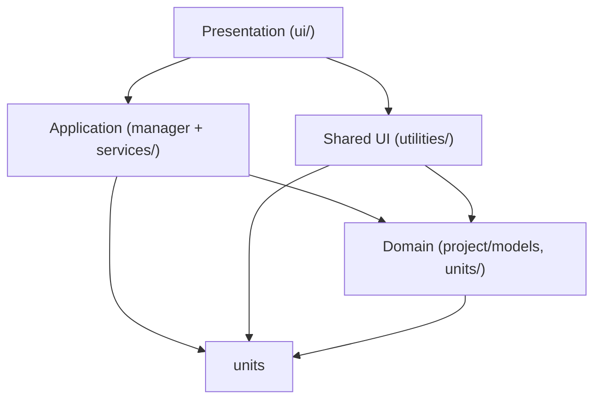

# RFT UI architecture — target layout and layer rules

Reference for restructuring `src/rft_app`. This is **not** strict MVC. Use four layers by **responsibility**, not widget size.

---

## Four layers (plain language)

| Layer | Question to ask | Examples in this project |
|-------|-----------------|--------------------------|
| **Domain** | What is the data, and what are the rules? (no Qt) | `project/models.py`, `project/canonical_names.py`, `units/` |
| **Application** | What workflows does the app run on that data? | `project/manager.py`, `project/persistence.py`, feature `services/` |
| **Presentation** | What does the user see and click? | `ui/main_window/`, `ui/analysis_view/ui/`, dialogs, trees |
| **Shared UI** | Reusable Qt helpers without RFT domain | `utilities/`, `ui/widgets/table_widgets.py`, `ui/icons.py` |

**Dependency rule (allowed direction only):**



**Avoid:**

- `project/models.py` or `units/` importing Qt
- `units/` importing `ui/`
- Domain dataclasses knowing about dialogs or tables

---

## Target folder tree (evolution of current layout)

Low-risk direction. Rename/move incrementally; no big-bang required.

```
src/rft_app/
  main.py

  project/                          # DOMAIN + project-wide APPLICATION
    models.py                       # domain dataclasses (DataSet, ColumnSpec, …)
    canonical_names.py              # domain constants
    manager.py                      # application: project state & operations
    persistence.py                  # application/I/O: save & load (.rftproj)
    __init__.py

  units/                            # DOMAIN (units definitions & conversion)
    units_manager.py
    units_normalisation.py
    __init__.py

  ui/
    main_window/                    # PRESENTATION — app shell
      main_window.py
      project_sidebar.py
      analysis_workspace.py

    analysis_view/                  # PRESENTATION — one analysis view tab
      ui/
        analysis_view.py
        view_sidebar.py
        tabular_frame.py
        graphical_frame.py
      services/                     # APPLICATION — feature workflows (was model/)
        analysis_view_data_manager.py
      __init__.py

    project_data_loader/            # PRESENTATION + feature services
      ui/
        dialog_data_loader_project.py
      services/                     # APPLICATION (rename from model/ when ready)
        project_data_loader_management.py

    widgets/                        # PRESENTATION — small reusable pieces
      tree_all_datasets.py
      tree_analyses.py
      dialog_data_loader_analysis.py
      dialog_new_analysis_view.py
      table_widgets.py
      tree_*_functions.py           # context menus (Qt-heavy → stays presentation)
      __init__.py

    project_file_actions.py         # file dialogs (presentation + I/O)
    icons.py
    styles/

  utilities/                        # SHARED UI (+ generic helpers)
    global_functions.py
    filterable_table/
    filterable_table_view/
    __init__.py

  resources/
```

### Naming convention

| Folder / file | Meaning |
|---------------|---------|
| `project/models.py` | **Only** place for domain dataclasses |
| `*/services/` | Feature workflows (import pipeline, build view dataframe, …) |
| `*/ui/` | Qt widgets and layouts for that feature |
| `ui/widgets/` | Leaf widgets reused by multiple features |

Do **not** use `model/` under `ui/` — it clashes with `project/models.py`.

---

## Where new code goes (decision rules)

| If the code… | Put it in… |
|--------------|------------|
| Is a dataclass / project fact | `project/models.py` |
| Is units / conversion / quantity | `units/` |
| Runs when user imports, builds a view, saves project | `project/manager.py` or feature `services/` |
| Is a window, dialog, tree, plot | `ui/.../ui/` or `ui/widgets/` |
| Is a generic table/tree helper | `utilities/` |

---

## Example flow: import dataset

1. **Presentation** — `dialog_data_loader_project.py` (user maps columns, clicks Import)
2. **Application** — `project_data_loader_management.py` (`create_column_specs`, normalise, log)
3. **Domain** — builds `ColumnSpec`, `DataSetLogEntry`, `DataFrame`
4. **Application** — `ProjectDataManager.add_loaded_dataset(...)`
5. **Presentation** — `main_window` refreshes trees

---

## Post-rename checklist: `model/` → `services/`

After renaming feature folders, update imports so nothing still points at `.model.`.

**Status when this doc was written:** `analysis_view/services/` exists; several imports still reference `analysis_view.model`. `project_data_loader` still uses `model/` (rename pending).

### Files that need import path updates

| File | Current import | Change to |
|------|----------------|-----------|
| `ui/analysis_view/__init__.py` | `from .model.analysis_view_data_manager import insert_excess_pressure_column` | `from .services.analysis_view_data_manager import insert_excess_pressure_column` |
| `ui/analysis_view/ui/analysis_view.py` | `from ..model.analysis_view_data_manager import build_view_df_and_col_specs_from_column_selection, on_column_unit_change` | `from ..services.analysis_view_data_manager import ...` |
| `ui/widgets/dialog_new_analysis_view.py` | `from ui.analysis_view.model.analysis_view_data_manager import insert_excess_pressure_column` | `from ui.analysis_view.services.analysis_view_data_manager import insert_excess_pressure_column` |

### After renaming `project_data_loader/model/` → `services/`

| File | Current import | Change to |
|------|----------------|-----------|
| `ui/project_data_loader/ui/dialog_data_loader_project.py` | `from ui.project_data_loader.model.project_data_loader_management import create_column_specs, define_column_names, populate_data_rows` | `from ui.project_data_loader.services.project_data_loader_management import ...` |

### Cleanup / hygiene (recommended)

1. **Remove old `ui/analysis_view/model/`** if it still exists alongside `services/` (duplicate module paths cause confusion; only one copy should remain).
2. **Add `ui/analysis_view/services/__init__.py`** (empty or re-export public functions) if you want cleaner package imports — optional.
3. **Add `ui/project_data_loader/services/__init__.py`** when that folder is renamed — optional.
4. **Search the repo** for stale paths:
   - `rg "\.model\." src/rft_app`
   - `rg "analysis_view\.model" src/rft_app`
   - `rg "project_data_loader\.model" src/rft_app`

### Imports that should **not** change

These refer to **domain** models, not feature services:

- `from project import ColumnSpec, DataSet, AnalysisObject, …`
- `from project.models import …` (if used)
- `from .models import …` inside `project/manager.py`

### Quick verification after fixes

1. Run from `src/rft_app`: `python main.py`
2. Exercise: import dataset, create analysis, open analysis view, change column units in sidebar
3. Optional: `python -c "from ui.analysis_view.services.analysis_view_data_manager import insert_excess_pressure_column"`

---

## Later refactors (not urgent)

- Move `dialog_data_loader_analysis.py` → `ui/analysis_loader/ui/` (or similar feature folder)
- Split `utilities/global_functions.py` (table UI vs generic helpers)
- Extract more logic from fat dialogs into `services/` as files grow
- Delete `dialog_data_loader_project_previous.py` when no longer needed

---

## Related docs

- Units workflow: `src/rft_app/units/ReadMe_units_manager.md`
